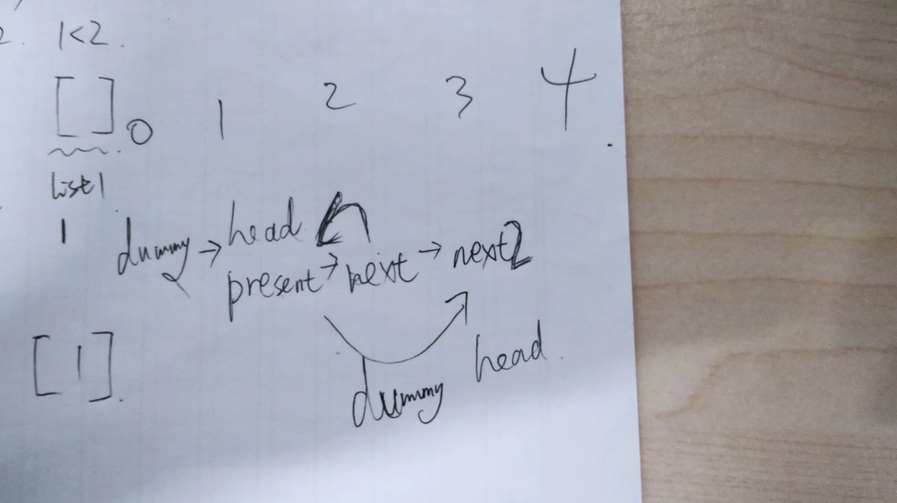

# 时间复杂度与空间复杂度
时间复杂度是 O(nlog⁡n) 的排序算法包括归并排序、堆排序和快速排序（快速排序的最差时间复杂度是 O(n^2)，其中最适合链表的排序算法是归并排序。


## leetcode 3 for循环和字典
```python
class Solution:
    def lengthOfLongestSubstring(self, s: str) -> int:
        left_pointer=0
        max_length=0
        char_record_map={}
        for right_pointer in range(len(s)):
            if s[right_pointer] in char_record_map and right_pointer>=left_pointer:
                left_pointer=max(left_pointer,char_record_map[s[right_pointer]]+1)
            char_record_map[s[right_pointer]]=right_pointer
            max_length=max(max_length,right_pointer-left_pointer+1)
        return max_length
solu=Solution()
print(solu.lengthOfLongestSubstring("dvdf"))
print(solu.lengthOfLongestSubstring("pwwkew"))
```
该算法的时间复杂度是 O(n)，空间复杂度是 O(n)
- 时间复杂度  
循环遍历字符串一次，使用两个指针（left_pointer 和 right_pointer）来维护无重复字符子串的窗口。在每次迭代中，对字符进行检查和记录。由于每个字符只会被处理一次，因此总的时间复杂度是 O(n)，其中 n 是输入字符串的长度。
- 空间复杂度  
使用了一个字典 char_record_map 来记录每个字符最后一次出现的位置。在最坏的情况下，所有字符都不重复，此时字典的大小会达到字符串的长度。因此，空间复杂度是 O(n)，其中 n 是输入字符串的长度。额外使用了几个整数变量，但它们的空间占用是常量级别的，不会随着输入规模增加而变化。


```
# 50. Pow(x, n)
# 方法同之前的 写出整除的代码。快速幂 + 迭代
class Solution:
    def myPow(self, x: float, n: int) -> float:
        result = 1
        if n < 0 : x, n = 1/x, -n
        while n > 0 :
            if n & 1 == 1 :
                result = result * x
            
            x = x * x
            n = n >> 1
        return result 
# 时间复杂度：O(log⁡n)，即为对 nnn 进行二进制拆分的时间复杂度。
# 空间复杂度：O(1)


# 官方 快速幂 + 递归
class Solution:
    def myPow(self, x: float, n: int) -> float:
        def quickMul(N):
            if N == 0:
                return 1.0
            y = quickMul(N // 2)
            return y * y if N % 2 == 0 else y * y * x
        
        return quickMul(n) if n >= 0 else 1.0 / quickMul(-n)

# 时间复杂度：O(log⁡n)，即为递归的层数。
# 空间复杂度：O(log⁡n)，即为递归的层数。这是由于递归的函数调用会使用栈空间。
```


## 递归算法 计算阶乘 n!
```python
def factorial(n):
    if n == 0:
        return 1
    else:
        return n * factorial(n-1)
```
时间复杂度是O(n)，  
空间复杂度也是O(n)，因为递归调用会占用栈空间。    

### 尾递归
什么是尾递归呢?(tail recursion), 顾名思议，就是一种“不一样的”递归，说到它的不一样，就得先说说一般的递归。对于一般的递归，比如下面的求阶乘，教科书上会告诉我们，如果这个函数调用的深度太深，很容易会有爆栈的危险。    
原因很多人的都知道，让我们先回顾一下函数调用的大概过程：   
- 调用开始前，调用方（或函数本身）会往栈上压相关的数据，参数，返回地址，局部变量等。
- 执行函数。
- 清理栈上相关的数据，返回。   

因此，在函数 A 执行的时候，如果在第二步中，它又调用了另一个函数 B，B 又调用 C… 栈就会不断地增长不断地装入数据，当这个调用链很深的时候，栈很容易就满了，这就是一般递归函数所容易面临的大问题。     
而尾递归在某些语言的实现上，能避免上述所说的问题，注意是某些语言上，尾递归本身并不能消除函数调用栈过长的问题，那什么是尾递归呢？在上面写的一般递归函数 func() 中，我们可以看到，func(n) 是依赖于 func(n-1) 的，func(n) 只有在得到 func(n-1) 的结果之后，才能计算它自己的返回值，因此理论上，在 func(n-1) 返回之前，func(n)，不能结束返回。因此func(n)就必须保留它在栈上的数据，直到func(n-1)先返回，而尾递归的实现则可以在编译器的帮助下，消除这个限制：   
```python
int tail_func(int n, int res)
{
     if (n <= 1) return res;

     return tail_func(n - 1, n * res);
}
```
从上可以看到尾递归把返回结果放到了调用的参数里。   
这个细小的变化导致，tail_func(n, res)不必像以前一样，非要等到拿到了tail_func(n-1, nres)的返回值，才能计算它自己的返回结果 – 它完全就等于tail_func(n-1, nres)的返回值。    
最终返回结果在传递参数里面    
因此理论上：tail_func(n)在调用tail_func(n-1)前，完全就可以先销毁自己放在栈上的东西。

这就是为什么尾递归如果在得到编译器的帮助下，是完全可以避免爆栈的原因：每一个函数在调用下一个函数之前，都能做到先把当前自己占用的栈给先释放了，尾递归的调用链上可以做到只有一个函数在使用栈，因此可以无限地调用！     
尾递归是一种特殊的递归形式，其特点是函数在最后一步调用自身，而且这个调用不依赖于任何额外的计算。    
可以避免爆栈的原因：每一个函数在调用下一个函数之前，都能做到先把当前自己占用的栈给先释放了，尾递归的调用链上可以做到只有一个函数在使用栈，因此可以无限地调用！

### 尾调用   
前面的讨论一直都集中在尾递归上，这其实有些狭隘，尾递归的优化属于尾调用优化这个大范畴，所谓尾调用，形式它与尾递归很像，   
都是一个函数内最后一个动作是调用下一个函数，不同的只是调用的是谁，显然尾递归只是尾调用的一个特例。     
```python
int func1(int a)
{
   static int b = 3;
   return a + b;
}

int func2(int c)
{
    static int b = 2;
    
    return func1(c+b);
}

```
上面例子中，func2在调用func1之前显然也是可以完全丢掉自己占有的栈空间的，原因与尾递归一样，因此理论上也是可以进行优化的，而事实上这种优化也一直是程序编译优化里的一个常见选项，甚至很多的语言在标准里就直接要求要对尾调用进行优化，原因很明显，尾调用在程序里是经常出现的，优化它不仅能减少栈空间使用，通常也能给程序运行效率带来比较大的提升。   

## leetcode 3 递归 
举例，如果递归函数中调用两次递归函数，则时间复杂度是O(2^n)，如下：  
使用了递归调用栈，空间复杂度主要取决于递归调用的深度。在最坏的情况下，递归深度为 n，因此空间复杂度为 O(n)。    
```python
class Solution:
    def lengthOfLongestSubstring(self, s: str) -> int:
        return self._lengthOfLongestSubstring(s, 0, set())

    def _lengthOfLongestSubstring(self, s: str, start: int, char_set: set) -> int:
        if start == len(s):
            return 0
        without_current_char = self._lengthOfLongestSubstring(s, start + 1, char_set)
        if s[start] not in char_set:
            char_set.add(s[start])
            with_current_char = 1 + self._lengthOfLongestSubstring(s, start + 1, char_set)
            char_set.remove(s[start])
            return max(without_current_char, with_current_char)
        return without_current_char
```
另一方法，看作尾递归
```python
public double findMedianSortedArrays(int[] nums1, int[] nums2) {
    int n = nums1.length;
    int m = nums2.length;
    int left = (n + m + 1) / 2;
    int right = (n + m + 2) / 2;
    //将偶数和奇数的情况合并，如果是奇数，会求两次同样的 k 。
    return (getKth(nums1, 0, n - 1, nums2, 0, m - 1, left) + getKth(nums1, 0, n - 1, nums2, 0, m - 1, right)) * 0.5;  
}
    
    private int getKth(int[] nums1, int start1, int end1, int[] nums2, int start2, int end2, int k) {
        int len1 = end1 - start1 + 1;
        int len2 = end2 - start2 + 1;
        //让 len1 的长度小于 len2，这样就能保证如果有数组空了，一定是 len1 
        if (len1 > len2) return getKth(nums2, start2, end2, nums1, start1, end1, k);
        if (len1 == 0) return nums2[start2 + k - 1];

        if (k == 1) return Math.min(nums1[start1], nums2[start2]);

        int i = start1 + Math.min(len1, k / 2) - 1;
        int j = start2 + Math.min(len2, k / 2) - 1;

        if (nums1[i] > nums2[j]) {
            return getKth(nums1, start1, end1, nums2, j + 1, end2, k - (j - start2 + 1));
        }
        else {
            return getKth(nums1, i + 1, end1, nums2, start2, end2, k - (i - start1 + 1));
        }
    }
```  
时间复杂度：每进行一次循环，我们就减少 k/2 个元素，所以时间复杂度是 O(log(k)，而 k=(m+n)/2，所以最终的复杂也就是 O(log(m+n）      
空间复杂度：虽然我们用到了递归，但是可以看到这个递归属于尾递归，所以编译器不需要不停地堆栈，所以空间复杂度为 O(1)   


## 时间复杂度为log
O(log n)的算法通常是二分查找或其他类似的分治算法，  
它们能够通过每一步排除一半的可能性，从而在较短的时间内找到解决方案。这种复杂度通常比线性复杂度（O(n)）更好，尤其在处理大型数据集时表现更为出色。

## 快排/二分查找
- 快排  
pivot，用递归不断大小划分
- 二分查找


## hashmap 列表list
- hashmap = {'I':1, 'V':5, 'X':10}   hashmap记录键值对    
if hashmap[s[i]] >= hashmap[s[i + 1]] :    #! 读hashmap用[] 而不是()   
- 创建列表 f = [[False] * (n + 1) for _ in range(m + 1)]    
- s = [('I', 1), ('V', 5), ('X', 10)] 列表记录键值对    
s = [['I', 1], ['V', 5], ['X', 10]]   这两样读取都正确，读取结果都一样    
for key,value in s   读取为 'I' 和 1   
for key in s   读取为('I', 1)
- new_num_list.append(x2 % 10)    
字符串不可以append，只能 + 或 ''.join()    
char1 + char2 字符串相加    
''.join()的对象是一个列表，而不是输入多个单体    
- 都是用 [] 取值。字符串，列表，hashmap   
函数采用()    
- letter_group + [table[digits[0]]]     # ！少了[]   列表 + 就是concat     
new_combine.append(char1 + char2)       # ！往列表内添加元素，不能list + str       
- 列表用pop，pop()最后一个，pop(2)索引2即第三个，   字符串不能用pop，只能切片     
- left_list = ''    
left_list = []    
都可以当成 if False :     


## 反转链表
```
# reverse none
# 1     - 2      - 3
# head
#      next_node
# reverse
#      head
```

### 原地交换节点 leetcode 24


## 深浅拷贝
元组，列表，链表 都需要深拷贝    
reverse2 = reverse    
reverse2.next = None      
reverse2会改变原链表    
如果你想创建一个链表的副本而不影响原始链表，你需要使用深拷贝（deep copy）   
reverse2 = copy.deepcopy(reverse)        

元组original_tuple = ([1, 2, 3], [4, 5, 6])   
列表original_list = [[1, 2, 3], [4, 5, 6]]

```
first = head
for i in range(n):
    first = first.next
这样只改变first 不改变head
```

# 一般知识

- mid = left + ((right - left) >> 1)       
！运算顺序 先加法后移位   
- Counter()特殊的字典，方便加减  
- 不能直接 nums[right:].sort()   
需要  
nums_2_sort = nums[right:]    
nums_2_sort.sort()    
有序列表 反转的代码实现        
```
while left < right:
            nums[left], nums[right] = nums[right], nums[left]
            left += 1
            right -= 1
```

- 记录方式   
dp    
双指针    
字典   
Counter()     
- 递减for     
for move in range(len(s) - 1, -1, -1)      
- [dfs(index, path + [candidates[index]], target - candidates[index]) for index in range(start, length)]       # ！列表推导式需要变成 列表     


- for while循环的条件变量不能在循环内部改变，会影响循环
```
错误示范
for index in (start + 1, start + max_jump_length + 1):                             #!  start
                if index > length - 1 :
                    flag = 1
                    break
                if max_jump_length_local <= nums[index] :
                    max_jump_length_local = nums[index]
                    start = index                                    #!
```

- lambda    
intervals = [[1,3],[2,6],[8,10],[15,18]]    
intervals.sort(key = lambda x : x[0])    

newlist = list(filter(lambda x: x not in little_list, nums))      

- matrix = list(zip(*matrix))[::-1]    
[(7, 11), (6, 10), (5, 9)]     
[(7, 6, 5), (11, 10, 9)]     
[[5, 6, 7, 8], [9, 10, 11, 12]]
[(5, 9), (6, 10), (7, 11), (8, 12)]
zip(*matrix): zip 函数用于将多个可迭代对象中的对应元素打包成元组。在这里，*matrix 将二维矩阵的列解压缩为单独的参数，然后 zip 将这些列元素打包成元组。这样就完成了矩阵的转置操作。      

- 518. 零钱兑换 II   
方案数。可重复元素，由小到大排序后不可重复。不讲究顺序，只讲究各元素个数的不重复性  
70题 走楼梯。可重复元素，由小到大排序后可重复，每个元素放的位置具有独立性，排列，讲究先后顺序    


- 简单实现异或 xor     
当且仅当操作数中有一个为真时，结果为真；如果两个或多个都为真或都为假，则结果为假。    
例如，如果A为真而B为假，或者A为假而B为真，则A XOR B为真，如果A和B都为真或都为假，则为假。    
```
if not p and not q: 双假情况提前返回退出
            return True
        if not p or not q:
            return False
```

- 错误言论 ：    
某些使用场景是 DFS 做不到的，只能使用 BFS 遍历。这就是本文要介绍的两个场景：「层序遍历」、「最短路径」。      


- 1
```
collections 是 Python 标准库中的一个模块，提供了一些额外的数据类型和数据结构，用于扩展内置数据类型的功能。这个模块包含了一些有用的容器类型，如命名元组、默认字典、有序字典和计数器等。以下是一些 collections 模块中常用的类：

namedtuple（命名元组）：创建一个带有命名字段的元组，使代码更具可读性。

python
Copy code
from collections import namedtuple

Point = namedtuple('Point', ['x', 'y'])
p = Point(1, 2)
print(p.x, p.y)
defaultdict（默认字典）：与普通字典相似，但是在访问不存在的键时，会返回一个默认值而不是引发 KeyError。

python
Copy code
from collections import defaultdict

d = defaultdict(int)
d['a'] += 1
Counter（计数器）：用于计算可哈希对象的元素个数。

python
Copy code
from collections import Counter

c = Counter(['a', 'b', 'a', 'c', 'b'])
print(c['a'])  # 输出 2
OrderedDict（有序字典）：按照元素添加的顺序保持字典的顺序。

python
Copy code
from collections import OrderedDict

d = OrderedDict()
d['one'] = 1
d['two'] = 2
```


## 列表创建
- 错误例子 ： dp = [[False] * (n + 1)] * (m + 1)    
正确例子： dp = [[False] * (n + 1) for _ in range(m + 1)]    
在Python中，使用 * 运算符创建二维数组时，实际上是创建了多个引用指向相同的子列表。当你执行 dp = [[False] * (n + 1)] * (m + 1) 时，[False] * (n + 1) 创建了一个包含 n+1 个 False 的列表，并且使用 * (m + 1) 复制这个列表 m+1 次，从而创建了 m+1 个引用指向相同的子列表。     

```
dp = [[False] * (target + 1) for _ in range(length)]
dp2 = [[False * (target + 1)] for _ in range(length)]

dp
[[False, False, False, False, False, False, False, False, False, False, False, False], [False, False, False, False, False, False, False, False, False, False, False, False], [False, False, False, False, False, False, False, False, False, False, False, False], [False, False, False, False, False, False, False, False, False, False, False, False]]

dp2
[[0], [0], [0], [0]]


dp3 = [0] * (5 + 1)
dp3[2] = 1 
这样生成的并没有指向同一个


- 错误例子 ： dp = [[False] * (n + 1)] * (m + 1)    
指向同一个
dp4 = [[False] * (3 + 1)] * (6 + 1)    
dp4[2] = True
[[False, False, False, False], [False, False, False, False], True, [False, False, False, False], [False, False, False, False], [False, False, False, False], [False, False, False, False]]

dp4 = [[False] * (3 + 1)] * (6 + 1)    
dp4[2][2] = True
[[False, False, True, False], [False, False, True, False], [False, False, True, False], [False, False, True, False], [False, False, True, False], [False, False, True, False], [False, False, True, False]]


正确例子： dp = [[False] * (n + 1) for _ in range(m + 1)]   
没有指向同一个


```

### 列表不能直接相减    
```
newlist = list(filter(lambda x: x not in little_list, nums))                          #！
            for x in newlist :     

错误例子
nums - little_list
```
```
在Python中，列表之间不能直接相减。但是，你可以使用一些方法来实现列表之间的差异操作。以下是一些方法：

1.使用列表推导式：
python
Copy code
list1 = [1, 2, 3, 4, 5]
list2 = [3, 4, 5, 6, 7]

result = [item for item in list1 if item not in list2]
print(result)
这将输出 [1, 2]，表示在list1中但不在list2中的元素。

2.使用set进行差集操作：
python
Copy code
list1 = [1, 2, 3, 4, 5]
list2 = [3, 4, 5, 6, 7]

set1 = set(list1)
set2 = set(list2)

result = list(set1 - set2)
print(result)
这也会输出 [1, 2]，通过将列表转换为集合，然后使用集合的差集操作。

3.使用filter函数：
python
Copy code
list1 = [1, 2, 3, 4, 5]
list2 = [3, 4, 5, 6, 7]

result = list(filter(lambda x: x not in list2, list1))
print(result)
同样，这也会输出 [1, 2]。
```
- if nums not in res :                       ！这样搜索耗时极久   
- res.append(nums[:])              ！创建副本append 。但 res.append(nums)  修改原指针位置     
另外一种创建副本  res.append(path.copy())      

- tuple才可哈希，其也是有序的     
键不能说集合，无法哈希      
set()通过add()加元素     

- and 和 索引越界
```
stack = []
        for j in range(length) :
            while stack and height[j] > height[stack[-1]] :                 #！j = 0 时，先判断 and 前面 不满足就跳过了，不执行后面的，所以不会索引越界
```


- 可以使用列表的pop(0)替代deque的popleft()。这两者都是用于从列表或队列的左侧移除元素的操作。以下是使用列表的pop(0)的等效代码    
尽管在这种情况下可以使用pop(0)，但它对于列表来说是一个较慢的操作，因为它需要移动列表中的所有元素。因此，使用deque通常更有效率，尤其是对于大型数据集。           
.append(node.left)      

- 动规
动态规划的题目分为两大类，一种是求最优解类，典型问题是背包问题，另一种就是计数类，比如这里的统计方案数的问题，它们都存在一定的递推性质。前者的递推性质还有一个名字，叫做 「最优子结构」 ——即当前问题的最优解取决于子问题的最优解，后者类似，当前问题的方案数取决于子问题的方案数。所以在遇到求方案数的问题时，我们可以往动态规划的方向考虑。     

- 一边扫描，空间哈希 换 重新检索时间 find index    
preorder 和 inorder 均 无重复 元素    
```
# 想使用list find index， 递归 但是觉得时间复杂度有n^2logn太大。想一次遍历
# 官方 在中序遍历中对根节点进行定位时，一种简单的方法是直接扫描整个中序遍历的结果并找出根节点，
#但这样做的时间复杂度较高。我们可以考虑使用哈希表来帮助我们快速地定位根节点。对于哈希映射中的每个键值对，
#键表示一个元素（节点的值），值表示其在中序遍历中的出现位置。在构造二叉树的过程之前，我们可以对中序遍历的列表进行一遍扫描，
#就可以构造出这个哈希映射。在此后构造二叉树的过程中，我们就只需要 O(1)O(1)O(1) 的时间对根节点进行定位了。

# 一边扫描，空间哈希 换 重新检索时间
```

### set()添加元素方法。由list 变 set 去检索 in 可能加快速度。

- 由list 变 set 去检索 in 不会加快速度：    
wordDict = set(wordDict)     
s[j : k] in wordDict :            

        record = set()
        while headA:
            record.add(headA)
            headA = headA.next
        while headB :
            if headB in record :
list 2s set() 70ms

- set()和{} 即dict不一样
'dict' object has no attribute 'add'     
dict没有add 也没有append    
dict得像列表一样直接赋值。a[1] = 2       
都有remove   
set有add   

如果要向字典中添加单个键值对，可以使用 dict[key] = value 语法，或者 dict.update({key: value}) 方法。        
print(my_dict)  # 输出: {'key': 'value', 'another_key': 'another_value'}    

集合set()       
print(my_set)  # 输出: {'element'}


### 生成器表达式 列表推导式
- ''.join(dp[current_row][current_column] for current_row in range(row) for current_column in range(column))   
生成器表达式   
生成器表达式则使用圆括号 () 创建一个生成器对象    
等价于   
```
result = ''
for current_row in range(row):
    for current_column in range(column):
        result += dp[current_row][current_column]
```
```
列表推导式
''.join([dp[current_row][current_column] for current_row in range(row) for current_column in range(column)])
```


### None
列表         
if stack == [] : break         ## == None不行

链表   
is not None

    正确写法 if fast != None or reverse_record != None : return False
    # 错误写法  if fast not None or reverse_record not None : return False
    # 正确写法 if fast is not None and reverse_record is not None:


## 递归中断结束方法
- 法一 Exception     
class RecursiveBreak(Exception):     
    pass    
try:     
if record >= root.val : raise RecursiveBreak("Condition satisfied, breaking recursion")    
except RecursiveBreak as e:   
return False    
```
class RecursiveBreak(Exception):
    pass
class Solution:
    def isValidBST(self, root: Optional[TreeNode]) -> bool:
        try:
            record = float('-inf')
            def inorder(root) :
                nonlocal record
                if not root : return 
                inorder(root.left)
                if record >= root.val : raise RecursiveBreak("Condition satisfied, breaking recursion")
                record = root.val
                inorder(root.right)

            inorder(root)
            return True
        except RecursiveBreak as e:
            return False
```

- 法二 if语句判断递归来结束递归 递归作为判断条件       
```
#if not helper(node.right, val, upper):
#                return False
```
- 法三 转成迭代法   
```
#if root.val <= inorder:
#                return False
#   inorder = root.val
```


- 前序，中序，后序
```

前序遍历（Preorder Traversal）和后序遍历（Postorder Traversal）是二叉树遍历的两种方式，它们之间的区别在于访问节点的顺序不同。

前序遍历：

访问根节点
前序遍历左子树
前序遍历右子树
在代码中，前序遍历可以表示为：root -> left -> right。

后序遍历：

后序遍历左子树
后序遍历右子树
访问根节点
在代码中，后序遍历可以表示为：left -> right -> root。

```


- 递归为我们提供了一种优雅的方式来反向遍历链表节点。

        function print_values_in_reverse(ListNode head)
            if head is NOT null
                print_values_in_reverse(head.next)
                print head.val


# 总结
- 第10题，困难，一个星期后第二次写，很久才想起方法，但不理解，‘正则项匹配’        
