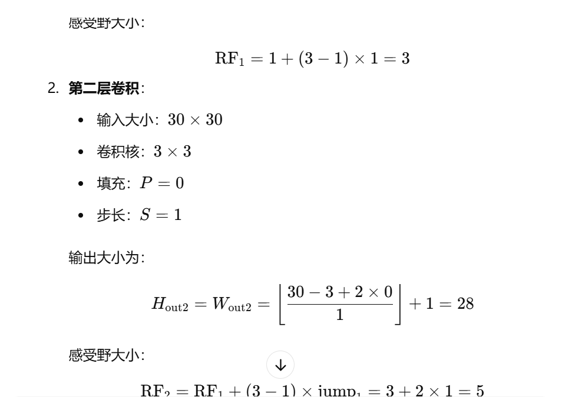

## 时间复杂度与空间复杂度
时间复杂度是 O(nlog⁡n) 的排序算法包括归并排序、堆排序和快速排序（快速排序的最差时间复杂度是 O(n^2)，其中最适合链表的排序算法是归并排序。


## leetcode 3 for循环和字典
```python
class Solution:
    def lengthOfLongestSubstring(self, s: str) -> int:
        left_pointer=0
        max_length=0
        char_record_map={}
        for right_pointer in range(len(s)):
            if s[right_pointer] in char_record_map and right_pointer>=left_pointer:
                left_pointer=max(left_pointer,char_record_map[s[right_pointer]]+1)
            char_record_map[s[right_pointer]]=right_pointer
            max_length=max(max_length,right_pointer-left_pointer+1)
        return max_length
solu=Solution()
print(solu.lengthOfLongestSubstring("dvdf"))
print(solu.lengthOfLongestSubstring("pwwkew"))
```
该算法的时间复杂度是 O(n)，空间复杂度是 O(n)
- 时间复杂度  
循环遍历字符串一次，使用两个指针（left_pointer 和 right_pointer）来维护无重复字符子串的窗口。在每次迭代中，对字符进行检查和记录。由于每个字符只会被处理一次，因此总的时间复杂度是 O(n)，其中 n 是输入字符串的长度。
- 空间复杂度  
使用了一个字典 char_record_map 来记录每个字符最后一次出现的位置。在最坏的情况下，所有字符都不重复，此时字典的大小会达到字符串的长度。因此，空间复杂度是 O(n)，其中 n 是输入字符串的长度。额外使用了几个整数变量，但它们的空间占用是常量级别的，不会随着输入规模增加而变化。


```
# 50. Pow(x, n)
# 方法同之前的 写出整除的代码。快速幂 + 迭代
class Solution:
    def myPow(self, x: float, n: int) -> float:
        result = 1
        if n < 0 : x, n = 1/x, -n
        while n > 0 :
            if n & 1 == 1 :
                result = result * x
            
            x = x * x
            n = n >> 1
        return result 
# 时间复杂度：O(log⁡n)，即为对 nnn 进行二进制拆分的时间复杂度。
# 空间复杂度：O(1)


# 官方 快速幂 + 递归
class Solution:
    def myPow(self, x: float, n: int) -> float:
        def quickMul(N):
            if N == 0:
                return 1.0
            y = quickMul(N // 2)
            return y * y if N % 2 == 0 else y * y * x
        
        return quickMul(n) if n >= 0 else 1.0 / quickMul(-n)

# 时间复杂度：O(log⁡n)，即为递归的层数。
# 空间复杂度：O(log⁡n)，即为递归的层数。这是由于递归的函数调用会使用栈空间。
```


## 递归算法 计算阶乘 n!
```python
def factorial(n):
    if n == 0:
        return 1
    else:
        return n * factorial(n-1)
```
时间复杂度是O(n)，  
空间复杂度也是O(n)，因为递归调用会占用栈空间。    

### 尾递归
什么是尾递归呢?(tail recursion), 顾名思议，就是一种“不一样的”递归，说到它的不一样，就得先说说一般的递归。对于一般的递归，比如下面的求阶乘，教科书上会告诉我们，如果这个函数调用的深度太深，很容易会有爆栈的危险。    
原因很多人的都知道，让我们先回顾一下函数调用的大概过程：   
- 调用开始前，调用方（或函数本身）会往栈上压相关的数据，参数，返回地址，局部变量等。
- 执行函数。
- 清理栈上相关的数据，返回。   

因此，在函数 A 执行的时候，如果在第二步中，它又调用了另一个函数 B，B 又调用 C… 栈就会不断地增长不断地装入数据，当这个调用链很深的时候，栈很容易就满了，这就是一般递归函数所容易面临的大问题。     
而尾递归在某些语言的实现上，能避免上述所说的问题，注意是某些语言上，尾递归本身并不能消除函数调用栈过长的问题，那什么是尾递归呢？在上面写的一般递归函数 func() 中，我们可以看到，func(n) 是依赖于 func(n-1) 的，func(n) 只有在得到 func(n-1) 的结果之后，才能计算它自己的返回值，因此理论上，在 func(n-1) 返回之前，func(n)，不能结束返回。因此func(n)就必须保留它在栈上的数据，直到func(n-1)先返回，而尾递归的实现则可以在编译器的帮助下，消除这个限制：   
```python
int tail_func(int n, int res)
{
     if (n <= 1) return res;

     return tail_func(n - 1, n * res);
}
```
从上可以看到尾递归把返回结果放到了调用的参数里。   
这个细小的变化导致，tail_func(n, res)不必像以前一样，非要等到拿到了tail_func(n-1, nres)的返回值，才能计算它自己的返回结果 – 它完全就等于tail_func(n-1, nres)的返回值。    
最终返回结果在传递参数里面    
因此理论上：tail_func(n)在调用tail_func(n-1)前，完全就可以先销毁自己放在栈上的东西。

这就是为什么尾递归如果在得到编译器的帮助下，是完全可以避免爆栈的原因：每一个函数在调用下一个函数之前，都能做到先把当前自己占用的栈给先释放了，尾递归的调用链上可以做到只有一个函数在使用栈，因此可以无限地调用！     
尾递归是一种特殊的递归形式，其特点是函数在最后一步调用自身，而且这个调用不依赖于任何额外的计算。    
可以避免爆栈的原因：每一个函数在调用下一个函数之前，都能做到先把当前自己占用的栈给先释放了，尾递归的调用链上可以做到只有一个函数在使用栈，因此可以无限地调用！

### 尾调用   
前面的讨论一直都集中在尾递归上，这其实有些狭隘，尾递归的优化属于尾调用优化这个大范畴，所谓尾调用，形式它与尾递归很像，   
都是一个函数内最后一个动作是调用下一个函数，不同的只是调用的是谁，显然尾递归只是尾调用的一个特例。     
```python
int func1(int a)
{
   static int b = 3;
   return a + b;
}

int func2(int c)
{
    static int b = 2;
    
    return func1(c+b);
}

```
上面例子中，func2在调用func1之前显然也是可以完全丢掉自己占有的栈空间的，原因与尾递归一样，因此理论上也是可以进行优化的，而事实上这种优化也一直是程序编译优化里的一个常见选项，甚至很多的语言在标准里就直接要求要对尾调用进行优化，原因很明显，尾调用在程序里是经常出现的，优化它不仅能减少栈空间使用，通常也能给程序运行效率带来比较大的提升。   

## leetcode 3 递归 
举例，如果递归函数中调用两次递归函数，则时间复杂度是O(2^n)，如下：  
使用了递归调用栈，空间复杂度主要取决于递归调用的深度。在最坏的情况下，递归深度为 n，因此空间复杂度为 O(n)。    
```python
class Solution:
    def lengthOfLongestSubstring(self, s: str) -> int:
        return self._lengthOfLongestSubstring(s, 0, set())

    def _lengthOfLongestSubstring(self, s: str, start: int, char_set: set) -> int:
        if start == len(s):
            return 0
        without_current_char = self._lengthOfLongestSubstring(s, start + 1, char_set)
        if s[start] not in char_set:
            char_set.add(s[start])
            with_current_char = 1 + self._lengthOfLongestSubstring(s, start + 1, char_set)
            char_set.remove(s[start])
            return max(without_current_char, with_current_char)
        return without_current_char
```
另一方法，看作尾递归
```python
public double findMedianSortedArrays(int[] nums1, int[] nums2) {
    int n = nums1.length;
    int m = nums2.length;
    int left = (n + m + 1) / 2;
    int right = (n + m + 2) / 2;
    //将偶数和奇数的情况合并，如果是奇数，会求两次同样的 k 。
    return (getKth(nums1, 0, n - 1, nums2, 0, m - 1, left) + getKth(nums1, 0, n - 1, nums2, 0, m - 1, right)) * 0.5;  
}
    
    private int getKth(int[] nums1, int start1, int end1, int[] nums2, int start2, int end2, int k) {
        int len1 = end1 - start1 + 1;
        int len2 = end2 - start2 + 1;
        //让 len1 的长度小于 len2，这样就能保证如果有数组空了，一定是 len1 
        if (len1 > len2) return getKth(nums2, start2, end2, nums1, start1, end1, k);
        if (len1 == 0) return nums2[start2 + k - 1];

        if (k == 1) return Math.min(nums1[start1], nums2[start2]);

        int i = start1 + Math.min(len1, k / 2) - 1;
        int j = start2 + Math.min(len2, k / 2) - 1;

        if (nums1[i] > nums2[j]) {
            return getKth(nums1, start1, end1, nums2, j + 1, end2, k - (j - start2 + 1));
        }
        else {
            return getKth(nums1, i + 1, end1, nums2, start2, end2, k - (i - start1 + 1));
        }
    }
```  
时间复杂度：每进行一次循环，我们就减少 k/2 个元素，所以时间复杂度是 O(log(k)，而 k=(m+n)/2，所以最终的复杂也就是 O(log(m+n）      
空间复杂度：虽然我们用到了递归，但是可以看到这个递归属于尾递归，所以编译器不需要不停地堆栈，所以空间复杂度为 O(1)   


## 时间复杂度为log
O(log n)的算法通常是二分查找或其他类似的分治算法，  
它们能够通过每一步排除一半的可能性，从而在较短的时间内找到解决方案。这种复杂度通常比线性复杂度（O(n)）更好，尤其在处理大型数据集时表现更为出色。

## 快排/二分查找
- 快排  
pivot，用递归不断大小划分
- 二分查找


## hashmap 列表list
- hashmap = {'I':1, 'V':5, 'X':10}   hashmap记录键值对    
if hashmap[s[i]] >= hashmap[s[i + 1]] :    #! 读hashmap用[] 而不是()   
- 创建列表 f = [[False] * (n + 1) for _ in range(m + 1)]    
- s = [('I', 1), ('V', 5), ('X', 10)] 列表记录键值对    
s = [['I', 1], ['V', 5], ['X', 10]]   这两样读取都正确，读取结果都一样    
for key,value in s   读取为 'I' 和 1   
for key in s   读取为('I', 1)
- new_num_list.append(x2 % 10)    
字符串不可以append，只能 + 或 ''.join()    
char1 + char2 字符串相加    
''.join()的对象是一个列表，而不是输入多个单体    
- 都是用 [] 取值。字符串，列表，hashmap   
函数采用()    
- letter_group + [table[digits[0]]]     # ！少了[]   列表 + 就是concat     
new_combine.append(char1 + char2)       # ！往列表内添加元素，不能list + str       
- 列表用pop，pop()最后一个，pop(2)索引2即第三个，   字符串不能用pop，只能切片     
- left_list = ''    
left_list = []    
都可以当成 if False :     

## hashmap dict.get
### 哈希表查询key的value或者是否有key
dict.get()函数比较常见，记录一下用法。        
该函数用于选择赋值。(搜索`键`，取出值),无值不会报错KeyError       
常见为dict.get(a,b):a是键值key，如果存在dict存在键值a，则函数返回dict[a]；否则返回b，如果没有定义b参数，则返回None。      
上代码：

m={'a':1,'b':2,'center':3}     
m.get('a',100)        
>>>1

m={'a':1,'b':2,'center':3}     
m.get(2,100)        
>>>100

m={'a':1,'b':2,'center':3}     
m.get(2)       
>>>None

    m={'a':1,'b':2,'center':3}     
    print(m.get('a',100) ) 
    print(m['a']) 
    print(m[1])          #报错KeyError

### 哈希表查询value的方法
第一种方法：利用in关键字  
if 1 in dict1.values():     
这种方法的优点是代码简洁明了，缺点是当字典中的value值比较多时，查找速度会比较慢。   

第三种方法：利用has_key()方法  
if dict1.has_key(1):     
这种方法已经在Python3.x版本中被移除，不再支持。所以如果你的项目是在Python2.x版本中进行开发的，并且不需要跨版本兼容，可以考虑使用这种方法。   

这个has_value函数通过map函数将字典的项（键值对）映射到它们的值上，然后检查value是否在映射后的值列表中。

    def has_value(d, value):
        return value in map(lambda x: x[1], d.items())
    
    # 示例使用
    my_dict = {'a': 1, 'b': 2, 'c': 3}
    print(has_value(my_dict, 2))  # 输出: True
    print(has_value(my_dict, 4))  # 输出: False

如果你需要频繁地执行这个查询，考虑使用以下方法可以提高性能：这里使用了any函数和生成器表达式来检查字典的值中是否存在value。这样做比先创建一个列表要更加高效，尤其是在处理大字典时。?????

    def has_value(d, value):
        return any(v == value for v in d.values())
    
    # 示例使用
    my_dict = {'a': 1, 'b': 2, 'c': 3}
    print(has_value(my_dict, 2))  # 输出: True
    print(has_value(my_dict, 4))  # 输出: False

### 哈希表内置函数
用内置函数items() 返回的就是每一组的key:value值      

3.用内置函数keys() 返回的就是每一个key值  
4.用内置函数values() 返回的就是每一个value值  

用函数get(key) 返回的就是value值，如果没有这个key值，则会返回None，相比于dict[key]来说，get(key)更加人性化。   
dict.get(a,b):a是键值key，如果存在dict存在键值a，则函数返回dict[a]；否则返回b，如果没有定义b参数，则返回None。   

### dict for 直接查询键的方法
直接查询键的方法：

    table = {'a':1, 'b':2}
    for num in table :
        print(num)

    a
    b
不需要使用.keys()


    table = {}
    for j, num in enumerate(nums) :
        if target - num in table :
            return [j, table[target - num]]
        table[num] = j
    return []


### update


    table = {'a':1, 'b':2}
    table.update({'c':3})
    print(table)

    {'a': 1, 'b': 2, 'c': 3}


### any, map，lambda
any() 函数用于判断给定可迭代对象中是否存在任何真值（True）。如果存在任何一个元素的值为True，那么any()函数返回True；如果所有元素都是False（或者可迭代对象为空），则返回False。  
any(iterable)   
iterable: 可迭代对象，如列表、元组、集合等。  

    # 示例1
    data = [False, True, False, False]
    print(any(data))  # 输出 True，因为至少有一个元素为True

    # 示例2
    data = [0, '', False, None]
    print(any(data))  # 输出 False，因为所有元素都是假值


map() 函数用于对可迭代对象中的每个元素应用指定的函数，然后返回一个包含所有函数返回值的迭代器。    
map(function, iterable1, iterable2, ...)   
return value in map(lambda x: x[1], d.items())    
lambda构建一行的函数    
返回一个迭代器，其中包含将函数应用于每个可迭代对象中对应元素的结果。   

    # 示例1：将列表中的每个元素求平方
    numbers = [1, 2, 3, 4, 5]
    squared = map(lambda x: x**2, numbers)
    print(list(squared))  # 输出 [1, 4, 9, 16, 25]

    # 示例2：将两个列表中的对应元素相加
    list1 = [1, 2, 3]
    list2 = [4, 5, 6]
    added = map(lambda x, y: x + y, list1, list2)
    print(list(added))  # 输出 [5, 7, 9]
功能类似于pandas的map   

map(str, tokens_to_add)  
str 是一个内置函数，它将其他类型的对象转换为字符串类型。tokens_to_add 可能是一个可迭代对象，如列表或元组，其中包含需要转换为字符串的元素。    
因此，这段代码的目的是将 tokens_to_add 中的每个元素转换为字符串类型。   


lambda   
lambda x, y: x + y   
lambda x: x**2   
定义输入输出   

    # 创建一个简单的 lambda 函数，求平方
    square = lambda x: x ** 2
    print(square(5))  # 输出 25

    lambda_func = lambda x: (
        x + 1,
        x * 2,
        x ** 3
    )

    print(lambda_func(2))  # Output: (3, 4, 8)


## 反转链表
```
# reverse none
# 1     - 2      - 3
# head
#      next_node
# reverse
#      head
```

### 原地交换节点 leetcode 24


## 深浅拷贝
元组，列表，链表 都需要深拷贝    
reverse2 = reverse    
reverse2.next = None      
reverse2会改变原链表    
如果你想创建一个链表的副本而不影响原始链表，你需要使用深拷贝（deep copy）   
reverse2 = copy.deepcopy(reverse)        

元组original_tuple = ([1, 2, 3], [4, 5, 6])   
列表original_list = [[1, 2, 3], [4, 5, 6]]

```
first = head
for i in range(n):
    first = first.next
这样只改变first 不改变head
```

# 一般知识

- mid = left + ((right - left) >> 1)       
！运算顺序 先加法后移位   
- Counter()特殊的字典，方便加减  
- 不能直接 nums[right:].sort()   
需要  
nums_2_sort = nums[right:]    
nums_2_sort.sort()    
有序列表 反转的代码实现        
```
while left < right:
            nums[left], nums[right] = nums[right], nums[left]
            left += 1
            right -= 1
```

- 记录方式   
dp    
双指针    
字典   
Counter()     
- 递减for     
for move in range(len(s) - 1, -1, -1)      
- [dfs(index, path + [candidates[index]], target - candidates[index]) for index in range(start, length)]       # ！列表推导式需要变成 列表     


- for while循环的条件变量不能在循环内部改变，会影响循环
```
错误示范
for index in (start + 1, start + max_jump_length + 1):                             #!  start
                if index > length - 1 :
                    flag = 1
                    break
                if max_jump_length_local <= nums[index] :
                    max_jump_length_local = nums[index]
                    start = index                                    #!
```

- lambda    
intervals = [[1,3],[2,6],[8,10],[15,18]]    
intervals.sort(key = lambda x : x[0])    

newlist = list(filter(lambda x: x not in little_list, nums))      

- matrix = list(zip(*matrix))[::-1]    
[(7, 11), (6, 10), (5, 9)]     
[(7, 6, 5), (11, 10, 9)]     
[[5, 6, 7, 8], [9, 10, 11, 12]]
[(5, 9), (6, 10), (7, 11), (8, 12)]
zip(*matrix): zip 函数用于将多个可迭代对象中的对应元素打包成元组。在这里，*matrix 将二维矩阵的列解压缩为单独的参数，然后 zip 将这些列元素打包成元组。这样就完成了矩阵的转置操作。      

- 518. 零钱兑换 II   
方案数。可重复元素，由小到大排序后不可重复。不讲究顺序，只讲究各元素个数的不重复性  
70题 走楼梯。可重复元素，由小到大排序后可重复，每个元素放的位置具有独立性，排列，讲究先后顺序    


- 简单实现异或 xor     
当且仅当操作数中有一个为真时，结果为真；如果两个或多个都为真或都为假，则结果为假。    
例如，如果A为真而B为假，或者A为假而B为真，则A XOR B为真，如果A和B都为真或都为假，则为假。    
```
if not p and not q: 双假情况提前返回退出
            return True
        if not p or not q:
            return False
```

- 错误言论 ：    
某些使用场景是 DFS 做不到的，只能使用 BFS 遍历。这就是本文要介绍的两个场景：「层序遍历」、「最短路径」。      


- 1
```
collections 是 Python 标准库中的一个模块，提供了一些额外的数据类型和数据结构，用于扩展内置数据类型的功能。这个模块包含了一些有用的容器类型，如命名元组、默认字典、有序字典和计数器等。以下是一些 collections 模块中常用的类：

namedtuple（命名元组）：创建一个带有命名字段的元组，使代码更具可读性。

python
Copy code
from collections import namedtuple

Point = namedtuple('Point', ['x', 'y'])
p = Point(1, 2)
print(p.x, p.y)
defaultdict（默认字典）：与普通字典相似，但是在访问不存在的键时，会返回一个默认值而不是引发 KeyError。

python
Copy code
from collections import defaultdict

d = defaultdict(int)
d['a'] += 1
Counter（计数器）：用于计算可哈希对象的元素个数。

python
Copy code
from collections import Counter

c = Counter(['a', 'b', 'a', 'c', 'b'])
print(c['a'])  # 输出 2
OrderedDict（有序字典）：按照元素添加的顺序保持字典的顺序。

python
Copy code
from collections import OrderedDict

d = OrderedDict()
d['one'] = 1
d['two'] = 2
```


## 列表创建
- 错误例子 ： dp = [[False] * (n + 1)] * (m + 1)    
正确例子： dp = [[False] * (n + 1) for _ in range(m + 1)]    
在Python中，使用 * 运算符创建二维数组时，实际上是创建了多个引用指向相同的子列表。当你执行 dp = [[False] * (n + 1)] * (m + 1) 时，[False] * (n + 1) 创建了一个包含 n+1 个 False 的列表，并且使用 * (m + 1) 复制这个列表 m+1 次，从而创建了 m+1 个引用指向相同的子列表。     

```
dp = [[False] * (target + 1) for _ in range(length)]
dp2 = [[False * (target + 1)] for _ in range(length)]

dp
[[False, False, False, False, False, False, False, False, False, False, False, False], [False, False, False, False, False, False, False, False, False, False, False, False], [False, False, False, False, False, False, False, False, False, False, False, False], [False, False, False, False, False, False, False, False, False, False, False, False]]

dp2
[[0], [0], [0], [0]]


dp3 = [0] * (5 + 1)
dp3[2] = 1 
这样生成的并没有指向同一个


- 错误例子 ： dp = [[False] * (n + 1)] * (m + 1)    
指向同一个
dp4 = [[False] * (3 + 1)] * (6 + 1)    
dp4[2] = True
[[False, False, False, False], [False, False, False, False], True, [False, False, False, False], [False, False, False, False], [False, False, False, False], [False, False, False, False]]

dp4 = [[False] * (3 + 1)] * (6 + 1)    
dp4[2][2] = True
[[False, False, True, False], [False, False, True, False], [False, False, True, False], [False, False, True, False], [False, False, True, False], [False, False, True, False], [False, False, True, False]]


正确例子： dp = [[False] * (n + 1) for _ in range(m + 1)]   
没有指向同一个


```

### 列表不能直接相减    
```
newlist = list(filter(lambda x: x not in little_list, nums))                          #！
            for x in newlist :     

错误例子
nums - little_list
```
```
在Python中，列表之间不能直接相减。但是，你可以使用一些方法来实现列表之间的差异操作。以下是一些方法：

1.使用列表推导式：
python
Copy code
list1 = [1, 2, 3, 4, 5]
list2 = [3, 4, 5, 6, 7]

result = [item for item in list1 if item not in list2]
print(result)
这将输出 [1, 2]，表示在list1中但不在list2中的元素。

2.使用set进行差集操作：
python
Copy code
list1 = [1, 2, 3, 4, 5]
list2 = [3, 4, 5, 6, 7]

set1 = set(list1)
set2 = set(list2)

result = list(set1 - set2)
print(result)
这也会输出 [1, 2]，通过将列表转换为集合，然后使用集合的差集操作。

3.使用filter函数：
python
Copy code
list1 = [1, 2, 3, 4, 5]
list2 = [3, 4, 5, 6, 7]

result = list(filter(lambda x: x not in list2, list1))
print(result)
同样，这也会输出 [1, 2]。
```
- if nums not in res :                       ！这样搜索耗时极久   
- res.append(nums[:])              ！创建副本append 。但 res.append(nums)  修改原指针位置     
另外一种创建副本  res.append(path.copy())      

- tuple才可哈希，其也是有序的     
键不能说集合，无法哈希      
set()通过add()加元素     

- and 和 索引越界
```
stack = []
        for j in range(length) :
            while stack and height[j] > height[stack[-1]] :                 #！j = 0 时，先判断 and 前面 不满足就跳过了，不执行后面的，所以不会索引越界
```


- 可以使用列表的pop(0)替代deque的popleft()。这两者都是用于从列表或队列的左侧移除元素的操作。以下是使用列表的pop(0)的等效代码    
尽管在这种情况下可以使用pop(0)，但它对于列表来说是一个较慢的操作，因为它需要移动列表中的所有元素。因此，使用deque通常更有效率，尤其是对于大型数据集。           
.append(node.left)      

- 动规
动态规划的题目分为两大类，一种是求最优解类，典型问题是背包问题，另一种就是计数类，比如这里的统计方案数的问题，它们都存在一定的递推性质。前者的递推性质还有一个名字，叫做 「最优子结构」 ——即当前问题的最优解取决于子问题的最优解，后者类似，当前问题的方案数取决于子问题的方案数。所以在遇到求方案数的问题时，我们可以往动态规划的方向考虑。     

- 一边扫描，空间哈希 换 重新检索时间 find index    
preorder 和 inorder 均 无重复 元素    
```
# 想使用list find index， 递归 但是觉得时间复杂度有n^2logn太大。想一次遍历
# 官方 在中序遍历中对根节点进行定位时，一种简单的方法是直接扫描整个中序遍历的结果并找出根节点，
#但这样做的时间复杂度较高。我们可以考虑使用哈希表来帮助我们快速地定位根节点。对于哈希映射中的每个键值对，
#键表示一个元素（节点的值），值表示其在中序遍历中的出现位置。在构造二叉树的过程之前，我们可以对中序遍历的列表进行一遍扫描，
#就可以构造出这个哈希映射。在此后构造二叉树的过程中，我们就只需要 O(1)O(1)O(1) 的时间对根节点进行定位了。

# 一边扫描，空间哈希 换 重新检索时间
```

### set()添加元素方法。由list 变 set 去检索 in 可能加快速度。

- 由list 变 set 去检索 in 不会加快速度：    
wordDict = set(wordDict)     
s[j : k] in wordDict :            

        record = set()
        while headA:
            record.add(headA)
            headA = headA.next
        while headB :
            if headB in record :
list 2s set() 70ms

- set()和{} 即dict不一样
'dict' object has no attribute 'add'     
dict没有add 也没有append    
dict得像列表一样直接赋值。a[1] = 2       
都有remove   
set有add   

列表    
.remove(具体内容)    
.pop(索引号)        
del a[索引号]   

如果要向字典中添加单个键值对，可以使用 dict[key] = value 语法，或者 dict.update({key: value}) 方法。        
print(my_dict)  # 输出: {'key': 'value', 'another_key': 'another_value'}    

集合set()       
print(my_set)  # 输出: {'element'}

### 字符串  

    index() 函数:

    语法: .index(str, beg=0, end=len(string))
    如果找到指定的子字符串，则返回它在字符串中的起始位置。
    如果未找到，则会引发 ValueError 异常。

    find() 函数:

    语法: .find(str, beg=0, end=len(string))
    如果找到指定的子字符串，则返回它在字符串中的起始位置。
    如果未找到，则返回 -1。


### 生成器表达式 列表推导式
- ''.join(dp[current_row][current_column] for current_row in range(row) for current_column in range(column))   
生成器表达式   
生成器表达式则使用圆括号 () 创建一个生成器对象    
等价于   
```
result = ''
for current_row in range(row):
    for current_column in range(column):
        result += dp[current_row][current_column]
```
```
列表推导式
''.join([dp[current_row][current_column] for current_row in range(row) for current_column in range(column)])
```


### None
列表         
if stack == [] : break         ## == None不行

链表   
is not None

    正确写法 if fast != None or reverse_record != None : return False
    # 错误写法  if fast not None or reverse_record not None : return False
    # 正确写法 if fast is not None and reverse_record is not None:


## 递归中断结束方法
- 法一 Exception     
class RecursiveBreak(Exception):     
    pass    
try:     
if record >= root.val : raise RecursiveBreak("Condition satisfied, breaking recursion")    
except RecursiveBreak as e:   
return False    
```
class RecursiveBreak(Exception):
    pass
class Solution:
    def isValidBST(self, root: Optional[TreeNode]) -> bool:
        try:
            record = float('-inf')
            def inorder(root) :
                nonlocal record
                if not root : return 
                inorder(root.left)
                if record >= root.val : raise RecursiveBreak("Condition satisfied, breaking recursion")
                record = root.val
                inorder(root.right)

            inorder(root)
            return True
        except RecursiveBreak as e:
            return False
```

- 法二 if语句判断递归来结束递归 递归作为判断条件       
```
#if not helper(node.right, val, upper):
#                return False
```
- 法三 转成迭代法   
```
#if root.val <= inorder:
#                return False
#   inorder = root.val
```


- 前序，中序，后序
```

前序遍历（Preorder Traversal）和后序遍历（Postorder Traversal）是二叉树遍历的两种方式，它们之间的区别在于访问节点的顺序不同。

前序遍历：

访问根节点
前序遍历左子树
前序遍历右子树
在代码中，前序遍历可以表示为：root -> left -> right。

后序遍历：

后序遍历左子树
后序遍历右子树
访问根节点
在代码中，后序遍历可以表示为：left -> right -> root。

```


- 递归为我们提供了一种优雅的方式来反向遍历链表节点。

        function print_values_in_reverse(ListNode head)
            if head is NOT null
                print_values_in_reverse(head.next)
                print head.val


## try 和 finally
try 和 finally 是用来处理异常的两个关键字，它们的作用有所不同：

try 块用于包裹可能会出现异常的代码段。当代码段中出现异常时，Python会跳转到 except 块中执行异常处理代码，如果没有找到匹配的 except 块，异常会向上传递给调用栈的上一级。如果 try 块中没有异常抛出，则会直接执行 try 块中的代码，而不会执行 except 块。

finally 块中的代码无论是否发生异常都会被执行。这意味着，不管 try 块中的代码是否引发了异常，finally 块中的代码都会执行。通常情况下，finally 块用来执行一些清理工作，比如关闭文件或释放资源。


    try:
        # 可能会引发异常的代码
        f = open('file.txt', 'r')
        data = f.read()
        print(data)
    except FileNotFoundError:
        print("File not found!")
    finally:
        # 无论是否发生异常都会执行的清理代码
        if f:
            f.close()


# 大厂题目
阿里暑期实习最后一道代码题比较难，在原序列中位数，有几种方案组合子串得到相同中位数   
选择题考了一个哈希冲突，排位散列表的方案    

## 赛码 acm 读取输入
阿里，小红书采用acm读取输入   
```python
import sys


#读取一行
#strip()函数用于去除输入行末尾的换行符和空格
input_data = sys.stdin.readline().strip()

#列表中存放字符串
input_list = input_data.split() # 其实没必要 strip()

# 一次性转成int
numbers = list(map(int,input_data.split()))
#虽然对象是list,但是经过map以后不是list，需要再转成list


#循环读取行
#这个为什么不需要去掉换行符
for line in sys.stdin:
    input_list = line.split()

```
strip()一般用来去掉换行符    
Python 字符串对象的 strip() 方法用于移除字符串头尾指定的字符 ( 默认为空白符 )   
空格 ( ' ' ) 、制表符 ( \t ) 、换行符 (\r\n) 统称为空白符       
在Python中，split()函数默认情况下会去掉字符串中的空白字符（包括空格、制表符和换行符）并返回一个字符串列表。换行符通常被认为是空白字符之一，因此默认情况下会被去掉。     

两个都能去掉空白符  


因为split()函数会自动忽略掉分隔符两边的空白。所以，strip()函数在这里一般不会再使用。   


需要特别注意的是：split() 与.split(" ")
```python
s = "  the sky  is blue"
list_s = s.split()	# 此时list_s = ["the", "sky", "is", "blue"],因为它是按连续空格切分的，无论中间有多少空格，都进行切分
list_s = s.split(" ")	# 此时list_s = [" the", "sky", " is", "blue"]，其中the和is
```

亲手实践    
```python
s = "    the  sky  is blue   "
print(s.split())
print(s.split(" "))

['the', 'sky', 'is', 'blue']
['', '', '', '', 'the', '', 'sky', '', 'is', 'blue', '', '', '']

```


也可以使用Python input()函数来读取标准输入数据   


## walk


```
import os

# 获取当前文件夹路径
current_directory = '/home/WujieAITeam/private/lujunda/infer-pics\
/fid-advance-sdxl-edm2000'

#os.getcwd()

# 使用walk函数遍历当前文件夹及其子文件夹
for dirpath, dirnames, filenames in os.walk(current_directory):
    # dirpath是当前文件夹的路径
    # dirnames是当前文件夹中的子文件夹列表
    # filenames是当前文件夹中的文件列表

    if dirpath == ref_dir : continue
    
    print("当前文件夹路径:", dirpath)
    print("子文件夹列表:", dirnames)

    #当前文件夹路径: /home/WujieAITeam/private/lujunda/infer-pics/fid-advance-sdxl-edm2000/vehicles
    #子文件夹列表: []

    当前文件夹路径: /home/WujieAITeam/private/lujunda/infer-pics/fid-advance-sdxl-edm2000
当前文件夹路径: /home/WujieAITeam/private/lujunda/infer-pics/fid-advance-sdxl-edm2000/art
当前文件夹路径: /home/WujieAITeam/private/lujunda/infer-pics/fid-advance-sdxl-edm2000/logo

```


# split()
使用空格作为分隔符


    使用自定义分隔符
    python
    复制代码
    text = "apple,banana,cherry"
    fruits = text.split(',')
    print(fruits)
    # 输出: ['apple', 'banana', 'cherry']
    使用多字符分隔符
    python
    复制代码
    text = "one--two--three"
    numbers = text.split('--')
    print(numbers)
    # 输出: ['one', 'two', 'three']


    限制拆分次数
    指定最大拆分次数
    python
    复制代码
    text = "one, two, three, four, five"
    parts = text.split(', ', 2)
    print(parts)
    # 输出: ['one', 'two', 'three, four, five']


# 小根堆 大根堆
## 定义
小根堆（Min Heap）和大根堆（Max Heap）是两种常见的二叉堆数据结构，它们具有特殊的排列规则，使得插入和删除操作具有较好的时间复杂度。它们广泛用于各种计算任务，如优先队列、排序算法等。

### 小根堆（Min Heap）

#### 定义
- 小根堆是一种完全二叉树，其中每个节点的值都小于或等于其子节点的值。
- 堆的最小值总是位于根节点。

#### 计算流程

1. **插入操作**：
   - 将新元素插入到堆的末尾（树的最后一个叶子节点）。
   - 然后，上浮（向上调整）这个新元素，直到父节点的值小于等于它为止，保持堆的性质。
   
2. **删除操作（删除最小值）**：
   - 从堆中删除根节点（即最小值）。
   - 将堆中最后一个元素移动到根节点位置。
   - 然后，下沉（向下调整）这个元素，将其与较小的子节点交换，直到它的子节点都大于等于它为止，重新保持堆的性质。

3. **堆化（Heapify）**：
   - 在构建堆或删除节点后，使用堆化来重新调整堆的结构，确保其符合堆的性质。

#### 用处
- 实现优先队列：支持快速地获取最小元素（如 Dijkstra 最短路径算法）。
- 排序算法：堆排序通过构建一个堆来进行排序，时间复杂度为 \(O(n \log n)\)。
- 动态获取最小值：在数据流中可以快速获取最小值。

### 大根堆（Max Heap）

#### 定义
- 大根堆是一种完全二叉树，其中每个节点的值都大于或等于其子节点的值。
- 堆的最大值总是位于根节点。

#### 计算流程

1. **插入操作**：
   - 将新元素插入到堆的末尾（树的最后一个叶子节点）。
   - 然后，上浮（向上调整）这个新元素，直到父节点的值大于等于它为止，保持堆的性质。

2. **删除操作（删除最大值）**：
   - 从堆中删除根节点（即最大值）。
   - 将堆中最后一个元素移动到根节点位置。
   - 然后，下沉（向下调整）这个元素，将其与较大的子节点交换，直到它的子节点都小于等于它为止，重新保持堆的性质。

3. **堆化（Heapify）**：
   - 在构建堆或删除节点后，使用堆化来重新调整堆的结构，确保其符合堆的性质。

#### 用处
- 实现优先队列：支持快速地获取最大元素（如事件模拟中的最大优先级事件处理）。
- 排序算法：堆排序可以通过大根堆实现升序排序。
- 动态获取最大值：在数据流中可以快速获取最大值。

### 小根堆与大根堆的主要区别

- **根节点值的大小**：小根堆的根节点是最小值，大根堆的根节点是最大值。
- **应用场景**：小根堆常用于找到最小元素的场景，而大根堆则用于找到最大元素的场景。

### 时间复杂度

- **插入操作**：\(O(\log n)\)
- **删除操作（删除最小或最大值）**：\(O(\log n)\)
- **获取最小或最大值**：\(O(1)\)

### 总结

- **小根堆**适用于需要快速获取最小值的应用场景。
- **大根堆**适用于需要快速获取最大值的应用场景。
- 二者的核心操作是**插入、删除、上浮和下沉**，这些操作保证了堆的特性。


## 题目
9，41，10，73，66，63，84，96是小根堆。插入34，调整后的小根堆是什么


要将值 34 插入到一个小根堆中，并调整堆以保持小根堆的性质，我们可以按照以下步骤进行：

### 1. **插入新元素**

首先，`将元素 34 添加到堆的末尾`。堆的末尾是数组的最后一个位置。

- **原小根堆**：\[9, 41, 10, 73, 66, 63, 84, 96\]
- **插入34后**：\[9, 41, 10, 73, 66, 63, 84, 96, 34\]

### 2. **调整堆（上浮操作）**

插入新元素后，我们需要调整堆以保持小根堆的性质。调整方法是将新插入的元素向上“上浮”到正确的位置。

1. **确定插入位置**：元素 34 现在位于数组索引 8（0 基础索引）。
2. **比较和交换**：
   - 父节点的索引是 \(\left\lfloor \frac{8 - 1}{2} \right\rfloor = 3\)，因此父节点值为 73（在位置 3）。
   - `34 小于 73`，所以我们需要`交换` 34 和 73。
   
   交换后的堆：\[9, 41, 10, 34, 66, 63, 84, 96, 73\]

3. **继续上浮**：
   - 新位置的索引是 3，父节点的索引是 \(\left\lfloor \frac{3 - 1}{2} \right\rfloor = 1\)，因此父节点值为 41（在位置 1）。
   - `34 小于 41`，所以我们需要再次`交换` 34 和 41。
   
   交换后的堆：\[9, 34, 10, 41, 66, 63, 84, 96, 73\]

4. **继续检查**：
   - 新位置的索引是 1，父节点的索引是 \(\left\lfloor \frac{1 - 1}{2} \right\rfloor = 0\)，因此父节点值为 9（在位置 0）。
   - `34 大于 9`，所以`不需要进一步交换`。

### 调整后的小根堆

调整完成后，堆的结构仍然保持小根堆的性质。最终的小根堆是：

\[9, 34, 10, 41, 66, 63, 84, 96, 73\]


# 完全二叉树

确实牛逼 4o

数学都给学完了 kpi优先级高


**完全二叉树**（Complete Binary Tree）是一种特殊的二叉树，具有以下特点：

1. **每一层都被完全填满**：除了最后一层，每一层的节点数都达到了最大。
2. **最后一层的节点尽可能向左排列**：最后一层的节点并不需要完全填满，但它的节点必须从左到右连续排列。

换句话说，完全二叉树是一种节点尽量紧凑排列的二叉树，除了可能在最后一层有缺失的节点外，其它层的节点都是满的。

### 特点

- **节点排列顺序**：节点是按照从上到下、从左到右的顺序依次排列的。
- **树的高度**：对于一个包含 \(n\) 个节点的完全二叉树，其高度为 \(\lfloor \log_2(n) \rfloor + 1\)。
- **节点编号顺序**：如果我们从 1 开始对树中的节点进行编号，那么节点的父子关系可以通过简单的数学公式来确定：
  - 给定节点 \(i\)：
    - 左孩子的索引为 \(2i\)（如果存在）
    - 右孩子的索引为 \(2i + 1\)（如果存在）
    - 父节点的索引为 \(\lfloor i/2 \rfloor\)


gemi也牛逼
## 完全二叉树的节点数计算

### 什么是完全二叉树？
完全二叉树是一种特殊的二叉树，它除了最后一层外，每一层上的节点数都达到最大值，并且最后一层的节点都集中在左子树。

### 节点数的计算
* **最多节点数：**
  * 一棵满二叉树（每一层节点都达到最大值）的节点总数是 2^h - 1，其中 h 是树的高度。
  * 对于完全二叉树，由于最后一层可能不是满的，但节点数一定是最多的，因此 **最多节点数** 也为 **2^h - 1**。

* **最少节点数：**
  * 最少节点数的情况是，最后一层只有一个节点，且这个节点是左叶子节点。
  * 我们可以通过层数来计算：
    * 前 h-1 层是满的，节点数为 2^(h-1) - 1。
    * 第 h 层有 1 个节点。
    * 所以，**最少节点数** 为 **2^(h-1)**。

### 公式总结
* **已知层数 h，完全二叉树最多节点数：** 2^h - 1
* **已知层数 h，完全二叉树最少节点数：** 2^(h-1)

### 例子
如果一棵完全二叉树有 4 层，那么：
* **最多节点数：** 2^4 - 1 = 15
* **最少节点数：** 2^(4-1) = 8

### 总结
通过层数，我们可以很方便地计算出一棵完全二叉树的节点数范围。这个结论在二叉树相关的算法和数据结构中有着广泛的应用。

**需要注意的是：**
* **完全二叉树** 与 **满二叉树** 的区别：满二叉树每一层节点都达到最大值，而完全二叉树只有最后一层可能不满。
* **节点数** 与 **高度** 的关系：节点数与高度呈指数关系，随着高度的增加，节点数会迅速增长。

**希望这个解释对您有所帮助！**

**如果您还有其他问题，欢迎随时提问。**

**您可以提出以下问题：**
* 如何根据节点数求层数？
* 完全二叉树与平衡二叉树有什么区别？
* 完全二叉树在实际应用中的例子有哪些？


## 示例

下面是一个完全二叉树的示例：

```
      1
     / \
    2   3
   / \  /
  4   5 6
```

在这个例子中：
- 节点 1 是根节点。
- 节点 2 和 3 是节点 1 的孩子。
- 节点 4 和 5 是节点 2 的孩子，节点 6 是节点 3 的左孩子。
- 最后一层（第三层）的节点从左到右填满，没有空隙。

### 与其他二叉树的区别

- **满二叉树（Full Binary Tree）**：每个节点要么是叶节点（没有子节点），要么有两个子节点。满二叉树是完全二叉树的一个特殊情况。
- **完美二叉树（Perfect Binary Tree）**：所有内节点都有两个子节点，所有叶节点都在同一层，完全填满。
- **不完全二叉树**：如果一棵二叉树不是完全二叉树，那它就是不完全二叉树。

### 用途

完全二叉树常用于实现 **堆**（如小根堆、大根堆）数据结构，因为它的紧凑性质使得堆结构的操作（如插入、删除）非常高效。通过数组表示完全二叉树，可以轻松地计算父节点和子节点的位置，节省存储空间和时间。

### 总结

完全二叉树是一种平衡性较好的二叉树，适用于需要高效查找、插入和删除操作的场景，如优先队列、堆排序等。


# 线性方程组解


对于‌线性方程组解的判断‌，可以通过将其转换为矩阵形式，然后通过初等行变换得到行最简型矩阵，根据行最简型矩阵的非全零行数与未知数个数的关系来判断解的情况。具体来说：

    当系数矩阵中的非全零行数小于未知数个数时，方程组有无穷多解。
    当系数矩阵中的非全零行数等于未知数个数时，方程组有唯一解。
    当系数矩阵中的非全零行数小于未知数个数时，方程组无解‌2。
对于‌非线性方程组‌，由于其形式的复杂性，求解和判断解的情况通常比线性方程组更为困难。非线性方程组的解可能不存在、唯一或无穷多个，具体取决于具体的方程形式和变量的取值范围‌

‌线性方程组‌是指方程中未知数的次数都是一次的方程，且方程的各项都是未知数的一次幂的线性组合。线性方程组的特点是，如果两个或多个线性方程的解存在，则这些方程的解的和或差仍然是方程的解，且方程的解对于其系数是线性的。例如，方程y=2x+3y = 2x + 3y=2x+3就是一个线性方程，因为其中xxx的次数是1，且方程的各项都是xxx的一次幂的线性组合。
 ‌非线性方程组‌则是指方程中至少有一个未知数的次数大于一次的方程，或者方程的形式不能通过变量的线性组合来表示。非线性方程的特点是，其解对于其系数通常不是线性的，且方程的解可能不存在、唯一或无穷多个。例如，方程y=x2y = x^2y=x 
2
 就是一个非线性方程，因为其中xxx的次数是2，大于1。
在判断方程是线性还是非线性时，还需要注意一些特殊情况。例如，虽然方程y2=xy^2 = xy 
2
 =x看起来是一个二次方程，但如果将其改写为y=±xy = \pm\sqrt{x}y=± 
x
​
 ，那么它就可以看作是两个线性方程的组合，因此也可以视为线性方程。总的来说，判断方程是线性还是非线性，需要综合考虑方程中未知数的次数以及方程的形式‌1。


# 不放回抽样概率
组合数 排列数         


组合数
定义: 从n个不同元素中，任取m个元素组成一个子集，不管这些元素的排列顺序，这样的不同取法种数称为从n个元素中取出m个元素的组合数。
公式: C(n,m) = n! / (m! * (n-m)!)
n! 表示n的阶乘，即n * (n-1) * (n-2) * ... * 1。
排列数
定义: 从n个不同元素中，任取m个元素按照一定的顺序排成一列，这样的排列方式称为从n个元素中取出m个元素的排列数。
公式: A(n,m) = n! / (n-m)!

两者之间的关系
组合与排列的区别: 组合不考虑顺序，而排列考虑顺序。
关系: 从n个元素中取出m个元素的所有排列，可以看作是先从n个元素中取出m个元素的所有组合，然后再对每个组合进行全排列。因此，排列数是组合数乘以m的排列数。
公式表示: A(n,m) = C(n,m) * m!


例子
从5个不同的小球中取出3个小球，

组合数: C(5,3) = 5! / (3! * 2!) = 10种不同的取法（不考虑顺序）
排列数: A(5,3) = 5! / 2! = 60种不同的排列方式（考虑顺序）

m! 表示对取出的m个元素进行全排列。

为什么组合数的分母是m! * (n-m)!？
m! 表示对取出的m个元素进行全排列。
(n-m)! 表示对剩下的(n-m)个元素进行全排列，但由于这些元素没有被取出，所以对最终结果没有影响，可以看作是进行归一化处理。


# sql
having      
where         

HAVING 关键字和 WHERE 关键字都可以用来过滤数据，且 HAVING 支持 WHERE 关键字中所有的操作符和语法，但是他们实现同样的功能时where效率更高

WHERE 和 HAVING 关键字存在以下几点差异：
1、一般情况下，WHERE 用于过滤数据行，而 HAVING 用于过滤分组。
2、WHERE 查询条件中`不可以使用聚合函数`，而 HAVING 查询条件中`可以使用聚合函数`。
3、`WHERE 在数据分组前进行过滤，而 HAVING 在数据分组后进行过滤` 。
4、WHERE 针对数据库文件进行过滤，而 HAVING 针对查询结果进行过滤。`也就是说，WHERE 根据数据表中的字段直接进行过滤，而 HAVING 是根据前面已经查询出的字段进行过滤`。
5、WHERE 查询条件中不可以使用字段别名，而 HAVING 查询条件中可以使用字段别名。
6、执行顺序：`where 早于 group by 早于 having`

聚合函数类型：`AVG() ，SUM()，MAX()，MIN()，COUNT()`
注意：与单行函数不同的是，聚合函数不能嵌套调用。比如不能出现类似“AVG(SUM(字段名称))”形式的调用。
对一组(多条)数据操作的函数，需要配合group by 来使用。

# 卷积计算 感受野计算





# 其他
## /
c++ c 的 / 默认是整除

在 Python 3 中，除法运算符 / 进行的是浮点除法，即使两个操作数都是整数，结果也会是一个浮点数。因此，3 / 1 的结果是 3.0，而不是整数 3。

如果你想要进行整除操作，可以使用 // 运算符。例如：

## 预剪枝 后剪枝


## 互斥量
互斥量（Mutex）用于同步访问共享资源，以避免多个线程或进程同时访问该资源而导致的冲突。它主要用于线程和进程的同步和协调，但具体的使用取决于操作系统和编程语言的实现。


## 递归和dfs有什么区别

递归和DFS（深度优先搜索）虽然在解决问题时经常被一起提及，但它们并不是完全相同的概念。

### 递归（Recursion）

* **定义：** 一个函数直接或间接地调用自身的一种编程技巧。
* **特点：**
    * 通过将问题分解为更小的子问题来解决问题。
    * 每个子问题都使用相同的函数来解决。
    * 存在递归基准，即当问题足够简单时，可以直接给出答案，避免无限递归。
* **应用场景：**
    * 计算阶乘、斐波那契数列
    * 树、图的遍历
    * 分治算法

### DFS（深度优先搜索）

* **定义：** 一种用于遍历或搜索树或图的算法。沿着树的深度方向优先搜索，尽可能深地搜索树的分支。
* **特点：**
    * 从根节点开始，沿着一条路径一直搜索到叶节点或不能继续搜索为止。
    * 然后回溯到上一个节点，继续探索其他分支。
    * 通常使用栈来实现。
* **应用场景：**
    * 拓扑排序
    * 寻找连通分量
    * 解决迷宫问题
    * 回溯算法

### 递归与DFS的关系

* **DFS可以利用递归实现：** 递归的本质是将问题分解为子问题，DFS也是如此。通过递归函数，我们可以很方便地实现DFS的回溯过程。
* **递归不一定就是DFS：** 递归可以用于解决各种问题，而DFS是一种特定的搜索策略。DFS只是递归的一种应用场景。
* **DFS也可以用非递归的方式实现：** 虽然递归实现DFS很直观，但也可以使用栈等数据结构来模拟递归过程，从而实现非递归的DFS。

### 总结

* **递归** 是一种编程技巧，而 **DFS** 是一种搜索算法。
* **DFS** 可以用 **递归** 来实现，但 **递归** 不仅限于 **DFS**。
* **递归** 的重点在于将问题分解为子问题，而 **DFS** 的重点在于搜索的顺序。

**举个例子：**

计算一棵树的高度，可以用递归实现：

```
def treeHeight(root):
    if root is None:
        return 0
    return 1 + max(treeHeight(root.left), treeHeight(root.right))
```

这个例子中，我们通过递归地计算左右子树的高度，然后取最大值加1得到整棵树的高度。这里使用了递归，但并不涉及DFS。

**什么时候用递归，什么时候用DFS？**

* **当问题具有明显的递归结构时**，使用递归可以使代码更简洁易懂。
* **当需要遍历树或图时**，DFS是一个常用的搜索策略。

**总的来说，递归是一种工具，DFS是一种算法。** 理解它们之间的关系有助于我们更好地解决问题。

**希望这个解释能帮助你更好地理解递归和DFS之间的区别！**

**如果你还有其他问题，欢迎随时提问。**

**你可以提出以下问题：**

* 递归和循环有什么区别？
* DFS和BFS有什么区别？
* 回溯算法和DFS有什么关系？
* 递归的效率如何？
* DFS的应用场景有哪些？

好的，我来给你举一个DFS（深度优先搜索）的例子，并用代码实现：

**问题：** 给你一个无向图，判断图中是否存在从节点A到节点B的路径。

**DFS解决思路：**

1. **从节点A开始搜索：** 将A标记为已访问，并将其相邻的未访问节点加入到待访问列表中。
2. **深度优先：** 从待访问列表中选择一个节点，将其标记为已访问，并继续搜索其未访问的相邻节点。
3. **回溯：** 如果当前节点的所有相邻节点都已经被访问过，则回溯到上一个节点，继续搜索其他分支。
4. **终止条件：** 如果找到节点B，则搜索成功；如果所有节点都已被访问过，且仍未找到B，则搜索失败。

**代码实现（Python）：**

```python
def dfs(graph, start, end):
    """
    深度优先搜索判断图中是否存在从start到end的路径

    Args:
        graph: 图的邻接表表示
        start: 起始节点
        end: 目标节点

    Returns:
        bool: 是否存在路径
    """

    visited = set()  # 标记已访问的节点
    stack = [start]  # 存储待访问节点

    while stack:
        node = stack.pop()
        if node == end:
            return True
        if node not in visited:
            visited.add(node)
            for neighbor in graph[node]:
                stack.append(neighbor)

    return False

# 示例用法
graph = {
    'A': ['B', 'C'],
    'B': ['A', 'D', 'E'],
    'C': ['A', 'F'],
    'D': ['B'],
    'E': ['B', 'F'],
    'F': ['C', 'E']
}

start = 'A'
end = 'F'

if dfs(graph, start, end):
    print(f"存在从{start}到{end}的路径")
else:
    print(f"不存在从{start}到{end}的路径")
```

**代码解释：**

* `graph`：用字典表示图的邻接表，键为节点，值为该节点的相邻节点列表。
* `visited`：使用集合来记录已访问的节点，避免重复访问。
* `stack`：使用栈来存储待访问的节点，实现深度优先搜索。
* `dfs`函数：
    * 从`start`节点开始，将`start`加入栈和`visited`集合。
    * 每次从栈顶取出一个节点，检查是否为目标节点`end`。
    * 如果不是目标节点，则将该节点的所有未访问的相邻节点加入栈中。
    * 重复上述过程，直到栈为空或找到目标节点。

**这个例子展示了DFS的基本思路和实现步骤。**

**DFS的其他应用场景：**

* **拓扑排序：** 对于有向无环图，可以利用DFS求出拓扑排序。
* **寻找连通分量：** 将无向图分割成若干个连通分量。
* **解决迷宫问题：** 寻找从起点到终点的路径。
* **回溯算法：** 解决各种组合问题，如N皇后问题、数独问题等。

**DFS的优点：**

* **实现简单：** 递归实现DFS非常直观。
* **能找到所有解：** 如果有多个解，DFS可以找到所有解。

**DFS的缺点：**

* **空间复杂度较高：** 递归调用会占用较多的栈空间。
* **对于大规模图，可能效率较低：** 尤其是当图中存在很多分支时。

**希望这个例子能帮助你更好地理解DFS！**

**如果你还有其他问题，欢迎随时提问。**

**你可以提出以下问题：**

* DFS和BFS有什么区别？
* 如何用非递归的方式实现DFS？
* DFS在实际应用中的例子有哪些？
* DFS的时间复杂度和空间复杂度是多少？


# sort
## .sort()原地改变，不需要赋值，返回值是None

## sorted indices写法,需要赋值
    price = [9,8,7]
    sorted_indices = [index for index,value in sorted(enumrate(price)使用这个作为sorted的x输入-这个应该是返回一个元组,key=lambda x:x[1])]

法二

    sorted_indices = sorted(range(len(scores))使用这个做为sorted的i输入, key=lambda i:scores[i], reverse=True)

    上一个更换成这个写法
    sorted_indices = sorted(range(len(price))使用这个做为sorted的i输入-也就是sorted接受一个列表作为输入或者元组列表的输入，key输入施加方法, key=lambda i:price[i])

    key默认应该是 lambda x:x 或者 lambda x:x[0]

    a = [9,8,7]
    sorteda = sorted(range(len(a)),key=lambda x:a[x])
    print(sorteda)

    [2, 1, 0]


# 常考c++选择题


# 总结
- 第10题，困难，一个星期后第二次写，很久才想起方法，但不理解，‘正则项匹配’        
