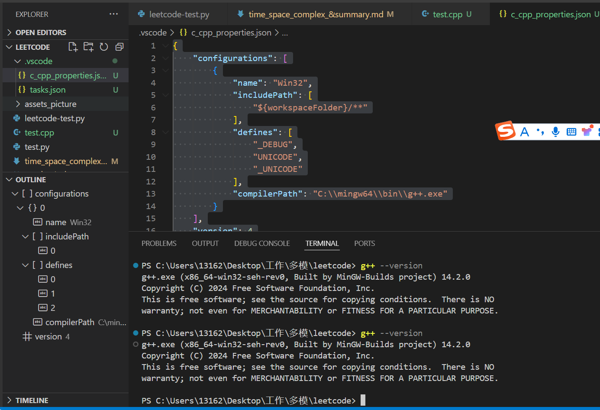
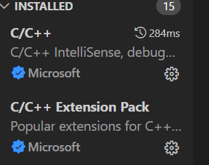
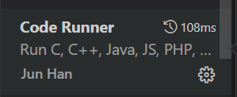

# win py
import sys

n = int(input())
for _ in range(n):
    ls = list(map(int, input().split()))
    print(ls[0] + ls[1])

运行

    PS C:\Users\13162\Desktop\工作\多模\leetcode> python.exe .\test.py
    2
    1 2
    3
    3 4
    7

debug直接用 在 input() 或者 sys.stdin 会等待输入

C:\Users\13162\.vscode\extensions\ms-python.vscode-pylance-2024.7.1\dist\typeshed-fallback\stdlib\builtins.pyi     

def input(prompt: object = "", /) -> str: ...

sys.stdin     
'1 1\n'

for line in sys.stdin:       
每次读一行 循环读取         

 input()    
'3'   
都是字符串读取 检测到键盘换行后就结束

'3 3'

但是  input()  不会读取包含换行符 也不需要sys

a= sys.stdin竟然无效

for line in sys.stdin:        
'3 2 3\n'       
更像是直接得到一个一行完整的字符串

a = line.split() 竟然还能自动去掉 \n        
['3', '2', '3']

for line in input():
    c=1

竟然这样会逐个读取       
输入 1 2          
第一次只读一个 1        
每个字符逐个读取 更像是得到一行的字符列表 字符列表竟然也能用split()        

c= input()       
但其实不是列表 '1 2 3 '      

两者在for使用上有点不一样 使用for的时候竟然是不同的效果

但是 a=sys.stdin 不能直接这样使用   
根本就不会等待输入 直接给个函数名 或者说其实是一个函数实例

a = sys.stdin
for b in a:
    pass

这样使用才可以

# g++
g++ --version

cmd 可用， vscode终端不可用？

C:\Users\13162>g++ --version
g++ (x86_64-win32-seh-rev0, Built by MinGW-Builds project) 14.2.0
Copyright (C) 2024 Free Software Foundation, Inc.
This is free software; see the source for copying conditions.  There is NO
warranty; not even for MERCHANTABILITY or FITNESS FOR A PARTICULAR PURPOSE.

C:\Users\13162>

使用 VS Code 终端的正确 Shell
检查 VS Code 使用的终端类型。你可以通过 Ctrl + ` 打开终端，并确保选择了正确的 shell：
点击终端右上角的下拉箭头。
确保选择了 Command Prompt（如果你在 cmd 中设置成功），而不是 PowerShell 或其他 shell。

解决方法：打开.vscode（外层的）下的c_cpp_properties.json文件,把正确的gcc安装地址放进“compilerPath”中。

    {
        "configurations": [
            {
                "name": "Win32",
                "includePath": [
                    "${workspaceFolder}/**"
                ],
                "defines": [
                    "_DEBUG",
                    "UNICODE",
                    "_UNICODE"
                ],
                "compilerPath": "C:/mingw64/bin/g++.exe"
            }
        ],
        "version": 4
    }

改

    {
        "configurations": [
            {
                "name": "Win32",
                "includePath": [
                    "${workspaceFolder}/**"
                ],
                "defines": [
                    "_DEBUG",
                    "UNICODE",
                    "_UNICODE"
                ],
                "compilerPath": "C:\\mingw64\\bin\\g++.exe"
            }
        ],
        "version": 4
    }

彻底关闭重启

vscode powershell cmd 都能用

## 插件

好用的

右键

# end