# 笔试 暑期实习 牛客真题 oj在线编程 OJ在线编程常见输入输出练习 acm模式

一般企业会用到以下几个平台：

牛客网：腾讯、美团等大中小厂；
赛码网：360、顺丰、字节和小红书等大中小厂；
其他小平台或自建平台：阿里等
一般企业都是选择前两个比较大的平台作为笔试的合作方，所以后面我会重点对这两个平台下的一些规则进行梳理。

该类在线测试系统也被称为 OJ (Online Judge)，即在线判题系统，是一种在编程竞赛中用来测试参赛程序的在线系统，也可以用于平时练习。关于该系统也有一些专业的术语和规则，如：
判题时经常会出现的评测状态有：


赛制：
OI 赛制：传统的赛制，比赛期间不能看到结果。以最后一次提交为准。
ACM 赛制：比赛时可以看到结果，必须 AC 了这道题目才会计分，会记录AC 这道题的耗时，每次失败的提交会加上 20 分钟的罚时。通过题目数多的排名在前；通过数一样的耗时少排名靠前。
乐多赛制：洛谷网站独创赛制。结合了 OI 赛制和 ACM 赛制的优点，既可以按照题目的测试点分点得分，也不失比赛的刺激。比赛时可以看到结果。对于一道题的得分，计算为（评测得分*0.95^(本题提交次数-1)），最低扣到原来的 70% 为止。
IOI 赛制：最不刺激的赛制，比赛时可以看到结果，计分按照这道题目的


## 输入方法汇总
输入描述：
包含多组测试用例。
对于每组测试用例：
第一行包括2个整数，N ( 1 < = N < = 1000 ) N(1 <= N <= 1000)N(1<=N<=1000)，M ( 0 < = M < = N ∗ ( N − 1 ) / 2 ) M(0 <= M <= N*(N-1)/2)M(0<=M<=N∗(N−1)/2)，代表现有 N NN 个人（用 1 ∼ N 1 \sim N1∼N 编号）和 M MM 组关系；
在接下来的 M MM 行里，每行包括3个整数，a aa，b bb， c cc，如果 c cc 为1，则代表 a aa 跟 b bb 是同乡；如果 c cc 为0，则代表a aa 跟 b bb 不是同乡；
已知1表示小赛本人。

    输入样例：
    3 1
    2 3 1
    5 4
    1 2 1
    3 4 0
    2 5 1
    3 2 1

所以要是我看到这个问题描述，直接就蒙了，我就会误以为，输入跟我没关系，默认每个输入就是一个测试用例，所以上面的输入样例中，是包含两个测试样例的，第1-2行和第3-7行。


    import math
    while 1: # 每一次循环针对一个测试样例
        #每组第一行是N和M 
        nm = list(map(int,input().split(" "))) # 每一个input()函数都针对一行输入
        N = nm[0]
        M = nm[1]
        print(str(N) + ' ' + str(M))
        # 接下来M行，每行a b c
        for i in range(M):
        abc = list(map(int,input().split(" "))) # 这里就针对除第一行输入外的其他行的输入
        a = abc[0]
        b = abc[1]
        c = abc[2]
        print(str(a) + ' ' + str(b) + ' ' + str(c))


1.2 各种输入输出的情况总结
python 语言中的输入一般使用 input() 或 sys.stdin.readline，一般使用前者即可，使用 print() 进行输出。

1.2.1 单个输入，单个输出

    input = int(input())
    output = input
    print(str(output))

1.2.2 单行多个输入，单行多个输出，空格分割（多行输入，每一行是一个测试样例）

    inputs = list(map(int, input().split(" ")))
    m, n = inputs[0], input[1]
    print(str(m), str(n))

1.2.3 多个测试案例，每个测试案例多行

    while 1:
        nm = list(map(int,input().split(" ")))
        N = nm[0]
        M = nm[1]
        print(str(n)+' '+str(m))
        for i in range(m):
            abc = list(map(int, input().split(" ")))
            a, b, c = abc[0], abc[1], abc[2]
            print(str(a)+' '+str(b)+' '+str(c))


牛客网建议使用 sys.stdin.readline() 获取输入，使用 print() 进行输出。
输入用空格隔开，如果要用 , 隔开，使用 .split(",")

2.1 多行输入，每一行是一个测试样例

    import sys 
    for line in sys.stdin:
        a = line.split()
        print(int(a[0]) + int(a[1]))

2.2 多个测试用例，每个测试用例有多行
输入包含多组测试用例。对于每组测试用例：第一行包含两个整数N和M，在接下来的M行内，每行包括3个整数。要求按照输入格式输出。

    import sys
    for line in sys.stdin:
        n, m = map(int, line.strip().split())
        print(n, m)
        for i in range(m):
            for line in sys.stdin:
                a, b, c = map(int, line.strip().split())
                print(a, b, c)5861/article/details/131903084


## 练习1 循环行读取 for line in sys.stdin 一次读完所有
输出描述：
输出a+b的结果
示例1

    输入例子：
    1 5
    10 20
    输出例子：
    6
    30
解答

    import sys

    for line in sys.stdin: 循环行读取，应该是被读取成一个iterate了 列表还是其他什么结构位置 应该就是next输出 或者是yield
        a = line.split() 行读取 切分空格 列表返回
        print(int(a[0]) + int(a[1]))


## 练习2 按行读取 input()
输出描述：
输出a+b的结果
示例1

    输入例子：
    2
    1 5
    10 20
    输出例子：
    6
    30

答案

    import sys
    
    n = int(input())
    for _ in range(n):
        ls = list(map(int, input().split()))
        print(ls[0] + ls[1])


## 练习3 
输出描述：
输出一行排序后的字符串，空格隔开，无结尾空格
示例1

    输入例子：
    5
    c d a bb e
    输出例子：
    a bb c d e

## 练习4 map直接用于整个list 而且返回值需要再转回list。int直接用不需要括号int()
    for line in sys.stdin:
        a = line.split()
        b = list(map(int, a))
        print(sum(b))

加括号会导致       
Exception has occurred: TypeError
'int' object is not callable
  File "C:\Users\13162\Desktop\工作\多模\leetcode\test.py", line 25, in <module>
    b = list(map(int(), a))
        ^^^^^^^^^^^^^^^^^^^
TypeError: 'int' object is not callable


b = list(map(int, "1"))       
也可以单个直接用 当成列表处理 好像之前有个函数也是这种逻辑         
[1]

# oppo真题
## 第一题 n, m, k = map(int, input().split())
题意：给你 x, y, k 三个正整数，每次可以选择以下操作之一

    x = x - 1
    x = x / k 当且仅当 x % k == 0
问你将 x 变为 y 的最小操作次数。

输入：

三个正整数，

输出

一行一个正整数，表示最小操作次数

样例

输入：

10 4 2

输出

2

思路与代码   
贪心，若  x % k != 0 ，将 x 减少到能整除为止，只到不能整除且大于等于 y ，然后操作1即可。

n, m, k = map(int, input().split())

竟然可以这样


    def solve() -> None:
        n, m, k = map(int, input().split())
        if k == 1:
            print(m - n)
            return
        ans = 0
        
        while n != m:
            if n // k >= m:
                ans += n % k 这个地方太巧妙 不能说简单吧 
                n //= k 题目只给/ - % 竟然能联想到用 // 来减少运算
            else:
                n -= 1 
            ans += 1
        print(ans)    

    if __name__ == '__main__':
        solve()


按照 10 1 3的例子 我肯定会进入else 但是这个方法进竟然没进入


写得比较巧妙 加大理解难度


## 第二题 counter。 for k, v in cnta.items(), from collections import Counter
题意
小O有一个字符串 s，她希望重新排列这个字符串，并改变字符的大小写，使得新的字符串包含尽可能多的字符串 a 或者字符串 b 。请问小O最多能包含多少个子串 a 和 b ， 如果字符串t可以通过从字符串s的开头删除若干(可能为零或全部)字符以及字符串 s 的结尾删除若干(可能为零或全部)字符得到，则字符串 t 是字符串 s 的子串。

输入：

三行三个字符串，s, a, b 其中 a和b开头均为大写，其余均为小写

输出：

包含的子串个数

样例

输入：

    abcdefg
    Abc
    Fge
输出：

2


文字太多

由于 a 和 b 的首字母大写，所有不存在重叠，那么考虑贪心，枚举有多少个 a ,然后计算剩下的字符能组成多少个 b，取最大值即可

题解看不懂

    def solve() -> None:
        s = input()
        a = input()
        b = input()
        s = [x.lower() for x in s]
        a = [x.lower() for x in a]
        b = [x.lower() for x in b]
        cnts = Counter(s)
        cnta = Counter(a)
        cntb = Counter(b)
        ans = 0
        for i in range(len(s)+1):
            ok = True
            for k, v in cnta.items():
                if cnts[k] < i * v:
                    ok = False
            if ok:
                now = len(s)
                for k, v in cntb.items():
                    now = min(now, (cnts[k] - i * cnta[k]) // v)
                ans = max(ans, i + now)
        print(ans)

    if __name__ == '__main__':
        solve()

还是比较难的


这他妈还比较简单？ 两个for循环 一个min中带有// 还有一个max

true false循环设置 以及ok定义完全不知道在干什么

这三行代码使用 Counter 计算每个字符在字符串 s、a 和 b 中出现的频率。cnts、cnta 和 cntb 是三个字典，分别记录了字符及其出现次数。

ok 被用来检查在 s 中是否有足够的字符来满足 i 个字符串 a。

不要求顺序吗


for k, v in cnta.items(): 检查 cnts 中每个字符是否有足够的数量来满足 i 个 a 字符串的需求。   
如果满足条件，计算剩余字符能组成多少个 b 字符串，并更新最大值 ans。    
ans = max(ans, i + now): 通过比较当前计算的值和之前的最大值来更新 ans。   

这段代码的目的是从三个字符串 s、a 和 b 中计算一个最大值 ans。这个值表示你可以从字符串 s 中提取出尽可能多的字符串 a，然后用剩下的字符构造尽可能多的字符串 b。最终，ans 是这些字符串 a 和 b 组合的最大值。


确实牛逼

小O有一个字符串 s，她希望重新排列这个字符串，并改变字符的大小写，使得新的字符串包含尽可能多的字符串 a 或者字符串 b 。请问小O最多能包含多少个子串 a 和 b ， 如果字符串t可以通过从字符串s的开头删除若干(可能为零或全部)字符以及字符串 s 的结尾删除若干(可能为零或全部)字符得到，则字符串 t 是字符串 s 的子串。

题意好像比较矛盾


    now = len(s)
    for k, v in cntb.items():
        now = min(now, (cnts[k] - i * cnta[k]) // v)

如果满足条件，计算剩余字符能组成多少个 b 字符串，并更新最大值 ans。

整个下来挺绕 边界问题竟然被倒逼处理这么好

// v 不太懂是为什么

now = min(now, (cnts[k] - i * cnta[k]) // v)

这句代码 now = min(now, (cnts[k] - i * cnta[k]) // v) 的作用是计算在当前情况下，字符 k 能够满足的最大数量，并更新 now 为其最小值。它是用于确定在 i 个 a 组成的字符串后，剩下的字符能组成的 b 字符串的数量。


// v 是为了计算在剩余字符中，能够组成多少个 b 中需要的字符 k。即通过整数除法确定剩余的字符数量除以每个 b 字符串所需的字符数 v，从而得到可以组成的 b 字符串的数量。

假设我剩下 5个，v=5，那么//v得到1个？

ChatGPT 说：
ChatGPT
是的，正如你所理解的，如果剩下 5 个字符，而每个 b 字符串需要 5 个这样的字符，那么 5 // 5 的结果是 1。这个结果表示，在剩下的字符中，你最多可以组成 1 个 b 字符串。

在这段代码中，// v 用来确定你能用剩余的字符来组成多少个 b 字符串。这里的逻辑是将剩余的字符数除以每个 b 字符串需要的字符数，从而确定最多可以组成多少个 b 字符串。


原来如此


## 第三题

题意
给你一颗树，包含 n 个节点和 n-1 条边，你可以在树中选两个节点进行连无向边，要求连边后的无向图是二分图，问你能连接的最多的边的个数。

输入：

一行一个整数 n, 接下来 n-1 行输入树的边

输出：

能增加的最多的边的条数

样例

输入：

    4
    1 2
    2 3
    3 4
输出：

2


一看就看不懂

本次比试难度适中，没有特别刁钻的题目。第一题简单的贪心，分析一下不难写出来。第二题也是基础的哈希的应用，难度不大。第三题是经典图论问题，dfs遍历即可，注意不要重复遍历。

这他妈


二分图染色，将节点分为两个集合，那么两个集合的点相互连边，这样可以保证结果仍是二分图。假设两个集合个数为 x, y=n-x , 那么答案为 x*y-(n-1)

二分图の定义

        二分图又叫二部图，是图论中的一种特殊模型。

        假设S=(V,E)是一个无向图。如果顶点V可分割为两个互不相交的子集(A,B)，并且图中的每条边(i,j)所关联的两个顶点i和j分别属于这两个不同的顶点集(i in A,j in B)，就可以称图S为一个二分图。简单来说，就是顶点集V可分割为两个互不相交的子集，并且图中每条边依附的两个顶点都分属于这两个互不相交的子集，两个子集内的顶点不相邻。

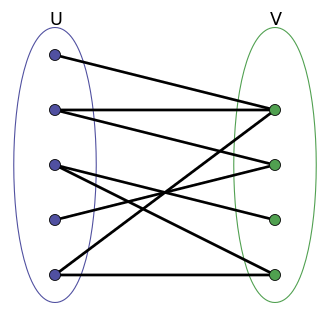

已经很像数学题了        

这题完全不懂


二分图（Bipartite Graph）是一种特殊的图，其中的节点可以被分成两个独立的集合，使得图中的每条边都连接这两个集合中的一个节点。换句话说，二分图中的节点集合可以被划分成两个互不相交的集合，使得所有的边都只在这两个集合之间连接，而不在同一集合内部连接。

图像示例
考虑一个简单的二分图示例：

图 1

    1      2
    |      |
    3      4
这个图是一个二分图，因为你可以将节点分为两组：

集合 𝑈
={
1
,
4
}
U={1,4}

集合 𝑉
={
2
,
3
}
V={2,3}


{竟然可以当成标题

所有的边都连接这两个集合的一个节点。具体来说：

边 
(
1
,
2
)
(1,2) 连接 
𝑈
U 中的节点 1 和 
𝑉
V 中的节点 2。
边 
(
1
,
3
)
(1,3) 连接 
𝑈
U 中的节点 1 和 
𝑉
V 中的节点 3。
边 
(
2
,
4
)
(2,4) 连接 
𝑉
V 中的节点 2 和 
𝑈
U 中的节点 4。
边 
(
3
,
4
)
(3,4) 连接 
𝑉
V 中的节点 3 和 
𝑈
U 中的节点 4。
你可以看到，这个图没有包含奇数长度的环（例如长度为 3 的环），所以它是一个二分图。


图 2（不是二分图）

    1
    / \
    2 - 3
这个图不是二分图，因为它包含了一个长度为 3 的环（1 → 2 → 3 → 1）。在二分图中，我们无法将其节点分为两个集合，使得每条边都连接不同集合中的节点。


如何判断一个图是否是二分图        
判断一个图是否是二分图的一种常用方法是使用 广度优先搜索（BFS） 或 深度优先搜索（DFS） 来尝试对图进行二分着色。如果在搜索过程中发现两个相邻的节点被着上了相同的颜色，则图不是二分图。


二分图（Bipartite Graph）是一种特殊的图，其中的节点可以被分成两个独立的集合，使得图中的每条边都连接这两个集合中的一个节点。换句话说，二分图中的节点集合可以被划分成两个互不相交的集合，使得所有的边都只在这两个集合之间连接，而不在同一集合内部连接。

二分图的性质
节点划分: 二分图的节点集合可以被划分为两个集合 
𝑈
U 和 
𝑉
V，使得每条边的两个端点分别属于这两个集合中的一个。
无奇环: 一个图是二分图的当且仅当它不包含奇数长度的环（循环）。即，二分图不能包含任何长度为奇数的环。
图的着色: 二分图可以用两种颜色来着色，使得相邻的节点颜色不同。
图像示例
考虑一个简单的二分图示例：

图 1
yaml
复制代码
   1      2
   |      |
   3      4
这个图是一个二分图，因为你可以将节点分为两组：

集合 
𝑈
={
1
,
4
}
U={1,4}
集合 
𝑉
={
2
,
3
}
V={2,3}
所有的边都连接这两个集合的一个节点。具体来说：

边 
(
1
,
2
)
(1,2) 连接 
𝑈
U 中的节点 1 和 
𝑉
V 中的节点 2。
边 
(
1
,
3
)
(1,3) 连接 
𝑈
U 中的节点 1 和 
𝑉
V 中的节点 3。
边 
(
2
,
4
)
(2,4) 连接 
𝑉
V 中的节点 2 和 
𝑈
U 中的节点 4。
边 
(
3
,
4
)
(3,4) 连接 
𝑉
V 中的节点 3 和 
𝑈
U 中的节点 4。
你可以看到，这个图没有包含奇数长度的环（例如长度为 3 的环），所以它是一个二分图。

图 2（不是二分图）
复制代码
   1
  / \
 2 - 3
这个图不是二分图，因为它包含了一个长度为 3 的环（1 → 2 → 3 → 1）。在二分图中，我们无法将其节点分为两个集合，使得每条边都连接不同集合中的节点。

如何判断一个图是否是二分图
判断一个图是否是二分图的一种常用方法是使用 广度优先搜索（BFS） 或 深度优先搜索（DFS） 来尝试对图进行二分着色。如果在搜索过程中发现两个相邻的节点被着上了相同的颜色，则图不是二分图。

示例代码
下面是一个使用 BFS 判断一个图是否是二分图的 Python 代码示例：


    from collections import deque, defaultdict

    def is_bipartite(graph, start):
        color = {}
        queue = deque([start])
        color[start] = 0
        
        while queue:
            node = queue.popleft()
            current_color = color[node]
            
            for neighbor in graph[node]:
                if neighbor not in color:
                    color[neighbor] = 1 - current_color
                    queue.append(neighbor)
                elif color[neighbor] == current_color:
                    return False
        
        return True

    def check_bipartite(graph):
        for node in graph:
            if node not in color:
                if not is_bipartite(graph, node):
                    return False
        return True

    # 图的表示：邻接列表
    graph = {
        1: [2, 3],
        2: [1, 3],
        3: [1, 2]
    }

    color = {}
    print("The graph is bipartite:" if check_bipartite(graph) else "The graph is not bipartite.")
在这个示例中，graph 是一个用邻接列表表示的图。如果图是二分图，程序将输出“图是二分图”；否则，输出“图不是二分图”。


    def solve() -> None:
        n = sint()
        adj = [[] for _ in range(n)]
        for i in range(n - 1):
            x, y = mint()
            adj[x - 1].append(y - 1)
            adj[y - 1].append(x - 1)
        m = 0
        def dfs(u, fa, c):
            nonlocal m
            if not c:
                m += 1
            for v in adj[u]:
                if v != fa:
                    dfs(v, u, not c)
        dfs(0, -1, False)
        print(m * (n - m) - (n - 1))
        

    if __name__ == '__main__':
        solve()


    n = map(int, input().split()) 竟然不行
    adj = [[] for _ in range(n)]
    for i in range(n - 1):
        x, y = map(int, input().split())
        adj[x - 1].append(y - 1)
        adj[y - 1].append(x - 1)


代码挺复杂 但是答案不对       
而且后处理很复杂     

        for v in adj[u]:
            if v != fa:
                dfs(v, u, not c)
    dfs(0, -1, False)
    print(m * (n - m) - (n - 1))

n 表示节点数，树的节点数量为 n。
adj 是一个邻接列表，用于表示树的边。
接下来，读入 n-1 条边，每条边连接两个节点 x 和 y。由于 Python 使用零索引，所以减去 1 来适应零索引的数组。


dfs 函数用于遍历树，并计算满足特定条件的节点数量。
u 是当前节点，fa 是父节点，c 是当前节点的颜色（布尔值）。c 从 False 开始。
如果 c 是 False（即节点 u 的颜色为 False），则增加计数 m。
遍历所有与 u 相邻的节点 v，递归调用 dfs，并切换颜色。


计算结果:


    print(m * (n - m) - (n - 1))
m 代表树的节点被染成 False 颜色的数量。
n - m 是树中被染成 True 颜色的节点数量。
m * (n - m) 计算了 False 节点与 True 节点之间边的数量的期望值。
n - 1 是树中总的边数，因为树有 n-1 条边。
结果是两个集合节点之间的边的数量减去 n - 1。


代码的目的是计算一个树的所有节点被分为两个集合后，这两个集合之间的边数的期望值。具体计算方式是通过对树进行二分颜色处理，统计每种颜色的节点数，然后计算这两个集合之间的边数减去树的总边数（n - 1）。

示例替代输入函数
你可以使用 Python 的内置 input() 函数替代 sint() 和 mint()，例如：


    def sint():
        return int(input().strip())

    def mint():
        return map(int, input().strip().split())

太扯了 辅助了也不懂

什么染色完全不明白

图论占比大吗


## 研发b卷814

本次oppo的机考有些卷子出了之前的原题了，还没投的赶紧投了噢，oppo的招聘持续性没有那么强的！

本次比试难度适中。

第1题打卡题，分析出来可以直接秒。

第2题需要分析要求的特点，根据特性来运算，数据很大不能特别暴力。

第3题的n,m比较小，观察到这个点就会好做了。

### 第一题
打卡

题意
有一个无限大的二维平面，上面有小O的两个机器人 A，B，其坐标分别为 (x1, y1) 和 (x2, y2)，小O现在可以操作任意一个机器人进行移动。

具体的，每次移动，被选择的机器人都可以选择四个方向(“上”，“下”，“左”，“右”，)之一，移动一个距离。

小O想知道，将两个机器人移动至同一个格子，最少需要几次移动。


### 第二题

题意
小O有一个仅包含小写字母的字符串，如果一个字符串某个字母出现次数严格大于其他字母出现次数之和，那么这个字符串就是一个好串。小O想删除字符串中的一些字符，使得剩下的字符串是一个好串，问最少删除多少个字符。

输入描述
在一行上输入一个长度不超过 10^5，且仅包含小写字母的字符串s.

输出描述
在一行上输出一个整数，代表最少删除多少个字符。

示例1：
输入：

aaabcd

输出：

1


还好，能分析


直接字典记录次数 找最大 然后直接数学加减计算， 多加1即可      
count > (total - count - 待减x ) 

直接得到 待减x         

不需要counter 内置函数麻烦


### 第三题 没有任何应用逻辑 只是为了出题而出题 语言不通

题意
小O有一个长度为 n 的数组 a1, a2, ..., an，初始全部元素都是 0。

他可以对数组中的一些区间使用“加一"操作：具体的，如果区间是 [l,r]， 则数组中 al 到 ar 的所有数字的值都会加一。

他想使得数组 a 最终单调不降，请问他最多可以选择多少个区间执行操作，使得a仍然满足单调不降。输入描述：输出描述：

输入描述
第一行输入两个整数 n, m (1 ≤ n, m ≤ 20) 表示数组的元素数量，以及可选的区间个数。

接下来 m 行，第 i 行输入两个整数 li, ri (1 ≤ li ≤ ri ≤ n) 表示第 i 个可选区间为 [li, ri]。

输出描述
在一行上输出一个整数，表示最多可以选择的区间个数。

示例1：
输入：

    5 4
    1 2
    2 3
    3 4
    5 5
输出：

    3
说明：

选择第一、三、四个区间操作即可，数组变为{1,1,1,1,1}，满足单调不降。

示例2：
输入：

    10 5
    1 5
    2 5
    3 9
    4 5
    1 6
输出：

    0


代码能稍微看懂 但是没有逻辑 没有价值


if ((mask & (1 << i)) != 0)


这行代码是位操作的一个常见用法，用于检查一个整数（mask）在特定位（由变量i指定）上的值是否为1。这里逐步解释它的工作原理：

    (1 << i)：这是一个位左移操作。它创建了一个整数，该整数在二进制表示中只有第i位（从右往左数，最右边为第0位）是1，其余位都是0。比如，如果i是2，那么(1 << 2)的结果是4（二进制表示为100）。
    mask & (1 << i)：这是一个位与（AND）操作。它将mask与上面步骤中创建的整数进行位与操作。这个操作的结果是一个新的整数，其每一位都是mask和(1 << i)对应位上值的逻辑与结果。因为(1 << i)除了第i位是1之外其余位都是0，所以这个操作实际上只检查了mask的第i位是否为1。如果mask的第i位是1，那么结果就是那个只有第i位是1的整数（即(1 << i)本身）；如果mask的第i位是0，那么结果就是0。
    if ((mask & (1 << i)) != 0)：这个条件判断语句检查上述位与操作的结果是否不等于0。如果不等于0（即mask的第i位是1），那么条件为真，执行if语句块内的代码。这通常用于遍历一个整数的所有位，并检查每一位的值。
    这种技术广泛用于处理位掩码（bitmask），位掩码是一种使用二进制位来表示一系列布尔值的紧凑方法。每个位可以独立地设置或清除，以表示相应的布尔值（true或false）


# 京东
8.10京东研发岗   
考点分别为：模拟、哈希表/二分查找、贪心+位运算


## 第一题：薯条哥醉酒

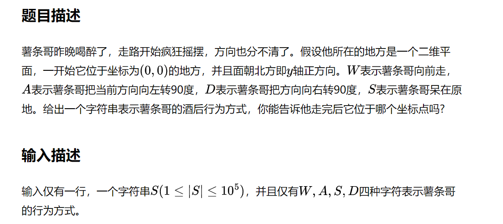

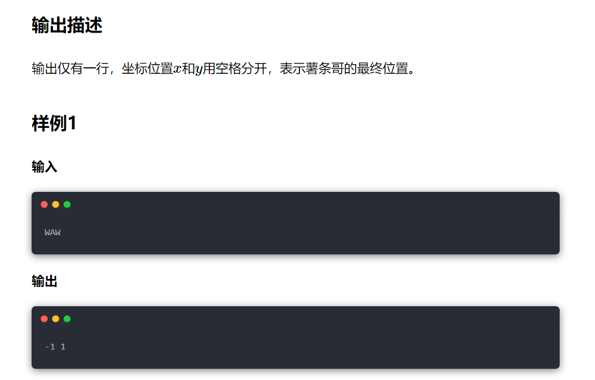

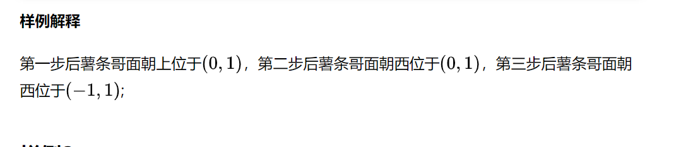


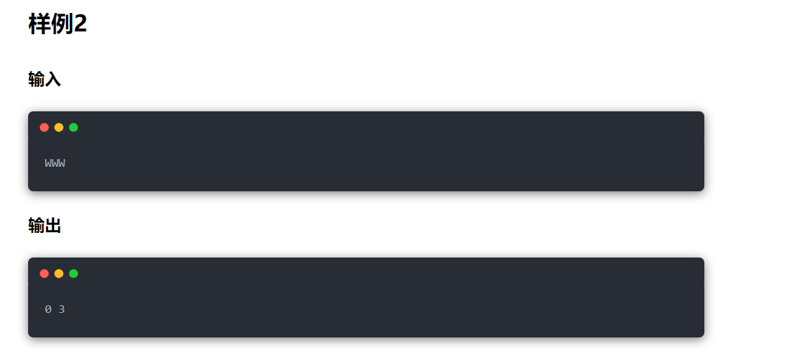


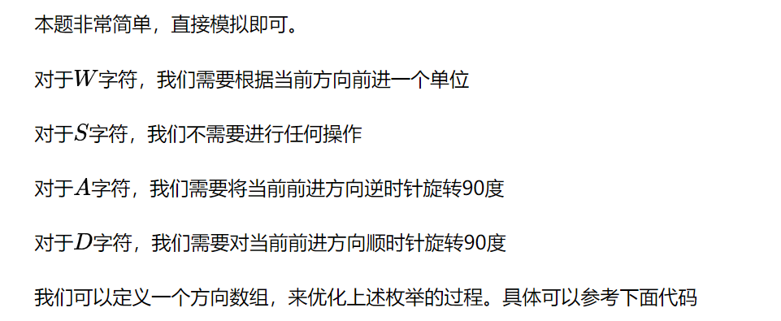


    dx = [0, 1, 0, -1]
    dy = [1, 0, -1, 0]  # 北东南西四个方向
    x, y, dirc = 0, 0, 0  # 定义初始位置,初始前进的方向(北方向)

    s = input()

    for ch in s:
        if ch == 'W':
            x = x + dx[dirc]
            y = y + dy[dirc]
        elif ch == 'A':  # 逆时针旋转90度
            dirc = (dirc - 1 + 4) % 4
        elif ch == 'D':   # 顺时针旋转90度
            dirc = (dirc + 1) % 4

    print(x, y)


这才是人做的

## 第二题：求和对数。 哈希表特殊应用 以key作为 加减结果 的索引


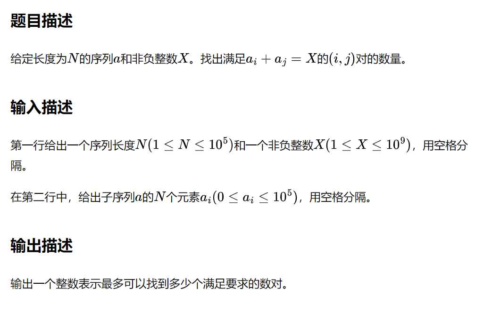


样例
输入

    3 4
    1 2 3
输出

    3

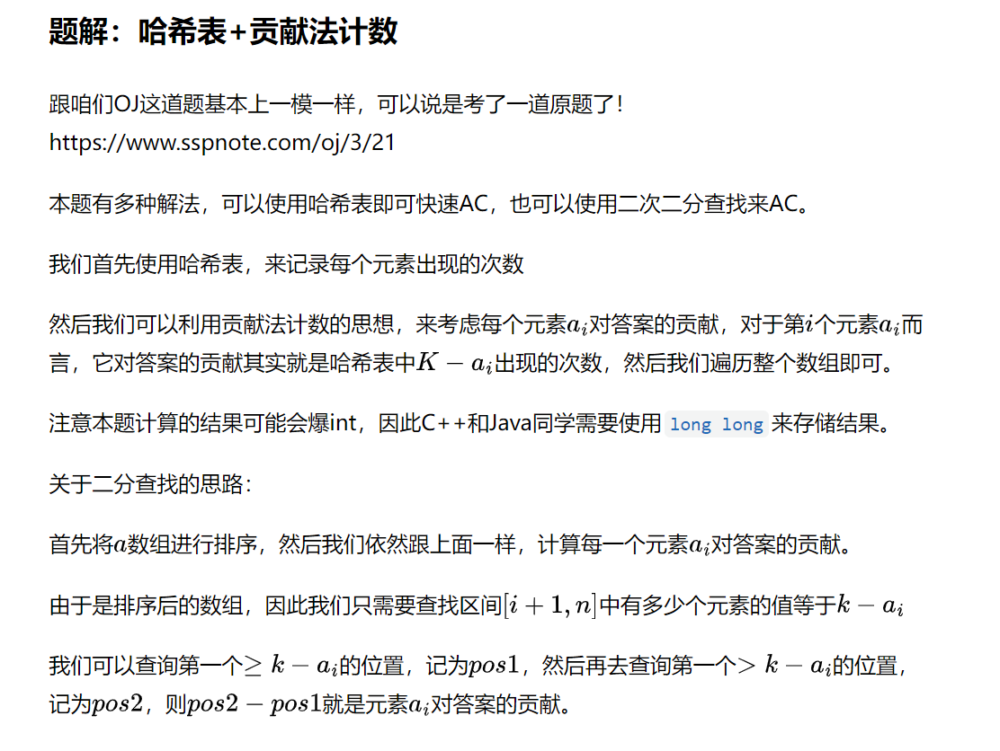

把值直接当成键记录进去。    
半个counter()

    n, k = map(int, input().split())
    a = list(map(int, input().split()))
    cnts = {}
    for i in range(n):
        if a[i] in cnts:
            cnts[a[i]] += 1
        else:
            cnts[a[i]] = 1
    res = 0
    for i in range(n):
        if k - a[i] in cnts:
            res += cnts[k - a[i]]
    print(res)

## 第三题：区间操作


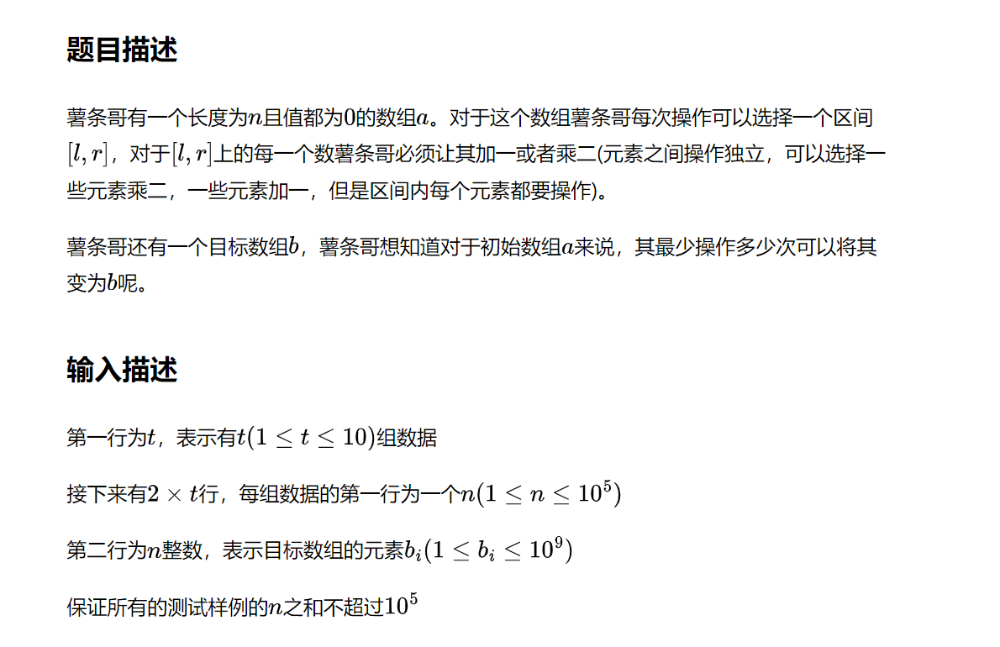


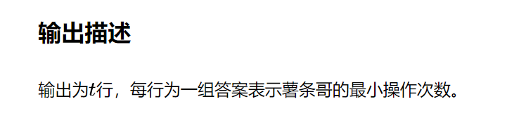


样例
输入

    2
    5
    1 1 2 1 1
    5
    1 2 3 4 5
输出

    2
    4


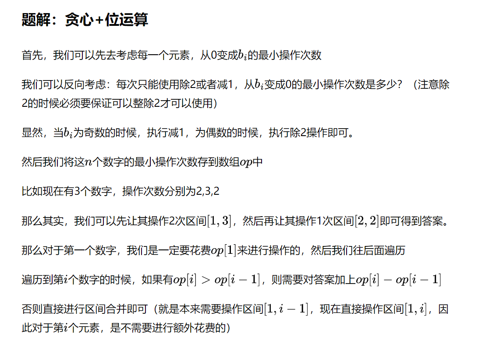


没看懂？


    def calc(n):
        cnt = 0
        while n > 0:
            if n & 1:
                n -= 1
            else:
                n //= 2
            cnt += 1
        return cnt

    def solve():
        n = int(input())
        a=list(map(int,input().split()))
        op=[0]*n
        for i in range(n):
            op[i]= calc(a[i])
        res = op[0]
        for i in range(1, n):
            res += max(0, op[i] - op[i - 1])
        print(res)

    t = int(input())
    while t > 0:
        solve()
        t -= 1


calc(n) 函数:

功能：计算将 n 变成 0 所需的步骤数。
逻辑：通过判断 n 是奇数还是偶数来决定操作。如果 n 是奇数，则减去 1；如果是偶数，则除以 2。每次操作都计数，直到 n 变成 0。


solve() 函数:

功能：处理每个测试用例，计算并输出结果。
逻辑：
读取整数 n 和包含 n 个整数的列表 a。
对每个整数计算步骤数，将结果存储在 op 列表中。
计算每个步骤数之间的差异，如果当前值大于前一个值，则累加到 res。

    示例：对于输入 n = 3 和 a = [4, 6, 5]：
    计算步骤数：op = [3, 4, 4]
    差异计算：res = 3 + max(0, 4-3) + max(0, 4-4) = 3 + 1 + 0 = 4


主循环:

功能：处理多个测试用例。
逻辑：读取测试用例数量 t，然后循环调用 solve() 函数处理每个测试用例。
示例：如果 t = 2，会依次处理两个测试用例的输入数据。
整体来说，代码的“ultimate”目标是计算和输出每个测试用例的最终结果，即所有数值的“变换步骤数”之和。

还是nlp牛逼


比如现在有3个数字，操作次数分别为2,3,2

那么其实，我们可以先让其操作2次区间，然后再让其操作1次区间即可得到答案。

那么对于第一个数字，我们是一定要花费来进行操作的，然后我们往后面遍历


这块不懂 操作都可以保持一致？万一一个加一个乘呢？


薯条哥有一个长度为且值都为的数组a。对于这个数组薯条哥每次操作可以选择一个区间，对于上的每一个数薯条哥必须让其加一或者乘二(元素之间操作独立，可以选择一些元素乘二，一些元素加一，但是区间内每个元素都要操作)。


始终是题意得问题 第一句和最后一句一直到最后才读懂


## 0817秋招

第1题属于比较基础的模拟，按题意要求操作即可。

第2题数据范围是1000，可以直接去枚举匹配。

第3题是DAG的dp，整体的推导也没有很多坑，难度也中等。


### 第一题


题意
村子里有一些桩子，从左到右高度依次为1,1+2,1+2+3…，每两颗桩子之间的间隔为1.现在下了一场大雪，但是不知道雪下了多厚，现在给你两个数字，这是雪后某相邻两个桩子在雪面的高度，请你通过这两个数字计算雪的厚度。

输入描述
在一行中输入两个正整数a,b

1≤a<b≤5*10^5

输出描述
在一行中输出一个整数代表雪的厚度。我们可以证明，答案一定存在

示例1：
输入：

8 13
输出：

2
示例2：
输入：

10 15
输出：

0
思路与代码
首先算出两个柱子a, b之间的差值c，

然后就可以还原出下雪前b柱子的高度 ：1 + 2 + 3 + ... + c。

这个高度减去b柱子下雪前的高度就是雪的厚度。

#include <iostream>
#include <cstring>
#include <algorithm>
using namespace std;

int main()
{
    int a, b;
    cin >> a >> b;
    int c = b - a;
    int sum = (c + 1) * c / 2;
    cout << sum - b;
    return 0;
}

### 第二题

题意
牛牛有一种锯齿状的积木，这种积木比较长，但是每个单位长度的高度是相等的，高度为1或者2。现在牛牛拿出了两块长度分别为n 和 m 的积木，她现在想把这两块积木拼接在一起，即使中间有空隙也没有关系。但是拼接后的积木的高度要不超过 3，请你帮助牛牛计算在满足这个前提下拼接后的积木的长度最短可以是多少。

输入描述
第一行给出两个正整数 n,m，代表第一块和第二块积木的长度 第二行给出 n 个数字代表第一块积木每个单位的高度 第三行给出 m 个数字代表第二块积木每个单位的高度


输出描述
在一行中输出一个正整数代表拼接后积木的最短长度

示例1：
输入：

7 10
2212112
2112112112
输出：

10
示例2：
输入：

3 2
222
22
输出：

5
思路与代码
数据范围很小，直接枚举匹配的起点位置就可以，复杂度为。 这里是固定其中一条字符串，移动另一条来匹配。边界条件容易出错，需要特别注意。

    #include <iostream>
    #include <cstring>
    #include <algorithm>
    using namespace std;

    int main()
    {
        int n, m;
        cin >> n >> m;
        string sn, sm;
        cin >> sn >> sm;

        int res = m + n;
        
        for(int j = - m; j < n; j ++)   //枚举要匹配的起始点
        {
            # 傻逼？ int idxm = j;
            int cnt = 0; //cnt表示两个字符串重叠之后小于等于3的长度
            bool flag = true;
            int idxn = j > 0 ? j: 0;   //sn字符串的匹配起点 有点骚
            
            for(int i = j; i < j + m; i ++)  //sm字符串匹配 还行吧 就是这两行写得乱 nm这种命名就是傻子 还有加减界限
            {
                if(i < 0) continue;
                if(idxn >= n) break;
                if(sn[idxn] - '0' + sm[i - j] - '0' > 3){
                    flag = false;
                    break;
                }
                idxn ++;
                cnt ++;
            }
            if(flag)  res = min(res, m + n - cnt);
        }
        cout << res;
        return 0;
    }

题意比较难以理解 这种题最好有图 有视频         
现在多模态确实还没有那么强          

这个解法倒是不难理解


在Python中，当你看到类似sm[i - j] - '0'的代码时，这实际上是一种将字符（假设是数字字符）转换为整数（int）的常用技巧。在Python中，字符和整数之间不能直接进行算术运算，但字符和字符之间可以进行减法运算，前提是这些字符代表的数字在ASCII码表中是连续的。

具体来说，数字字符（如'0', '1', '2', ..., '9'）在ASCII码表中的值是连续的，'0'的ASCII值是48，'1'的ASCII值是49，依此类推，直到'9'的ASCII值是57。因此，当你从一个数字字符中减去'0'时，你实际上是在从该字符的ASCII值中减去'0'的ASCII值（即48），从而得到该字符所代表的整数值。


### 第三题
题意


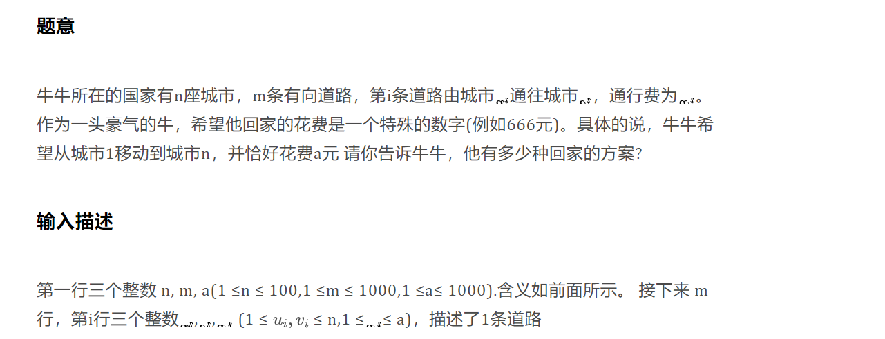


输出描述如果牛牛回家的方案数大于等于20220201种,请你在第一行输出All roads lead to Home! ，然后在第二行输出回家的方案数对20220201取模的结果。
否则只需要输出一行一个整数，表示牛牛回家的方案数示例：输入：

    3 6 2
    1 2 1
    1 2 1
    1 2 1
    2 3 1
    2 3 1
    2 3 1
输出：9


思路与代码使用一个二维数组 dp 来表示从城市 1 到达城市 i，花费 j 元的路径数。dp[i][j] 表示从城市 1 到城市 i，花费正好为 j 的路径数。转移方程：对于每一条从 vi 到 ui，花费 wi 的边，我们可以进行如下状态转移：dp[ui][j + wi] += dp[vi][j]其中 j + wi 不超过 a。
答案即为 dp[n][a]，表示从城市 1 到城市 n，花费恰好为 a 的路径数。需要注意的是要及时对dp数组取模，一旦中间过程一个答案超过了INF，那么后面由这个点转移过去的答案都超过INF，这里用st数组记录。

    #include <iostream>
    #include <cstring>
    #include <algorithm>
    #include <vector>

    const int INF = 20220201;
    using namespace std;

    int main() {
        int n, m, a;
        cin >> n >> m >> a;

        vector<vector<pair<int, int>>> graph(n + 1); 
        for (int i = 0; i < m; ++i) {
            int vi, ui, wi;
            cin >> vi >> ui >> wi;
            graph[vi].emplace_back(ui, wi);
        }

        vector<vector<int>> dp(n + 1, vector<int>(a + 1, 0));
        vector<vector<bool>> st(n + 1, vector<bool>(a + 1, 0));
        dp[1][0] = 1; 
       
        for (int i = 0; i < a; ++i) {
            for (int v = 1; v <= n; ++v) {
                if (dp[v][i] > 0 || st[v][i]) {  
                    for (auto &[u, w] : graph[v]) {
                        if (i + w <= a) {
                            dp[u][i + w] = (dp[u][i + w] + dp[v][i]) % INF;
                            if(dp[u][i + w] + dp[v][i] >= INF) st[u][i + w] = true;
                            if(st[v][i]) st[u][i + w] = true;
                        }
                    }
                }
            }
        }
        if(st[n][a]) cout << "All roads lead to Home!" << endl;
        cout << dp[n][a] << endl; 
        return 0;
    }

py


    INF = 20220201

    def main():
        import sys
        input = sys.stdin.read
        data = input().split()
        index = 0

        def next_int():
            nonlocal index
            index += 1
            return int(data[index-1])

        n, m, a = next_int(), next_int(), next_int()
        graph = [[] for _ in range(n + 1)]
        for _ in range(m):
            vi, ui, wi = next_int(), next_int(), next_int()
            graph[vi].append((ui, wi))

        dp = [[0] * (a + 1) for _ in range(n + 1)]
        st = [[False] * (a + 1) for _ in range(n + 1)]
        dp[1][0] = 1

        for i in range(a):
            for v in range(1, n + 1):# 好像是通过这个地方保证了两条路连起来
                if dp[v][i] > 0 or st[v][i]: 这里也巧妙 如果没有路径的记录会被跳过。 or st[v][i]仍然没看懂这是要干嘛？就是上条路径如果超了，后续新路径就不开了 不计算了？ 不是要取模吗？？
                不对好像是说 抄了就继续进去，但是如果上条dp没有路 为0 进去有什么意义？ 这里难以验证 没有官方例子使用
                    for u, w in graph[v]:# 好像是通过这个地方保证了两条路连起来。首先第二条路起点是v
                        if i + w <= a: # 
                            dp[u][i + w] = (dp[u][i + w] + dp[v][i]) % INF  #有些巧妙 竟然能保证路是连起来的。 然后第一条路的终点是v 很巧妙 这种字典键值的处理
                            然后 dp设置成二维也很巧妙 保证了将 不同终点 以及 相同终点不同价格 都记下来
                            if dp[u][i + w] + dp[v][i] >= INF:
                                st[u][i + w] = True
                            if st[v][i]:
                                st[u][i + w] = True

        if st[n][a]:
            print("All roads lead to Home!")
        print(dp[n][a])

    if __name__ == "__main__":
        main()

这题根本不简单

照着官方例子走一遍还行

## 831
炸裂


本次笔试难度适中。第一题打卡题，难度比较低。第二题是思维题，并不是特别好想。第三题动态规划，难度适中，不会特别难的。

### 1

小明获得了一项任务，任务是一个谜题，谜题的答案是一个长度为N的字母串。小明试图寻找答案，整理出所有的字符串。为了不重复，他萌生了按字典序浏览单词的想法。但是小明已经厌倦了手动计算每个字符串的下一个字符串，所以他想让你帮助他编写一个程序自动化实现这个过程。编写一个程序，根据输入的字母串，按字典序输出下一个单词(长度相同)


输入描述输入的第一行给出一个字符串S;
1 ≤ S < 10^3

字母串仅包含小写字母，输出描述根据输入的字母串，按字典序输出与给出字母串长度相同的下一个字母串。若没有这样的字母串，输出-1。

示例1输入zz
输出-1

示例2输入aa
输出ab


一开始没看懂

后来看懂，觉得得从后外前改变，然后记录，但是忘记怎么数字和字母互相转换

思路与代码：判断是否全是z，全是z输出-1
找到第一个不是z的然后当面字母加1，后面的的全变成a


    import java.util.Scanner;

    public class Main {
        public static void main(String[] args) {
            Scanner scanner = new Scanner(System.in);
            String s = scanner.nextLine().strip();
            System.out.println(solve(s));
            scanner.close();
        }

        public static String solve(String s) {
            char[] sArray = s.toCharArray();
            int n = sArray.length;

            int i = n - 1;
            while (i >= 0 && sArray[i] == 'z') {
                i--;
            }

            if (i == -1) {
                return "-1";
            }

            sArray[i] = (char) (sArray[i] + 1);
            for (int j = i + 1; j < n; j++) {
                sArray[j] = 'a';
            } 写得好简单
            return new String(sArray);
        }
    }

py


    def solve(s: str) -> str:
        s_array = list(s)
        n = len(s_array)

        i = n - 1
        while i >= 0 and s_array[i] == 'z':
            i -= 1 他这思路这么简单吗？

        if i == -1:
            return "-1"

        s_array[i] = chr(ord(s_array[i]) + 1) 只对第一个非z 加1

        for j in range(i + 1, n):
            s_array[j] = 'a'

        return "".join(s_array)


    if __name__ == "__main__":
        s = input().strip()
        print(solve(s))

`chr()` 和 `ord()` 是 Python 中两个用于字符和 Unicode 码点之间相互转换的函数。

1. **`ord()` 函数**: 接受一个字符作为输入，返回对应的 Unicode 码点（整数）。例如：

   ```python
   ord('A')  # 输出: 65
   ```

2. **`chr()` 函数**: 接受一个整数（Unicode 码点）作为输入，返回对应的字符。例如：

   ```python
   chr(65)  # 输出: 'A'
   ```

所以，`chr(ord(x))` 这种表达式通常用于将字符 `x` 转换为其对应的 Unicode 码点，然后再转换回原字符 `x`。这是一个无操作（no-op），因为它并不改变输入字符的值。


AI Overview
Learn more
…
The full name of the functions chr() and ord() is "character to integer" and "integer to character", respectively. These are built-in functions in Python that convert characters to integers and vice versa.


It stands for “ordinal”. The ordinal here is the number representing the position of c in the sequence of Unicode codepoints.

序数

太简洁了 还有键值 以及一次性操作 不需要for能放逻辑判断        


### 2 高优先：奇偶问题

给出一个几个互不相同的非负整数，最初是无序的，现在有两种操作:选择两个连续的数字，然后反转他们的位置，比如「1,2会变成2，1选择三个连续的数字，然后反转他们的位置，比如「1,2,3会变成3,2,1可以证明，在有限次以上两种操作下，一定可以将数列变为有序。但是如果一直进行第一种操作，那不就变成冒泡排序了吗，所以你要最小化第一种操作的次数。现在问在要把所有数字变成升序的前提下，最少要进行多少次第一种操作?


这个也是后来结合gpt一起想的 确实给出了看起来可行的办法 然后牛客大佬给的是什么奇偶数 这更难想了


输入描述第一行输入一个正整数n，代表数字的个数
接下来n行，每行一个整数ai,保证这些数字互不相同
l ≤ n ≤ 10^5
0 ≤ ai < 10^9输出描述输出一个整数，代表最少进行的操作1的次数示例

输入4
2
4
3
1

输出1

说明

先对最后三个数字进行一次操作2，然后再对前两个数字进行一次操作1


思路与代码:

统计每个数与最终位置的距离为奇数之和
一个是原始数组一个是最终排序后的数组，如果同一个数在两个数组中的距离为偶数那么一定可以通过第二种方式置换得到（第二种就是不要钱）
然后距离差为奇数的数字个数一定是偶数，最后除以2就是最终答案      
这句终于看懂了，但是一定是偶数，好像只能从直觉感受出来

似乎很简洁 属于技巧 但是这样意义不大


似乎看懂了这个表述      
先使用sort排序     
然后算？？ 还是不懂     

2431
1234

索引奇偶性相同，说明该位置距离是偶数，不同说明距离是奇数，奇数一定可以通过第一种方法置换出

距离偶数，一定可以通过三元组方法置换出

12345
12543

遍历12543，结果0

12345
12354

遍历12354，最后s//2可以得出答案


    import java.util.*;

    public class Main2 {
        public static void main(String[] args) {
            Scanner scanner = new Scanner(System.in);
            int n = Integer.parseInt(scanner.nextLine());
            int[] nums = new int[n];
            for (int i = 0; i < n; i++) {
                nums[i] = Integer.parseInt(scanner.nextLine());
            }
            int[] nums2 = nums.clone();
            Arrays.sort(nums2);

            Map<Integer, Integer> dic = new HashMap<>();
            for (int i = 0; i < n; i++) {
                dic.put(nums2[i], i); 把排序后的值和键放进字典
            }

            int s = 0;
            for (int i = 0; i < n; i++) {
                if (i % 2 != dic.get(nums[i]) % 2) { 直接就是判断 i 的奇偶性 和 排序后值的索引的奇偶性，感觉这两个就是一样的吧 。他是用nums数组去查询nums2的dict
    也就是说，判断索引奇偶性 和 排序后所处索引的奇偶性 是否一致
    如果奇偶性不一致，s+=1
    如果一致，不加s，相当于说完全可以用2方法实现
                    s += 1;
                }
            }
            System.out.println(s / 2);
        }
    }


奇偶性判断： 通过比较每个元素在原始数组和排序后数组中的索引的奇偶性，来判断是否需要进行一次第一种操作。
哈希表优化： 使用哈希表来快速查找每个元素在排序后数组中的索引，提高了查找效率。


遍历原始数组 nums。
对于每个元素，比较其在原始数组和排序后数组中的索引的奇偶性。
如果奇偶性不同，则需要进行一次第一种操作，计数器 s 加一。
最终，将 s 除以2，得到需要进行的第一种操作的最小次数。

优化建议
空间优化：
可以考虑使用一个额外的数组来记录每个元素在排序后数组中的索引，而不是使用哈希表。这样可以节省空间，尤其是在元素个数较大的情况下。
算法优化：
对于较大的数组，可以考虑使用更快的排序算法，例如快速排序或归并排序，来提高排序的效率。
边界条件处理：
可以添加一些边界条件的判断，例如判断输入数组是否为空，或者判断数组中是否有重复元素。

核心思想： 问题本质上是关于元素在排序前后位置的相对关系。通过奇偶性判断，可以快速确定是否需要进行交换操作。


import sys

def main(n,nums):

  nums2 = nums.copy()  # Create a copy for sorting
  nums2.sort()

  dic = {}  # Dictionary to store index mapping
  for i, num in enumerate(nums2):
    dic[num] = i

  s = 0
  for i, num in enumerate(nums):
    if i % 2 != dic[num] % 2:  哦哦 这个地方看错了
      s += 1

  print(s // 2)

if __name__ == "__main__":
  main(4,[2,4,3,1])
  main(4,[1,2,3,4])


### 3
给定一个2行 N列的矩阵。一个有效的路径为从起点(1,1)出发，经过向上、向下或向右的移动，不重复访问同一个方格，最终到达终点(2,N)现在有两名玩家，他们轮流选择路径上的下一个方格(游戏从第一个玩家选择方格(1,1)开始)。当路径到达终点(2,N)时，游戏停止。路径的成本定义为路径上所有方格上数字的总和。第一个玩家希望最大化路径的成本，而第二个玩家希望最小化路径的成本。如果两个玩家都采取最优策略，路径的成本将是多少?


贪心竟然0分


唯一有希望的


输入描述第一行包含一个整数 N(1 < N < 10^5)，表示矩阵的列数。接下来两行，每行均包含 N 个整数，表示矩阵 4 中的元素(-10^9≤ A ≤ 10^9)。输出描述输出一个整数，表示两个玩家都采取最优策略下的路径成本示例

输入3
1 5 2
3 4 0
输出8

说明两个玩家都采取最优策略下的路径为:1->3->4->0，路径成本为1+3+4+0=8


思路与代码：使用动态规划（DP）来解决。我们考虑两名玩家交替选择路径上的下一个方格，其中一名玩家希望最大化成本，而另一名玩家希望最小化成本。这类似于一个经典的博弈问题，可以通过构建一个动态规划表来求解最终的最优策略。


本次笔试难度适中。第一题打卡题，难度比较低。第二题是思维题，并不是特别好想。第三题动态规划，难度适中，不会特别难的。


算法思路

初始化动态规划数组： 我们需要定义一个二维数组 dp[i][j]，其中 i 表示行（0 或 1），j 表示列。dp[i][j] 的值代表从 (i, j) 开始到达终点 (2, N) 的最优成本。

边界条件： 设置 dp[0][N-1] 和 dp[1][N-1]，这是因为最后一列是游戏的结束点，只包含自身的值。？？？？？？？？？

填充动态规划表：

    从右向左填充，因为每个位置的值依赖于其右侧的值。（这怎么想得到，因为好像第一个玩家必须选择11吧，那么最后能保证是第一个玩家选择11？）
    对于每个位置 (i, j)，根据轮次（玩家1或玩家2）来选择操作。如果是玩家1的轮次，他会试图最大化从当前位置到终点的成本。如果是玩家2的轮次，他会试图最小化成本。
    玩家可以选择向右或向下/上移动（取决于当前行），因此需要比较这两种选择的成本并选取最优的策略。

决策转移：

    对于玩家1（偶数轮次），使用 max() 函数选择最大可能的成本。
    对于玩家2（奇数轮次），使用 min() 函数选择最小可能的成本。考虑所有可行的移动方向（右侧、上方或下方）并更新 dp 表。

计算结果： dp[0][0] 将包含从起点 (1,1) 到终点 (2,N) 的最优成本路径值。


    import java.util.*;

    public class Main3 {
        public static void main(String[] args) {
            Scanner scanner = new Scanner(System.in);
            int n = scanner.nextInt();

            int[][] a = new int[2][n];
            for (int i = 0; i < 2; ++i) {
                for (int j = 0; j < n; ++j) {
                    a[i][j] = scanner.nextInt();
                }
            }

            int[][] r = new int[2][n];
            int[][] dp = new int[2][n];
            dp[1][n - 1] = a[1][n - 1];
            dp[0][n - 1] = a[0][n - 1] + dp[1][n - 1]; 好像是说只能往下走，其实dp[1][n-2]也可以初始化

            for (int j = n - 2; j >= 0; --j) { 倒数第二列开始，规范化计算
                for (int i = 0; i < 2; ++i) { 每一列对每一行遍历
                    r[i][j] = dp[i][j + 1] + a[i][j]; 这个r好像只记录右边加过来得值
                }
                for (int i = 0; i < 2; ++i) { 
                    if ((i + j) % 2 != 0) { 奇数
                        dp[i][j] = Math.max(dp[i][j + 1], r[i ^ 1][j]) + a[i][j]; 这确实没看懂
                    } else { 偶数
                        dp[i][j] = Math.min(dp[i][j + 1], r[i ^ 1][j]) + a[i][j];
                    }
                }
            }

            System.out.println(dp[0][0]);
        }
    }

代码行竟然那么少


    def min_max_path_sum(matrix):
    """
    Calculates the minimum and maximum path sums in a given matrix.

    Args:
        matrix: A 2D list representing the matrix, where each element represents a value.

    Returns:
        A tuple containing the minimum and maximum path sums.
    """

    n = len(matrix[0])  # Get the number of columns from the first row

    # Initialize result and dynamic programming arrays
    result = [float('inf'), float('-inf')]  # Initialize min and max with infinity and negative infinity
    dp = [[0] * n for _ in range(2)]  # Create a 2D array for dynamic programming

    # Base case: Last column
    dp[1][n - 1] = matrix[1][n - 1]  # Set bottom right corner value for maximum path
    dp[0][n - 1] = matrix[0][n - 1] + dp[1][n - 1]  # Set bottom right corner value for minimum path (sum with max)

    # Iterate backwards from the second last column
    for j in range(n - 2, -1, -1):
        for i in range(2):
        # Calculate right paths (bottom-up)
        r_i_j = dp[i][j + 1] + matrix[i][j]

        # Update results and dynamic programming array based on odd/even sum rules
        result[i] = min(result[i], r_i_j) if (i + j) % 2 == 0 else max(result[i], r_i_j)
        dp[i][j] = r_i_j + matrix[i][j]

    return result[0], result[1]  # Return the minimum and maximum path sums

    # Example usage
    matrix = [[1, 3, 1], [1, 5, 0]]
    min_sum, max_sum = min_max_path_sum(matrix)
    print("Minimum path sum:", min_sum)
    print("Maximum path sum:", max_sum)


确实看不到他写什么


    def max_cost(matrix):
        n = len(matrix[0])
        dp = [0] * n

        # 初始化最后一列
        dp[n-1] = matrix[0][n-1]

        # 从右向左遍历
        for j in range(n-2, -1, -1):
            for i in range(2):
                # 向右移动
                right_cost = dp[j+1] + matrix[i][j]
                # 向上或向下移动（注意越界处理）
                up_down_cost = float('inf') if i == 0 else dp[j] + matrix[i-1][j]
                up_down_cost = min(up_down_cost, float('inf') if i == 1 else dp[j] + matrix[i+1][j])

            太乱了

                # 根据当前玩家选择最大或最小值
                dp[j] = max(right_cost, up_down_cost) if j % 2 == 0 else min(right_cost, up_down_cost)

                太乱 还是不懂

        return dp[0]

    # 示例用法
    matrix = [[1, 5, 2], [3, 4, 0]]
    result = max_cost(matrix)
    print(result)  # 输出 8


以上gemini


以下gpt


    def optimal_path_cost(N, matrix):
        # 初始化dp数组
        dp = [[0] * N for _ in range(2)]
        
        # 边界条件：最后一列的值
        dp[0][N-1] = matrix[0][N-1]
        dp[1][N-1] = matrix[1][N-1]
        
        # 从右向左填充动态规划表
        for j in range(N-2, -1, -1):
            # 玩家1的最优选择
            dp[0][j] = matrix[0][j] + min(dp[0][j+1], dp[1][j+1])
            # 玩家2的最优选择
            dp[1][j] = matrix[1][j] + min(dp[0][j+1], dp[1][j+1])
        
        # 初始的起点的值
        return dp[0][0]

    # 示例输入
    N = 3
    matrix = [
        [1, 5, 2],
        [3, 4, 0]
    ]

    # 输出路径成本
    print(optimal_path_cost(N, matrix))  # 输出：8


也是不理解题意啊

今天只学会了一点第一题


# 美团


## 第一题：偶数因子
简单

## 第二题：登录密码 ak没有评论不知道是不是真的,基本无评论，群里也常常推荐老题目，主营网站  万诺每个都有评论，主营教学付费

在线测评链接：https://www.sspnote.com/oj/3/342
题目描述
ak机准备登录美团，需要输入密码，ak机忘记了密码，只记得密码可能是字符串中的一个。ak机会按照密码的长度从小到大依次尝试每

个字符串，对于相同长度的字符串，ak机随机尝试，并且相同的密码只会尝试一次。ak机想知道，她最少需要尝试多少次才能登录成功，

最多需要尝试多少次才能登录成功。

ak机不会重新尝试已经尝试过的字符串。成功登录后会立即停止尝试。

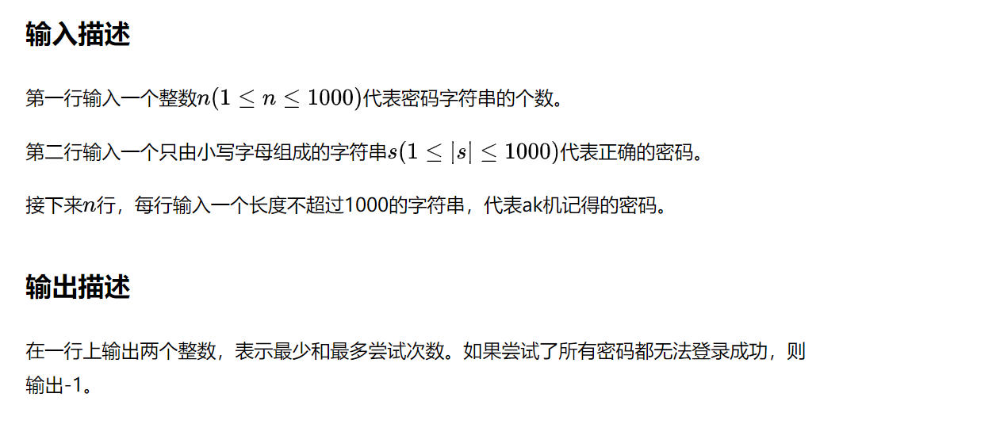


样例
输入

    4
    ab
    abc
    ab
    ac
    ac
输出

    1 2
样例解释

ak机可能按照 ["ab", "ac", "abc"] 的顺序尝试，第一次尝试成功，也可能按照 ["ac", "ab", "abc"] 的顺序尝试，第二次尝试成功。

ak机在尝试 "ac" 发现不正确后不会继续尝试 "ac"。


## 817万诺 算法五道俩小时
第一题挺麻烦的，就是字符串模拟，用正则就更工程化一点。

第二天题也比较简单，求gcd和prim就好了，接着就是按照题目要求模拟。

第三题需要一些小技巧，分析题目要求的性质也不会很难。


算法岗的1、2、4题为测开、客户端的三道题目

侧开


### 第一题 正则式写法？不做


题意
小美在处理外卖订单的时候，遇到一个任务，他需要判断一个给定的字符串是否符会特定的分类规则。

具体来说，我们需要判断一个字符串是否是一个有效的电子邮件地址、IP 地址或者电话号码。

电子邮件地址的格式为:username@domain.com，其中 username 和 domain 只能包含字母、数字和下划线。
IP 地址的格式为：xxx.xxx.xxx.xxx，其中 xxx 是 0 到 255 之间的整数。
电话号码的格式为：+国家码-区号-号码 ，其中 国家码 和 区号 只能包含数字，号码 可以包含数字和'#’。
输入描述

输入描述
第一行包含数据组数 n。

接下来的 n 行，每一行输入一个需要判断的字符串。

输出描述
对于每一行，输出判断的结果，可能的结果如下:

    如果是有效的电子邮件地址，输出 email。
    如果是有效的 IP 地址，输出 ip。
    如果是有效的电话号码，输出 phone。
    如果都不是，输出invalid。
示例：
输入：

    5
    user@example.com
    192.168.1.1
    +86-10-12345#78
    hello@world
    256.256.256.256
输出：

    email
    ip
    phone
    invalid
    invalid


思路与代码
模拟题，但是逻辑毕竟复杂，可以使用正则表达式来检查字符串是否符合给定的格式：电子邮件地址、IP 地址或电话号码。

    关于正则表达式匹配电子邮件地址、IP地址、电话号码的解释:

    电子邮件地址的正则表达式

    ^：表示字符串的开始。

    [a-zA-Z0-9_]+：匹配一个或多个字母（大小写均可）、数字或下划线。这部分用于匹配电子邮件的 "username" 部分。

    @：字面意义上的 '@' 符号，电子邮件地址的标准部分。

    [a-zA-Z0-9_]+：再次匹配一个或多个字母（大小写均可）、数字或下划线。这部分用于匹配电子邮件的 "domain" 部分。

    \\.com：匹配字面上的 ".com"。点号 (.) 在正则表达式中是一个特殊字符，代表任意字符，所以使用 \\. 来表示字面上的点号。

    $：表示字符串的结束。

    这个正则表达式只匹配以 ".com" 结尾的电子邮件地址，并且 "username" 和 "domain" 部分只能包含字母、数字和下划线。

    IP地址的正则表达式

    该正则表达式确保 IP 地址由四部分组成，每部分是 0 到 255 的整数，四部分之间由点号分隔。

    \d{1,2}：匹配 1 到 2 位的数字（0 到 99）。

    1\d{2}：匹配 100 到 199。

    2[0-4]\d：匹配 200 到 249。

    25[0-5]：匹配 250 到 255。

    ^：表示字符串的开始。

    (\d{1,2}|1\d{2}|2[0-4]\d|25[0-5])：这个分组表达式用于匹配 0 到 255 之间的整数。

    \\.：匹配点号，IP 地址各部分的分隔符。

    $：表示字符串的结束。

    电话号码的正则表达式

    ^：表示字符串的开始。
    \\+：匹配加号 (+)，通常用于国际电话号码的开头。
    \\d+：匹配一个或多个数字，用于国家码。
    -：字面意义上的短划线，用于分隔国家码和区号。
    \\d+：再次匹配一个或多个数字，用于区号。
    -：又一个字面意义上的短划线，用于分隔区号和电话号码。
    [\\d#]+：匹配一个或多个数字或井号 (#)，用于电话号码。
    $：表示字符串的结束。
    这个正则表达式用于匹配国际电话号码，其中号码部分可以包含数字和井号。

我靠 直接正则表达式还写个毛

如果是写普通逻辑还好

第一题挺麻烦的，就是字符串模拟，用正则就更工程化一点。

字符串模拟通常指的是在编程题目中，对字符串的操作或处理进行模拟。这类题目一般要求你模拟某些字符串操作，如插入、删除、替换、反转、查找子串等，或者对字符串进行某种变换和处理。

举个例子：

假设有一道题目要求你模拟一个字符串的变换操作，比如将字符串中的所有元音字母（a, e, i, o, u）替换成数字1，其他字符保持不变。

问题描述：
给定一个字符串，请将其中的元音字母替换成数字1，返回处理后的字符串。

输入："hello world"

输出："h1ll1 w1rld"

解题思路：

遍历字符串的每一个字符。
如果字符是元音字母，替换为数字1。
其余字符保持不变。
将最终的字符串返回。
示例代码（Python）：

    python
    复制代码
    def replace_vowels(s):
        vowels = "aeiouAEIOU"
        result = []
        for char in s:
            if char in vowels:
                result.append('1')
            else:
                result.append(char)
        return ''.join(result)

    # 测试
    input_str = "hello world"
    output_str = replace_vowels(input_str)
    print(output_str)  # 输出："h1ll1 w1rld"
总结：
字符串模拟题目主要考察的是对字符串的操作和处理能力。通常要求熟练使用字符串操作的基本方法和技巧，比如遍历、索引、切片、拼接等。

    def is_valid_email(s):
        if '@' not in s or s.count('@') != 1:
            return False
        username, domain = s.split('@')
        if '.' not in domain or domain.count('.') != 1:
            return False
        domain_name, domain_suffix = domain.split('.')
        
        if (username.isalnum() or '_' in username) and (domain_name.isalnum() or '_' in domain_name) and domain_suffix.isalnum():
            return True
        return False


如果能直接复制确实好

    def is_valid_ip(s):
        parts = s.split('.')
        if len(parts) != 4:
            return False
        for part in parts:
            if not part.isdigit() or not 0 <= int(part) <= 255:
                return False
        return True


    def is_valid_phone(s):
        if not s.startswith('+'):
            return False
        parts = s[1:].split('-')
        if len(parts) != 3:
            return False
        country_code, area_code, number = parts
        if not country_code.isdigit() or not area_code.isdigit():
            return False
        for ch in number:
            if not ch.isdigit() and ch != '#':
                return False
        return True

将 username.isalnum() 转换为二进制处理的方式会显得比较复杂，但确实可以通过逐个字符检查的方式来替代 isalnum()，并通过判断每个字符的 ASCII 值是否在字母或数字的范围内来实现。

字符检查：

字母的 ASCII 范围：'A' 到 'Z' 和 'a' 到 'z'。
数字的 ASCII 范围：'0' 到 '9'。
下划线的 ASCII 值为 95（'_'）。
逐字符遍历：

遍历字符串中的每个字符，将其 ASCII 值与上述范围进行对比。


    def is_alnum_or_underscore(s):
        for char in s:
            ascii_value = ord(char)
            if not (ord('A') <= ascii_value <= ord('Z') or
                    ord('a') <= ascii_value <= ord('z') or
                    ord('0') <= ascii_value <= ord('9') or
                    ascii_value == ord('_')):
                return False
        return True

我的水平能想到这个 但还是写不出完整


使用 ASCII 码进行字符判断
通过这种方式，你可以更灵活地控制字符的校验，而不仅仅依赖于 isalnum()，使代码更具可读性和可扩展性。

if (username.isalnum() or '_' in username) 这东西确实没接触过         


### 第二题 最大公约数 素数代码计算和判断 不做

真离谱 大公司校招还有hc吗 不如不做了


题意
小美对 gcd (最大公约数) 很感兴趣，她会询问你t次。

每次询问给出一个大于1的正整数n，你是否找到一个数字 m (2 ≤ m ≤ n)，使得 gcd(n,m)为素数。

输入描述
每个测试文件均包含多组测试数据。第一行输入一个整数 T (1 ≤ T ≤ 100) 代表数据组数，每组测试数据描述如下：

在一行上输入一个整数 n (2 ≤ n ≤ 10^5)代表给定的数字。

输出描述
对于每一组测试数据，在一行上输出一个整数，代表数字m。 如果有多种合法答案，您可以输出任意一种。

示例：
输入：

    2
    114
    15
输出：

    57
    5


思路与代码
题给已经明确的说出 m 的范围是 2 ≤ m ≤ n，因此基本思路就是在[2,n]这个范围内寻找一个数m，满足gcd(n,m)是一个素数。


    public class GCDPrime {
        // 函数：计算两个数的最大公约数（GCD）
        public static int gcd(int a, int b) {
            while (b != 0) {
                int temp = b;
                b = a % b;
                a = temp;
            }
            return a;
        }

        // 函数：检查一个数是否为素数
        public static boolean isPrime(int num) {
            if (num <= 1) return false;
            if (num <= 3) return true;
            if (num % 2 == 0 || num % 3 == 0) return false;
            for (int i = 5; i * i <= num; i += 6) {
                if (num % i == 0 || num % (i + 2) == 0) return false;
            }
            return true;
        }

        public static void main(String[] args) {
            Scanner scanner = new Scanner(System.in);
            int T = scanner.nextInt(); 

            ArrayList<Integer> data = new ArrayList<>();
            for (int i = 0; i < T; i++) {
                data.add(scanner.nextInt()); 
            }

            ArrayList<Integer> result = new ArrayList<>();

            for (int n : data) {
                boolean found = false;
                for (int m = 2; m <= n; ++m) {
                    int gcdVal = gcd(n, m); // 计算gcd(n, m)
                    if (isPrime(gcdVal)) { // 检查gcd是否为素数
                        result.add(m);
                        found = true;
                        break; 
                    }
                }
                if (!found) {
                    result.add(-1); 
                }
            }

            for (int res : result) {
                System.out.println(res);
            }

            scanner.close();
        }
    }


这个很明显不知道两个核心代码的数学含义

解题思路：
遍历 m：对于每个 n，我们可以从 m = 2 开始，直到 m = n，计算 gcd(n, m)。一旦发现 gcd(n, m) 为素数，就输出这个 m。
优化：考虑到 gcd(n, m) 的定义，如果我们从 n 的约数开始寻找 m，可以更快找到解。例如，我们可以从 m = n//2 开始往前找，这样可以减少遍历的次数。
素数判断：判断一个数是否为素数时，我们可以使用常规的素数判断方法，比如试除法。


    import math

    def is_prime(x):检查一个数是否为素数
        if x <= 1:
            return False
        if x == 2:
            return True
        if x % 2 == 0:
            return False
        for i in range(3, int(math.sqrt(x)) + 1, 2):这个也夸张 这都什么题？
            if x % i == 0: 试除法 哪里学过吗？
                return False
        return True

    def find_m(n):
        # 从 n//2 开始查找
        for m in range(n//2, n+1):
            g = math.gcd(n, m) ？？？这个计算两个数的最大公约数（GCD）更夸张
            if is_prime(g):检查一个数是否为素数
                return m
        # 理论上会找到答案，因此一般不会到这里
        return None

    # 处理输入和输出
    T = int(input())
    results = []
    for _ in range(T):
        n = int(input())
        results.append(find_m(n))

    # 输出结果
    for result in results:
        print(result)


素数判断太难

简单的就一个计算gcd

在不使用 math 模块的情况下，我们可以手动实现计算两个数的最大公约数（GCD）的方法。通常使用的算法是 欧几里得算法 (Euclidean algorithm)，其基本思想是：

    如果 b 为 0，那么 GCD(a, b) = a。
    否则，GCD(a, b) = GCD(b, a % b)，不断重复这个过程，直到 b 为 0。


欧几里得算法的实现：
以下是使用递归和迭代两种方式实现欧几里得算法的示例。

递归实现：还是这种明了

    def gcd(a, b):
        if b == 0:
            return a
        else:
            return gcd(b, a % b)
迭代实现：

    def gcd(a, b):
        while b != 0:
            a, b = b, a % b
        return a

### 第三题 动两个 极差最小 直接平均值下界，不管边界条件 能狗出来就行


题意
小美有一个长度为 n 的数组，每次操作可以选择两个下标i和 j，将 ai 减去 1，将 aj 加上 1。小美想知道最少需要多少次操作，可以使数组极差最小。

数组的极差为数组中最大值和最小值的差。

输入描述
第一行输入一个整数 n (2 ≤  n ≤ 10^5)代表数组的长度。

第二行输入几 个整数 a1,a2,...,an (1 ≤ ai ≤ 10^9) 代表数组的元素。

输出描述
在一行上输出一个整数，表示最少需要多少次操作。

示例：
输入：

    5
    1 2 3 4 5
输出：

    3
说明：

三次操作分别为 (a1,a5), (a2,a5), (a1,a4)。最终数组为[3,3,3,3,3]，极差为0。


这种太多考虑的没办法 直接死机 没思路

回溯找出所有？        
dp找出最优 怎么dp?????        


思路与代码
这个问题的核心是要通过一系列增减操作来使数组中的最大值和最小值尽可能接近，从而最小化数组的极差。这可以通过计算数组中每个元素与数组平均值之间的差异来完成。

要实现目标，我们应考虑将所有元素调整到一个共同的目标值上，这个目标值最接近整个数组的平均值。由于每次操作是将一个元素减去 1，另一个元素加上 1，这意味着数组的总和在操作前后保持不变。因此，最佳策略是尝试使所有元素达到数组总和除以数组长度的结果（向下取整的结果）？？？？，即平均值。

ok 思路试所有元素达到均值 怎么保证？一次变两个，每次一个个大于小于遍历？或者说先看第一个差值 再遍历找合适的第二个？


    long avg = sum / n;  // 计算平均值（向下取整）
    long extra = sum % n;  // 计算余数，尽管这个变量在此代码中未使用

    // 计算需要操作的最小次数
    long minMoves = 0;
    long need = 0;
    for (int i = 0; i < n; i++) {
        need += a[i] - avg;  // 更新差值累计
        minMoves = Math.max(minMoves, Math.abs(need));  // 更新最大操作次数
    }


很6 但为什么是向下取整 而不是向上？


gemini

    def min_diff(nums):
        n = len(nums)
        nums.sort()
        avg = sum(nums) // n

        # 计算每个元素需要移动的距离
        moves = 0
        for num in nums:
            moves += abs(num - avg)

        return moves // 2  # 因为每次操作会同时改变两个元素，所以总操作次数除以2

    # 示例
    nums = [1, 2, 3, 4, 5]
    result = min_diff(nums)
    print(result)  # 输出：3


为什么这样可行？
平均值作为目标： 将所有元素向平均值靠拢，可以有效缩小极差。
移动距离： 移动距离的总和代表了调整所有元素到目标状态所需的最小操作次数。
除以2的原因： 每次操作会同时改变两个元素，所以总操作次数需要除以2。
优化与拓展
大数处理： 如果数组元素非常大，可以使用更适合大数运算的数据类型或算法。
特殊情况： 可以考虑数组中元素全相等或只有两个不同元素等特殊情况，进行优化。
其他操作： 如果允许更复杂的操作，可以探索更高级的算法。
总结
通过将数组元素向平均值靠拢，并计算每个元素需要移动的距离，我们能有效地求解出最小化数组极差所需的最少操作次数。


也可以 就算不能全a


## 810
### 第一题 小美的密码
小美准备登录美团，需要输入密码，小美忘记了密码，只记得密码可能是 n个字符串中的一个。小美会按照密码的长度从小到大依次尝试每个字符串，对于相同长度的字符串，小美随机尝试，并且相同的密码只会尝试一次。小美想知道，她最少需要尝试多少次才能登录成功，最多需要尝试多少次才能登录成功。小美不会重新尝试已经尝试过的字符串。成功登录后会立即停止尝试。

输入描述第一行输入一个整数 n(1<=n<=1000)代表密码字符串的个数。第二行输入一个只由小写字母组成的字符串 s(1<=|s|<=1000)代表正确的密码。接下来 n 行，每行输入一个长度不超过 1000的字符串，代表小美记得的密码。

输出描述在一行上输出两个整数，表示最少和最多尝试次数。示例 1输入

    4
    ab
    abc
    ab
    ac
    ac

输出

1 2


    from collections import defaultdict

    n = int(input())
    ans = input()

    pos = defaultdict(set)
    for _ in range(n):
        p = input()
        pos[len(p)].add(p)

    pos = dict(sorted(pos.items()))

    step = 0
    MIN,MAX = -1,-1
    for k,v in pos.items():
        if ans in v:
            MIN =step + 1
            MAX = step + len(v)
        else:
            step += len(v)

    print(MIN, MAX)

很简单 但是答案比我想的更简单

因为有充分利用了键值 和 集合

### 第二题 小美的数组删除

小美有一个长度为 n 的数组 a1,a2,....,an ，他可以对数组进行如下操作：● 删除第一个元素 a1，同时数组的长度减一，花费为 x。● 删除整个数组，花费为 k*MEX(a) （其中 MEX(a) 表示 a 中未出现过的最小非负整数。例如 [0,1,2,4] 的 MEX 为 3 ）。小美想知道将 a 数组全部清空的最小代价是多少，请你帮帮他吧。

输入描述

每个测试文件均包含多组测试数据。第一行输入一个整数 T(1<=T<=1000) 代表数据组数，每组测试数据描述如下：第一行输入三个正整数 n,k,x(1<=n<=2*10^5, 1<=k,x<=10^9) 代表数组中的元素数量、删除整个数组的花费系数、删除单个元素的花费。第二行输入 n 个整数 a1,a2,....,an(0<=ai<=n)，表示数组元素。除此之外，保证所有的 n 之和不超过 2*10^5。


输出描述

对于每一组测试数据，在一行上输出一个整数表示将数组中所有元素全部删除的最小花费。


输入

1
6 3 3
4 5 2 3 1 0

输出15

说明若不执行操作一就全部删除，MEX{4,5,2,3,1,0} = 6，花费 18 ；
若执行一次操作一后全部删除，MEX{5,2,3,1,0} = 4，花费 3+12；
若执行两次操作一后全部删除，MEX{2,3,1,0} = 4，花费 6+12 ；
若执行三次操作一后全部删除，MEX{3,1,0} = 2，花费 9+6 ；
若执行四次操作一后全部删除，MEX{1,0} = 2，花费 12+6 ；
若执行五次操作一后全部删除，MEX{0} = 1，花费 15+3；
若执行六次操作一，MEX{} = 0，花费 18；

太绕了

直接就是遍历 min 对着示例输出

思路和代码

动态规划+维护动态最小未出现的整数。f[i]表示从i往后考虑的最小花费，选择就是选择第一个元素或者直接删除后续所有的元素。

对于删除后续所有的元素的选项，我们必须要直到MEX是多少，我们可以用在更新dp的过程中，用一个suffix不断地更新当前的最小未出现的整数。虽然这里出现了两层循环的嵌套，但是并不会重置参数，因此复杂度是O(n).

第二题需要一点小技巧，包装在更新过程中可以线性的维护核心的值即可，难度也不算很大。


    from math import inf

    T = int(input())
    for _ in range(T):
        n,k,x = map(int, input().split())
        A = [int(c) for c in input().split()]
        dp = [inf]*(n+1)
        dp[n] = 0
        vst = set()
        suffix_MEX = 0
        for i in range(n-1,-1,-1):
            vst.add(A[i])
            while suffix_MEX in vst:
                suffix_MEX += 1
            dp[i] = min(dp[i+1]+x, k*suffix_MEX)
        print(dp[0])

从后往前算 方便 suffix_MEX  同时 dp设置也很巧妙

而且 suffix_MEX 不会重复计算

保证 o(n)解决？


### 第三题 小美的彩带

小美的彩带是由一条长度为 n 的彩带一直无限循环得到的，彩带的每一个位置都有一个颜色，用 ai 表示。因此当 i>n 时，ai = ai-n  。小美每次会从左往后或从右往左剪一段长度为 x 的彩带，她想知道她每次剪下来的彩带有多少种颜色。

输入描述

第一行输入两个整数 n,q(1<=n,q<=2*10^5) 代表彩带长度、剪彩带次数。第二行输入 n 个整数 a1,a2,...,an(1<=ai<=10^9) 代表彩带每一个位置的颜色。此后 q 行，每行输入一个字符 c 和一个整数 x(1<=x<=10^9; c∈L,R) 代表裁剪方向和裁剪长度，其中 'L' 说明从左往右剪， 'R' 说明从右往左剪 。


输出描述

对于每一次裁剪彩带，在一行上输出一个整数代表颜色数量。


输入

    6 3
    1 1 4 5 1 4
    L 2
    L 3
    R 12
输出

    1
    3
    3

说明第一次剪彩带，剪下来的是 [1,1] ，有 {1} 这 1 种颜色；
第二次剪彩带，剪下来的是 [4,5,1] ，有 {1,4,5} 这 3 种颜色；
第三次剪彩带，剪下来的是 [1,1,4,5,1,4,1,1,4,5,1,4] ，有 {1,4,5} 这 3 种颜色。


题目看不懂 放弃

表达不清晰 就是得照着示例写代码


直接for循环用set解决


太复杂了

    MAXN = 2000007

    a = [0] * MAXN
    ans = [0] * MAXN
    hsh = [0] * MAXN
    vis = [0] * MAXN
    c = [0] * MAXN

    def lowbit(x):
        return x & -x

    def update(x, k):
        while x < MAXN:
            c[x] += k
            x += lowbit(x)

    def getsum(x):
        sum = 0
        while x > 0:
            sum += c[x]
            x -= lowbit(x)
        return sum

    def main():
        n, q = map(int, input().split())
        queries = []

        for i in range(1, n + 1):
            a[i] = int(input())
            hsh[i] = a[i]

        hsh = sorted(set(hsh[1:n+1]))  # 直接去重排序
        idx_map = {v: i + 1 for i, v in enumerate(hsh)}  # 值到索引的映射

        for i in range(1, n + 1):
            a[i] = a[n + i] = idx_map[a[i]]  # 双倍数组

        nl, nr = 1, n * 2

        for i in range(q):
            direction, x = input().split()
            x = min(int(x), n)
            if direction == 'L':
                queries.append((nl, nl + x - 1, i))
                nl += x
                if nl > n:
                    nl -= n
            else:
                queries.append((nr - x + 1, nr, i))
                nr -= x
                if nr <= n:
                    nr += n

        queries.sort(key=lambda q: q[1])

        cur = 1
        for l, r, i in queries:
            while cur <= r:
                if vis[a[cur]]:
                    update(vis[a[cur]], -1)
                update(cur, 1)
                vis[a[cur]] = cur
                cur += 1
            ans[i] = getsum(r) - getsum(l - 1)

        for i in range(q):
            print(ans[i])

    if __name__ == "__main__":
        main()

lowbit(x)：计算x的二进制表示中最低位的1对应的数值。这个函数用于实现树状数组（Fenwick Tree）的索引更新。

    def lowbit(x):
        return x & -x


    def update(x, k):
        while x < MAXN:
            c[x] += k
            x += lowbit(x)
update(x, k)：更新树状数组c，将值k加到位置x及其影响的后续位置。用于维护区间和信息。


    def getsum(x):
        sum = 0
        while x > 0:
            sum += c[x]
            x -= lowbit(x)
        return sum
getsum(x)：计算从1到x之间的前缀和。通过树状数组快速计算某一区间的和。

前缀和的定义
对于一个给定的数列A，他的前缀和数中 S 中 S[ i ] 表示从第一个元素到第 i 个元素的总和。

如下图：绿色区域的和就是前缀和数组中的 S [ 6 ]。


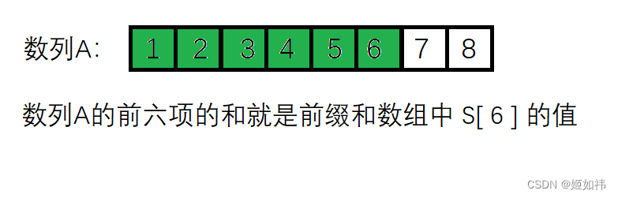


2. 一维前缀和
2.1 计算公式
前缀和数组的每一项是可以通过原序列以递推的方式推出来的，递推公式就是：S[ i ] = S[  i - 1 ] + A[ i ]。S[  i - 1 ] 表示前 i - 1 个元素的和，在这基础上加上 A[ i ]，就得到了前 i 个元素的和 S [ i ]。

2.2 用途
一维前缀和的主要用途：求一个序列中某一段区间中所有元素的和。有如下例子：

有一个长度为 n 的整数序列。

接下来输入 m 个询问，每个询问输入一对 l，r。

对于每个询问，输出原序列中第 l 个数到第 r 个数的和。


queries：用于存储每个查询的信息。


    for i in range(1, n + 1):
        a[i] = int(input())
        hsh[i] = a[i]
读取n个整数，并存入数组a和hsh中。hsh数组用于后续去重和排序。


    hsh = sorted(set(hsh[1:n+1]))
    idx_map = {v: i + 1 for i, v in enumerate(hsh)}
hsh：通过set去重，并sorted排序，得到唯一且有序的元素列表。
idx_map：将这些唯一元素映射到它们对应的索引，用于压缩原始数据（即将原始值映射到一个较小的范围内）。


    for i in range(1, n + 1):
        a[i] = a[n + i] = idx_map[a[i]]
使用idx_map对数组a中的元素进行值压缩，并将其双倍复制到a的后半部分，用于处理区间查询时的循环逻辑。

这种字典中查字典的行为真太乱了


   queries.sort(key=lambda q: q[1])
将所有查询按照右边界r从小到大排序。这样可以在处理时高效地更新区间和。

对每个查询进行处理。遍历从cur到r的范围，更新树状数组，并记录每个元素最后出现的位置。
计算当前查询区间的和，存储在ans数组中


核心逻辑
树状数组：用于快速维护和查询区间和，通过update和getsum实现。
查询处理：根据左右边界的不同移动方向，调整区间位置，最后通过排序和树状数组的高效计算，得出结果。
总结
这段代码通过压缩数据、使用树状数组和双倍数组技巧，有效处理了一系列区间查询。优化后的代码简洁明了，保留了关键的算法思路，同时去除了冗余和复杂的部分。


a[i] = a[n + i] = idx_map[a[i]] 这行代码中的两个等号实现了链式赋值的操作。

链式赋值的原理
链式赋值的含义是从右到左依次进行赋值。具体到这行代码，操作步骤如下：

最右侧的表达式计算：首先计算右侧的表达式，即 idx_map[a[i]]，得到一个值。

赋值给最左侧的变量：将这个值赋给 a[n + i]。

继续赋值给左侧的另一个变量：接着将这个值赋给 a[i]。

具体作用
所以，这行代码的作用是：

先计算 idx_map[a[i]]，这个表达式将 a[i] 的值映射到一个新的索引值。
然后，将这个新索引值同时赋值给 a[i] 和 a[n + i]。


假设：

n = 5
i = 2
idx_map[a[i]] = 10
那么执行 a[i] = a[n + i] = idx_map[a[i]] 后，a[2] 和 a[7] 都会被赋值为 10。

作用
这个操作的主要目的是将数组 a 中第 i 个位置的值更新为 idx_map 映射后的新值，并且同时更新数组 a 中第 n + i 个位置的值为相同的值。这在算法中可能用于构造双倍数组或进行数据压缩的处理。

x & -x 是一个常见的二进制运算操作，用于提取整数 x 的二进制表示中最低位的1所对应的值。


负数的补码表示：

在计算机中，负数是以补码形式存储的。对于一个整数 x，它的负数 -x 可以通过取反并加1得到。
例如，如果 x = 6，它的二进制是 0110。-x 的二进制表示是 1010。


按位与运算：

& 是按位与运算符，对应位置的两个二进制位都为1时，结果为1，否则为0。
计算 x & -x：

x & -x 会将 x 的最低位的1保留下来，其他位都变为0。


例子 1：x = 6
x 的二进制表示是 0110。
-x 的二进制表示是 1010。
x & -x 的结果：
plaintext
复制代码
0110   (x)
&
1010   (-x)
----
0010   (结果)
所以，x & -x = 2，即 0010。
例子 2：x = 12
x 的二进制表示是 1100。
-x 的二进制表示是 0100。
x & -x 的结果：
plaintext
复制代码
1100   (x)
&
0100   (-x)
----
0100   (结果)
所以，x & -x = 4，即 0100。


用途
x & -x 在算法中有多种用途，其中最常见的是：

提取最低位的1：在树状数组（Fenwick Tree）中，x & -x 用来找到一个位置的最低位1，常用于快速定位和更新区间。
检查是否为2的幂：如果 x 是2的幂，那么它只有一个二进制位为1，x & -x 的结果等于 x 本身。
总结
x & -x 是一个简单而有效的操作，可以快速提取整数的最低位1所在的值，广泛应用于各种算法和位运算操作中。


离谱


# 深信服 事后只会写第二题
只知道 dfs深度有限搜索，动态规划         
不知道回溯法      
我理解就是可以回退 然后找出所有可能        
这和dfs不就是一样吗？            


## 第一题
用dp理不清逻辑，别人也有写出部分的        
牛客说用回溯法？能写出大部分           

类似lc 44题


1.吃豆子，我用两个指针和count计数，不是星号就一起前进，是星号就跳过匹配的豆子，然后星号在末尾就退出，结果这题就过了一半左右不知道为啥。
2.魔法数字，用dp处理k之前的和k之后的，结果也就过了一半
3.疲劳度算的不太对，也没时间处理输入输出的，结果没提交，直接做填空题了

第一题他的思路确实简单 但是要是涉及dp我直接懵了第一题


## 第二题 

    class Solution:
        def twoSum(self, n,k,num):
            dp = [0] * (n+1)
            for i in range(1,n+1):
                if i<k :
                    dp[i]=num[i-1]
                else:
                    dp[i] = max(dp[i-1], dp[i-k]+num[i-1])
            return dp[n]
    print(Solution().twoSum(5,2,[3,2,5,10,7]))


根据牛客别人的说法，竟然确实能硬狗出来 可能不能百分百通过        
牛客提示 dp 然后分情况 对k分情况    
自己想就是 先写出状态转移 硬确定 max分法，直接就设置dp[i-1]为前 i-1的最大


第二题可能存在负数的情况，所以dp条件我设置的是dp[i] = Max[当前的, dp[i-1]，dp[i-k]+当前的]，这样就从过90变成过100了   


吃豆子我用栈写的，过了78%，真不知道卡在哪里了     
1
回复
分享
发布于 08-18 21:30
北京
来自iOS客户端

躺平了777

回复
双指针也是a了78     
1
回复
发布于 昨天 13:27
湖南

白面神君不白面

回复
先切割字符串，再用的set，78   

这个set好像有点牛逼？


## 第三题据说回溯

我的笔试一共有四道算法。第一道是01背包，算是签到题吧，除了描述之外也没有改别的条件，有刷过dp的同学应该问题不大。这也是笔试传统了，第一道题通常难度不会太大，大家不用太过于担心。第二道是带权图的最短路径，在acm模式下图论的题目比较困难的就是构建了，但是只要耐心读懂题目，构建出邻接表，dfs/bfs即可破解。第三、第四道分别是任务处理和汉诺塔，这里不展开讲了。


可以留意到，多道算法题的解题思路大概率是不重复的，`dp、图论、回溯、二分、贪心、栈、堆、树`都有可能考察到，所以对于如何准备笔试，我总结以下这几点：

1、对于多类算法，先广度优先地学习，每种算法都简单过一遍，能用这些算法解决easy题，对每个算法有基础的概念之后，再深入学习某一类算法；

2、算法是日积月累的，培养一天刷1～2道题的习惯

3、算是我总结的偷机小技巧，在时间紧迫下，`链表和树可以设为优先级较低的类型`，因为结构的特殊，acm模式很少会出链表和树相关的题目，当然这并不绝对，仅对于时间紧急情况。


2、不用恐惧手撕，手撕通常来说是比笔试简单的，如果笔试能a出来题目，手撕更不是问题了，我面试过程的唯一一道手撕是LRU，有刷算法的同学应该知道这不是一道难题；


LRU-least recently used-最近最少使用算法，是一种内存数据淘汰策略，使用常见是当内存不足时，需要淘汰最近最少使用的数据。LRU常用语缓存系统的淘汰策略。


4.Redis LRU算法实现

分析Redis LRU实现之前，我们先了解一下Redis缓存淘汰策略。

当Redis内存超出物理内存限制时，内存会频繁的磁盘swap区交换数据，而交换会导致redis对外服务性能的急剧下降，这在生产环境是不允许的。说得更明白些，在生产环境是不允许交换行为的，通过设置maxmemory可限制内存超过期望大小。


## 回溯法
回溯法（Backtracking）是一种通过探索所有可能的候选解来找出所有解的算法。如果候选解被确认不是一个解（或者至少不是最后一个解），回溯算法会通过在上一步进行一些变化来撤销上一步或上几步的计算，即通过“回溯”来尝试其他的候选解。回溯法通常用于解决组合问题、排列问题、子集问题、图的着色问题、旅行商问题（TSP）等。

例子：解决八皇后问题
八皇后问题是一个经典的问题，要求在一个8x8的`棋盘上放置八个皇后，使得她们互不攻击，即任意两个皇后都不在同一行、同一列或同一对角线上`。

    解题思路
    初始化：创建一个8x8的棋盘，并初始化一个数组来记录每一列上皇后的位置（即行号）。
    放置皇后：从第一行开始，尝试在每一列放置皇后。
    检查冲突：对于每一个放置的皇后，检查其是否与已放置的皇后冲突（同行、同列、同对角线）。
    回溯：如果当前位置无法放置皇后（即存在冲突），则回溯到上一行，尝试在该行的下一列放置皇后。如果当前行所有列都尝试完毕且无法放置，则继续回溯到上一行。
    成功放置：如果成功地在第8行放置了皇后，则找到了一个解。
    寻找所有解：找到一个解后，回溯到上一行，继续寻找其他可能的解。

    初始化棋盘和列位置数组  
    for 第1行到第8行:  
        for 第1列到第8列:  
            如果 当前位置可以放置皇后:  
                放置皇后  
                if 当前行 == 8:  
                    找到一个解，打印棋盘  
                    回溯（移除当前行的皇后）  
                else:  
                    递归到下一行  
            回溯（尝试当前行的下一列）

通过回溯法，我们可以系统地探索所有可能的放置方式，直到找到所有符合条件的解。这种方法虽然可能需要探索大量的候选解，但它能保证找到`所有解`（如果存在的话）。


    def is_safe(board, row, col):  
        # 检查列  
        for i in range(row):  # 只检查已有的，走过的。
            if board[i] == col:  # 这是什么？ board索引是行 值是列 假设0行1列已有值，当到达1行时检查board 发现 for col in range(n): 的col其实不可用
                return False  
        
        # 检查左上对角线  
        for i, j in zip(range(row-1, -1, -1), range(col-1, -1, -1)):  # 这些设置得比较巧妙 
            if board[i] == j:  
                return False  
        
        # 检查右上对角线  
        for i, j in zip(range(row-1, -1, -1), range(col+1, len(board))):  
            if board[i] == j:  
                return False  
        
        return True  
    
    def solve_n_queens(n):  # 这个函数大概能看懂
        def backtrack(row, board):  
            if row == n:  
                result = [''.join('Q' if j == col else '.' for j in range(n)) for col in board]  
                print('\n'.join(result))  
                return  
            
            for col in range(n):  
                if is_safe(board, row, col):  
                    board[row] = col  
                    backtrack(row + 1, board)  
                    board[row] = -1  # 回溯，重置当前行皇后的位置  
    
        board = [-1] * n  # [-1, -1, -1, -1, -1, -1, -1, -1]
        backtrack(0, board)  
    
    # 调用函数解决8皇后问题  
    solve_n_queens(8)

在这个代码中，is_safe 函数用于检查在棋盘的 (row, col) 位置放置皇后是否安全。它检查同一列、左上对角线和右上对角线上是否有其他皇后。

solve_n_queens 函数是主函数，它接受一个参数 n，表示棋盘的大小（n x n）。它定义了一个内部函数 backtrack，该函数递归地尝试在每一行放置皇后，并使用 board 列表来跟踪每一行皇后的列位置。如果成功地在第 n 行放置了皇后，则找到了一个解决方案，并将其打印出来。然后，它回溯到上一行，尝试其他可能的列位置。

最后，solve_n_queens(8) 调用用于解决8皇后问题，并打印出所有可能的解决方案。

下面是一个使用Python实现的八皇后问题的具体代码示例。这个示例使用了回溯法来找到所有可能的解决方案，并将每个解决方案打印到控制台上。


    Q.......
    ....Q...
    .......Q
    .....Q..
    ..Q.....
    ......Q.
    .Q......
    ...Q....
    Q.......
    .....Q..
    .......Q
    ..Q.....
    ......Q.
    ...Q....

# 华为
华为的笔试模拟题的比例非常大，对于理解能力要求比较高，所以读题一定要十分仔细。这两年华为的offer含金量上升大家也都知道，hc数量也不会太少，还是要认真对待的。

本次笔试难度适中，但依旧是华为比较明显的风格，代码不是太好写。

第1题是比较基础的模拟题，理解好题目，进行模拟操作即可。但是需要注意里面的一些特殊要求，否则很容易没分。

第2题也是偏向于模拟的题，但其中有一个思维的小点需要反应得过来，否则也很容易拿不到大的分数。

第3题则是一个暴力解的题目，枚举的思路比较繁琐，但是难度也不大的，注意好有效的剪枝即可。(这一题可以参考米哈游20240813的第二题)

## 第1题 nums = [int(c) for c in input().split()] 。使用set TypeError: unhashable type: 'list'。list不能直接当成set或字典的键，只能当值

数据重删
数据重删是一种节约存储空间的技术，通常情况下，在数据存储池内是有很多重复的数据块，重删则是将这些重复的数据块找出并处理的技术。简单地说重删，就是将N份重复的数据块仅保留1份，并将N-1份数据的地址指针指向唯一的那一份。 我们输入一串存储的数据，用N表示数据个数，用K表示数据块的大小，设计一个方法判断当前数据块是否和前面的数据块有重复，两个数据块内容完全一样则表示重复，如果重复则将这个数据块删除，并且在第一个出现数据块的后面增加重复数据的计数，输出经过重删之后的数据内容。

输入
8 输入数据的个数 2 数据块的大小 1 2 3 4 1 2 3 4 依次是数据值

注意： 输入的数据值都是正整数 1 <= K <= 10^6 1<= N <= 10^2

输出
1 2 2 3 4 2 输出结果为去除重复数据后的结果，输出结果最后没有空格，以数字结尾，输出内容不改变输入数据块的顺序

样例1
输入：

    8 
    2 
    1 2 3 4 1 2 3 4
输出：

    1 2 2 3 4 2
解释：

总共8个数据，数据块的大小为2，按照窗口2进行切片表示一个数据块，分别得到数据块为 [1, 2]，[3, 4]，[1, 2]，[3, 4]。其中第一个数据块和第三个数据块相同，第二个数据块和第四个数据块相同，可以分别进行重删。重删之后数据块[1,2]的计数变为2，表示有两个相同的数据块[1,2]；同理[3,4]的数据块计数也变为2

样例2
输入：

    8 
    3 
    3 4 5 3 4 5 5 4
输出：

    3 4 5 2 5 4 1
解释：

总共8个数据，数据块的大小为3，按照窗口3进行切片表示一个数据块，分别得到数据块为 [3, 4, 5]，[3, 4, 5]，[5, 4]，其中 [3, 4, 5] 和 [3, 4, 5] 是重复的窗口，可以进行重删。重删之后数据块[3,4,5]的计数变为2，由于剩余数据块不满足3个连续数据，所以下一个数据块只包含 [5, 4]，[5,4]和前面的数据块不同，所以保留下来，只有一份。


先直接input读split map转int list       
然后根据 第二个数 划分第三组数      
构成新list 取set?     
可以直接for循环计数        

    print(set([[1,2],[1,2],[2]]))
          ^^^^^^^^^^^^^^^^^^^^^^
TypeError: unhashable type: 'list'

思路与代码

哈希表模拟。

题目还是比较简单的，用python处理起来会方便太多了。大体的思想就是按照题目要求去截取字符串，然后用哈希表来统计出现次数。需要注意的是，需要统计每个数据块第一次出现的下标，最后的输出结果需要按照这个下标来排序。（最后不要有空格或者换行符）

需要统计每个数据块第一次出现的下标       
也不是不行

    N = int(input())
    blk = int(input())
    nums = [int(c) for c in input().split()]

    res = {}

    for i in range(0, N, blk):挺讲究
        cur_blk = nums[i:i + blk]
        tp = tuple(cur_blk) # 
        if tp not in res:
            res[tp] = [i, 1]  # 下标、出现次数
        else:
            res[tp][1] += 1

        挺好的

    sorted_res = sorted(res.items(), key=lambda x: x[1][0]) 含义未知
    ans = []
    for key, value in sorted_res:
        ans.extend(key)  # 将整个数据块加入结果
        ans.append(value[1])  # 加入计数

    print(' '.join(map(str, ans)))

讲究

    res = {}
    tp = tuple([1]) #   
    res[tp] = [1, 1] 
    print(res)

{(1,): [1, 1]}


    res = {}
    tp = [12] 
    res[tp] = [1, 1] 
    print(res)
    print(a)


    res[tp] = [1, 1]
    ~~~^^^^
TypeError: unhashable type: 'list'

果然list不能直接当成set或字典的键，只能当值


1 2 2 3 4 2 输出结果为去除重复数据后的结果，输出结果最后没有空格，以数字结尾，输出内容不改变输入数据块的顺序

需要统计每个数据块第一次出现的下标，最后的输出结果需要按照这个下标来排序。（最后不要有空格或者换行符）

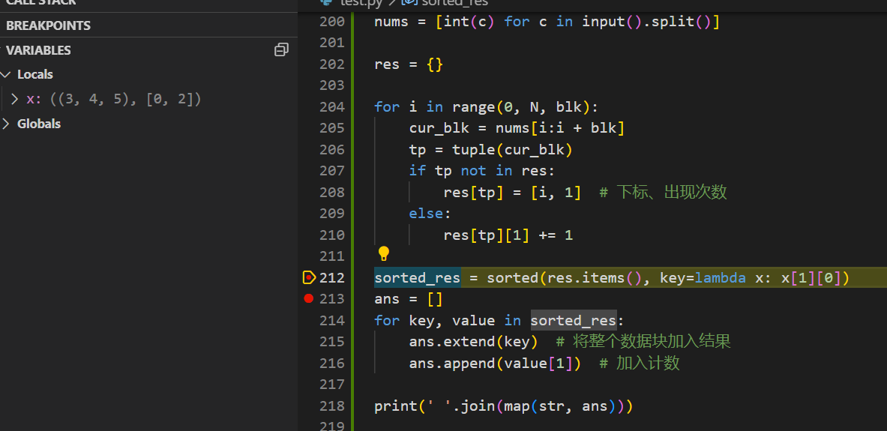

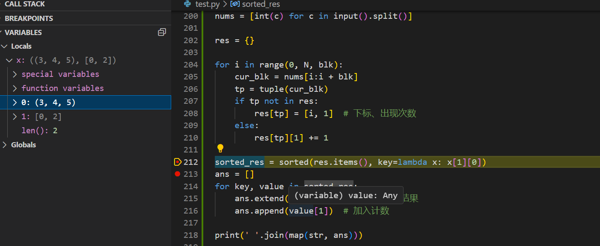

字典进入sorted竟然变成元组

出来后是list和套的新元组

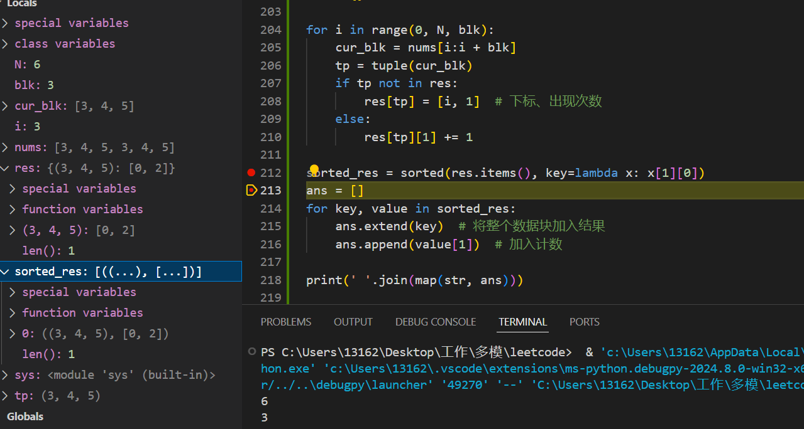

元组竟然也能像list一样被extend


## 第2题


DevOps任务调度
某Devops系统有一批并发任务需要匹配合适的执行机调度执行，任务和执行机都具有CPU型（用0表示）和IO型（用1表示）的区别，此外还有一种通用型执行机（用2表示），一批任务和执行机的类型分别用数组tasks、machines表示，tasks[i]表示第i个任务，machines[i]表示执行机的类型。每台CPU型、IO型执行机只能执行一个对应类型的任务，而通用型执行机既能执行CPU类型任务也能执行IO类型任务。

假设现有的匹配策略如下: 任务需要按照优先级从高到低依次匹配执行机（i=0优先级最高）,因此每一轮选择任务数组头部(i=0)的任务去匹配空置执行机数组头部（i=0）的执行机，若任务与执行机类型匹配，则代表该任务调度成功，把该执行机从空置执行机数组中移除。若任务与执行机的类型不匹配，则将执行机放到执行机数组尾部，循环该过程直到任务全部匹配成功或当前任务无法被所有剩余空置执行机匹配。

现规定任意时刻都可以选择使用通用执行机，但一旦选择将某个类型的任务匹配通用型执行机，则所有通用型机器都只能用于执行该类型的任务，为了避免任务排队阻塞，请返回现有匹配策略下剩下的最小空置执行机数量。


输入
输入共3行
首行是一个正整数n，表示任务数量以及执行机数量
第2行包含n个整数，以空格分隔，表示为任务数组tasks
第3行包含n个整数，以空格分隔，表示为空置执行机数组machines
数据范围：1<=n<=100, 0<=tasks[i]<=1，0<=machines[i]<=2。
输出
一行一个整数，代表当前匹配策略下剩下的最小空置执行机数量。

样例1
输入：

    3 
    1 0 1 
    1 2 0
输出：

    0
解释：

第一轮 任务数组头部类型1，空置执行机数组头部类型1，匹配成功，任务数组变为[0, 1],空置执行机数组变为[2, 0] 第二轮 任务数组头部类型0，空置执行机数组头部类型2，若不选择类型2的执行机执行类型0的任务，将执行机放回数组尾部，任务数组不变为[0, 1],空置执行机数组变为[0, 2] 第三轮 任务数组头部类型0，空置执行机数组头部类型0，匹配成功，任务数组变为[1],空置执行机数组变为[2] 第四轮 任务数组头部类型1，空置执行机数组头部类型2，任务类型1选择匹配执行机类型2，因此剩下的最小空置执行机数量为0

样例2
输入：

    4 
    1 0 1 1 
    1 0 2 0 
输出：

    1
解释：

第一轮 任务数组头部类型1，空置执行机数组头部类型1，调度成功，任务数组变为[0,1,1],空置执行机数组变为[0,2,0] 第二轮 任务数组头部类型0，空置执行机数组头部类型0，调度成功，任务数组变为[1,1],空置执行机数组变为[2,0] 第三轮 任务数组头部类型1，空置执行机数组头部类型2，类型1的任务选择匹配类型2的执行机，任务数组变为[1],空置执行机数组变为[0] 第四轮 任务数组头部类型1，空置执行机数组头部类型0，无法匹配，剩下的最小空置执行机数量为1

任务和执行机都具有CPU型（用0表示）和IO型（用1表示）的区别，此外还有一种通用型执行机（用2表示），一批任务和执行机的类型分别用数组tasks、machines表示，tasks[i]表示第i个任务，machines[i]表示执行机的类型。每台CPU型、IO型执行机只能执行一个对应类型的任务，而通用型执行机既能执行CPU类型任务也能执行IO类型任务。

看起来直接遍历列表写匹配就行了 不行就切片去掉然后append


假设现有的匹配策略如下: 任务需要按照优先级从高到低依次匹配执行机（i=0优先级最高）,因此每一轮选择任务数组头部(i=0)的任务去匹配空置执行机数组头部（i=0）的执行机，若任务与执行机类型匹配，则代表该任务调度成功，把该执行机从空置执行机数组中移除。若任务与执行机的类型不匹配，则将执行机放到执行机数组尾部，循环该过程直到任务全部匹配成功或当前任务无法被所有剩余空置执行机匹配。

现规定任意时刻都可以选择使用通用执行机，但一旦选择将某个类型的任务匹配通用型执行机，则所有通用型机器都只能用于执行该类型的任务，为了避免任务排队阻塞，请返回现有匹配策略下剩下的最小空置执行机数量。


好像还是有难度的 因为2的存在 而且2会变身

然后优先级其实也不太明白


思路与代码

枚举+队列模拟。

核心是这句话：对于通用性的机器2，无非就两种选择：改成0或者改成1，我们尝试两种方案，取最小值即可。


这句话看不明白         
模拟的过程可以用一个双端队列来进行，只要当前任务与当前执行机不匹配，那么就把执行机换到队尾，这个过程最多执行的次数不得超过当前执行机的队列长度。最后返回执行机队列的剩余长度即可，因为无法匹配的机器就等价于无法匹配的任务。


    from collections import deque

    n = int(input())
    tasks = [int(c) for c in input().split()]
    machines = [int(c) for c in input().split()]

    # 两种选择，要么转0，要么转1

    def solve(machines):
        machines = deque(machines)
        for i, task in enumerate(tasks):
            cnt = 0
            while cnt <= len(machines) and task != machines[0]:
                left = machines.popleft()
                machines.append(left)
                cnt += 1

            if cnt >= len(machines):
                break
            if task == machines[0]:
                machines.popleft()
        return len(machines)


    print(min(solve([0 if x == 2 else x for x in machines]) , solve([1 if x == 2 else x for x in machines])))

    # 两种选择，要么转0，要么转1

他直接把两种选择结果全部算出来 取min

把以下问题解决
好像还是有难度的 因为2的存在 而且2会变身

然后又全部算移动次数 只要移动次数不超过剩余长度就直至移动

题目也没说数据量级

默认枚举

    while cnt <= len(machines) and task != machines[0]:
        left = machines.popleft()
        machines.append(left)
        cnt += 1

他甚至不考虑剩余长度 直接整个长度

        machines.popleft()
    return len(machines)

核心就是遍历 task       
pop machine 返回machine长度

还行吧 就是挺溜的


### deque 很方便 反转列表-其实也可以切片反转 或者 appendleft popleft extendleft。基本就是在列表外，套一层创建起来，然后加了几个left功能

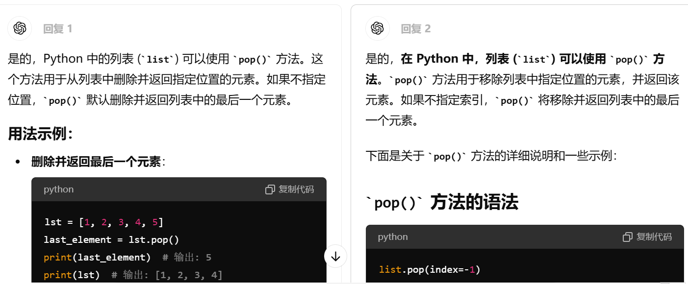

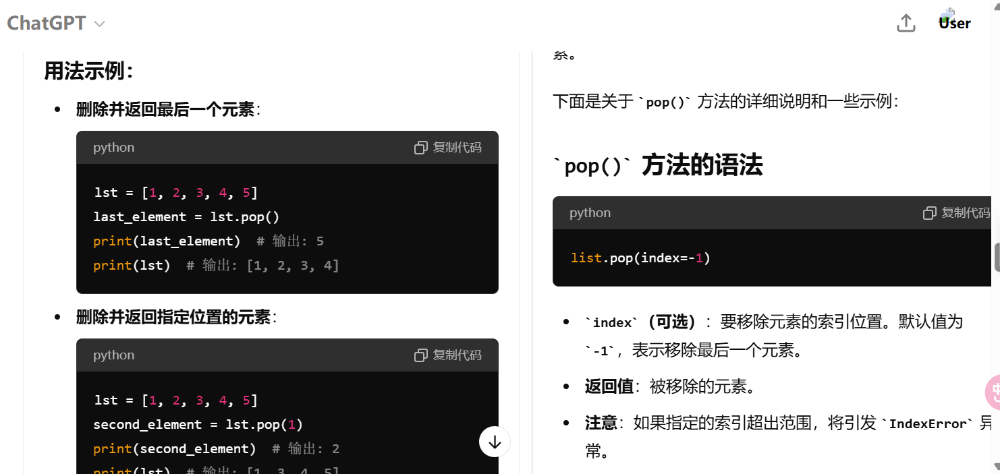

列表竟然还能指定pop index


d = deque([1, 2, 3])


append(x): 在队列的右端添加一个元素 x。

python
复制代码
d.append(4)  # d -> deque([1, 2, 3, 4])
appendleft(x): 在队列的左端添加一个元素 x。

python
复制代码
d.appendleft(0)  # d -> deque([0, 1, 2, 3, 4])
pop(): 移除并返回队列右端的元素。

python
复制代码
d.pop()  # 返回 4, d -> deque([0, 1, 2, 3])
popleft(): 移除并返回队列左端的元素。

python
复制代码
d.popleft()  # 返回 0, d -> deque([1, 2, 3])
extend(iterable): 将 iterable 中的元素添加到队列的右端。

python
复制代码
d.extend([4, 5])  # d -> deque([1, 2, 3, 4, 5])
extendleft(iterable): 将 iterable 中的元素逆序添加到队列的左端。

python
复制代码
d.extendleft([0, -1])  # d -> deque([-1, 0, 1, 2, 3, 4, 5])
rotate(n): 向右旋转队列 n 步（如果 n 为负，则向左旋转）。

python
复制代码
d.rotate(1)  # d -> deque([5, -1, 0, 1, 2, 3, 4])
d.rotate(-1) # d -> deque([-1, 0, 1, 2, 3, 4, 5])
clear(): 清空队列。

python
复制代码
d.clear()  # d -> deque([])
count(x): 返回队列中元素 x 的个数。

python
复制代码
d = deque([1, 2, 3, 1, 1])
d.count(1)  # 返回 3
reverse(): 将队列反转（in-place 操作）。

python
复制代码
d.reverse()  # d -> deque([5, 4, 3, 2, 1, 0, -1])
maxlen: deque 可以设定最大长度，超出长度时会从另一端删除元素。

python
复制代码
d = deque([1, 2, 3], maxlen=3)
d.append(4)  # d -> deque([2, 3, 4])
这些方法使得 deque 在处理需要频繁从两端操作元素的场景中非常有用，如实现队列、双端队列等数据结构。

### 字符串在python里能直接reverse吗
ChatGPT 说：
ChatGPT
在 Python 中，字符串是不可变的对象，因此不能直接修改它们。不过，你可以通过多种方式创建一个字符串的反转版本。以下是几种常见的方法：

1. 使用切片（Slicing）
这是最常用和简单的方法。

python
复制代码
s = "hello"
reversed_s = s[::-1]
print(reversed_s)  # 输出: "olleh"
2. 使用 reversed() 函数和 join()
reversed() 函数返回一个反转的迭代器，可以结合 join() 将其转换为字符串。

python
复制代码
s = "hello"
reversed_s = ''.join(reversed(s))
print(reversed_s)  # 输出: "olleh"
3. 使用循环
你可以通过循环手动构建反转的字符串。

python
复制代码
s = "hello"
reversed_s = ""
for char in s:
    reversed_s = char + reversed_s
print(reversed_s)  # 输出: "olleh"
4. 使用 reduce() 函数
reduce() 函数可以将字符串逐步累积反转。

python
复制代码
from functools import reduce

s = "hello"
reversed_s = reduce(lambda x, y: y + x, s)
print(reversed_s)  # 输出: "olleh"


## 第三题 勉强能理解 dfs回溯 记录最小time 多次放入 返回恢复


# 快手 823

第一题是基础的栈模拟，难度比较低。

第二题也是基础的动态规划，难度比较低。

第三题难度比较大，需要先预处理，然后使用状压来实现dp，这个考点并不常见。

## 题目一
题目描述给定一个只包括 '('，')'，'{'，'}'，'['，']' 的字符串 s（1 <= s.length <= 1e4) ，判断字符串是否有效。如果有效，输出有效括号的个数。如果无效，则输出False。

有效字符串需满足：左括号必须用相同类型的右括号闭合。左括号必须以正确的顺序闭合。每个右括号都有一个对应的相同类型的左括号。


输入

    5
    ()
    ([])
    ([[}]]){
    ){}()
    ))(())
输出

    1
    2
    False
    False
    False

### 队列
太简单 列表轻松实现 甚至用不到那个双端列表

    from collections import deque
    d = deque([1, 2, 3])

封装也很简单

rotate(n): 向右旋转队列 n 步（如果 n 为负，则向左旋转）。

rotate

reverse

extendleft

popleft

appendleft

    [1,2,3].reverse   <built-in method reverse of list object at 0x000001FA470AD100> 这好像是获得了一个方法？
    [1,2,3].reverse()   None


    a=[1,2,3]
    a.reverse   [1, 2, 3]
    a=[1,2,3]
    a.reverse()   [3, 2, 1]


    a=[1,2,3]
    a.reverse   [1, 2, 3]
    a=[1,2,3]
    a.reverse()   [3, 2, 1]
    a=3e-5  3e-05
    a*10  0.00030000000000000003
    a*100  0.003


## 题目二

题目描述

Michael喜欢滑雪百这并不奇怪， 因为滑雪的确很刺激。可是为了获得速度，滑的区域必须向下倾斜，而且当你滑到坡底，你不得不再次走上坡或者等待升降机来载你。Michael想知道载一个区域中最长底滑坡。区域由一个二维数组给出。数组的每个数字代表点的高度。

    1 2 3 4 5
    16 17 18 19 6
    15 24 25 20 7
    14 23 22 21 8
    13 12 11 10 9
一个人可以从某个点滑向上下左右相邻四个点之一，当且仅当高度减小。在上面的例子中，一条可滑行的滑坡为24-17-16-1。当然25-24-23-...-3-2-1更长。事实上，这是最长的一条。答案就是25.

输入的第一行表示区域的行数R和列数C(1 <= R,C <= 100)。下面是R行，每行有C个整数，代表高度h，0<=h<=10000。

输出最长区域的长度。

输入

    5 5
    1 2 3 4 5
    16 17 18 19 6
    15 24 25 20 7
    14 23 22 21 8
    13 12 11 10 9
输出25


感觉是回溯 同时记录最长道？但最高不一定最长把         
dp?       

好难写

最简单的就是对着用例直接解决

啥都不考虑 直接找最顶点 然后贪心直接找 不管什么窗口大小 然后记录 直接输出答案

第二题也是基础的动态规划，难度比较低。

我靠 难度低？

记忆化搜索，用dp{i,j}表示从(i,j)出发能滑的最远距离，用dfs搜索，若dp{i,j}>0即已经计算过，直接返回值即可，否则按照dfs思路递推计算其最大值，递推式为：dp{i,j}=max(dp{i,j},dfs(x,y)+1)（（i,j)与(x,y)相邻，且a{ x, y}<a{i, j}）


还可以但是想不到

他这个就是搜索所有答案 不见得复杂度低 但是他能形成代码啊 我的逻辑感觉没有那么严谨 简洁


    #include<cstdio>
    #include<algorithm>
    using namespace std;

    int r,c,res;
    int a[105][105],dp[105][105];
    int go[4][2]={-1,0,0,1,1,0,0,-1}; 这个挺好

    int dfs(int x,int y){
        if(dp[x][y]>0) return dp[x][y];
        dp[x][y]=1;
        for(int i=0;i<4;++i){
            int xx=x+go[i][0],yy=y+go[i][1];
            if(xx>=0&&xx<r&&yy>=0&&yy<c&&a[xx][yy]<a[x][y])
                dp[x][y]=max(dp[x][y],dfs(xx,yy)+1); 这个挺核心的。这个好像是从叶子节点找到最大才返回 这是不是有点说法？ 反正不管 dp就是一股脑找最大 不管是二维还是一维dp
        }
        return dp[x][y]; 遍历完四个方向 贪心取出 所以也只是简单的贪心 同时遍历完所有的可能
    }

    int main(){
        scanf("%d%d",&r,&c);
        for(int i=0;i<r;++i)
            for(int j=0;j<c;++j)
                scanf("%d",&a[i][j]);
        for(int i=0;i<r;++i)
            for(int j=0;j<c;++j){
                int tmp=dfs(i,j); 直接对每个点找 为了通过率真实拼了 复杂度嗖嗖涨
    但是本质还是最近贪心
                if(tmp>res) res=tmp;
            }
        printf("%d\n",res);
        return 0;
    }


## 第三题 太难看不懂说不清


# shopee 0825
过虾皮可能学历卡的比较紧一点，hc不多的，招聘周期也不长。没投的得赶紧投了。

本次笔试难度比较低，有一定刷题基础的同学应该都可以解决。第一题是LC经典的链表处理题了，注意好链表的指针操作即可。第二题则是基础的数组搜索问题，排序后双指针即可。第三题是基础的DP，套用模板即可。


## 第一题
给定单链表头节点head,实现一个调整单链表的函数，使得海k个节点之间逆序，如果最后不 够K个节点，则不进行调整。

输入

1,2,3,4,5,6,7,8,9,10,11,12,13,3

输出

3,2,1,6,5,4,9,8,7,12,11,10,13


力扣25题原题，可参考官方题解,虾皮均为力扣模式，不需要手写输入输出


    ListNode* reverseKGroup(ListNode* head, int k) {
        ListNode* dummy = new ListNode(0, head);
        ListNode* cur = dummy;
        while (true) {
            auto cur1 = cur;
            for (int i = 0; i < k && cur1; i++) {
                cur1 = cur1->next;
            }
            if (!cur1)
                break;
            auto a = cur->next, b = a->next;
            for (int i = 0; i < k - 1; i++) {
                auto c = b->next;
                b->next = a;
                a = b, b = c;
            }
            auto t = cur->next;
            cur->next->next = b;
            cur->next = a;
            cur = t;
        }
        return dummy->next;
    }


写得太乱 完全无法明白含义


## 第二题
在两个数组中找出满足要求的两个数 详细描述 给定正整数X,两个正整数数组Arr1和Arr2,请在Arr1和Arr2中各找一个数，使得这两个数字之 和与X最接近，输出两个值对应的下标。


输入[1,5,13,15],[10,11,17,20],20输出[0,3]


这也不简单啊

第二题则是基础的数组搜索问题，排序后双指针即可

一步一步 依次移动？


思路与代码


对数组 Arr1 和 Arr2 分别进行排序，并保留它们的原始下标。使用双指针，一个指向 Arr1 的起始位置，另一个指向 Arr2 的末尾。计算当前两个指针所指向元素的和与目标值 X 的差距，并根据差距调整指针的移动方向。记录最小差距及其对应的下标。当两个指针相遇时，输出对应的下标。


下标如何保留

？？

    vector<int> findClosetPair(vector<int>& arr1, vector<int>& arr2, int x) {
        int n1 = arr1.size();
        int n2 = arr2.size();
        
        // 存储原始下标的数组
        vector<pair<int, int>> arr1Indexed, arr2Indexed;
        
        for (int i = 0; i < n1; ++i) {
            arr1Indexed.push_back({arr1[i], i});  竟然用字典存下标？重复呢？
        }
        for (int i = 0; i < n2; ++i) {
            arr2Indexed.push_back({arr2[i], i});
        }
        
        // 对两个数组按值排序
        sort(arr1Indexed.begin(), arr1Indexed.end());
        sort(arr2Indexed.begin(), arr2Indexed.end());
        
        int left = 0;
        int right = n2 - 1; 好像有些巧妙啊 能避免错过？
        int closestSum = INT_MAX;
        int closestLeft = 0, closestRight = 0;
        
        // 使用双指针法
        while (left < n1 && right >= 0) {
            int sum = arr1Indexed[left].first + arr2Indexed[right].first;
            int diff = abs(sum - x);
            
            // 如果找到更接近的值，更新最近的下标
            if (diff < closestSum) {
                closestSum = diff;
                closestLeft = arr1Indexed[left].second;
                closestRight = arr2Indexed[right].second;
            }
            
            // 根据sum和x的比较结果来移动指针
            if (sum < x) {
                left++; 
            } else {
                right--;
            }
        }
        
        return {closestLeft, closestRight};
    }


好像不是字典 而是元组 重复没关系


    from typing import List, Tuple

    def find_closest_pair(arr1: List[int], arr2: List[int], x: int) -> Tuple[int, int]:
        n1 = len(arr1)
        n2 = len(arr2)
        
        # 存储原始下标的数组
        arr1_indexed = [(value, idx) for idx, value in enumerate(arr1)] 巧妙
        arr2_indexed = [(value, idx) for idx, value in enumerate(arr2)]
        
        # 对两个数组按值排序
        arr1_indexed.sort()
        arr2_indexed.sort()
        
        left = 0
        right = n2 - 1
        closest_sum = float('inf')
        closest_left = 0
        closest_right = 0
        
        # 使用双指针法 比较巧妙
        while left < n1 and right >= 0:
            sum_value = arr1_indexed[left][0] + arr2_indexed[right][0]
            diff = abs(sum_value - x)
            
            # 如果找到更接近的值，更新最近的下标
            if diff < closest_sum:
                closest_sum = diff
                closest_left = arr1_indexed[left][1]
                closest_right = arr2_indexed[right][1]
            
            # 根据sum和x的比较结果来移动指针
            if sum_value < x:
                left += 1
            else:
                right -= 1
        
        return (closest_left, closest_right)


arr1_indexed.sort() 是依据 value 进行排序的。

在 Python 中，sort() 函数默认根据元组的第一个元素（即 value）进行排序。如果 value 相同，它会进一步根据第二个元素（即 idx）排序，但在这个代码中，主要是依据 value 进行排序。

元组记录信息 然后又用了 两边的双指针


## 第三题

假设货车的容量为V(正整数，0<=V<=20000),货物的总个数为(0<n<=32)。请你写一个程序，找出如何将货车的容量充分利用（剩余空间最小）。输入：V货车的容量，数组n表示每个货物占的体积输出：一个整数，表示货车的剩余容量

输入24,8,3,12,7,9,7

输出0

没写清楚


思路与代码


这个问题可以看作是“背包问题”的变种，我们需要找到一种货物的组合，使得其总容量尽量接近货车的容量V，这样剩余空间最小。使用一二维数组dp[i][j]表示`前i个货物中选择体积不超过j的最大体积`，这样最后可以通过V - dp[n][V]来得到最小的剩余空间。

第三题是基础的DP，套用模板即可。


        int bestFit(int v, vector<int>& item) {
            int n = item.size();
            vector<int> dp(v + 1, 0);

            // 动态规划，计算在容量为v的情况下，能够装载的最大体积
            for (int i = 0; i < n; ++i) {
                for (int j = v; j >= item[i]; --j) { 
        j代表可装重量 但是为什么是倒着来 同时物品i却从0开始？
                    dp[j] = max(dp[j], dp[j - item[i]] + item[i]); i=0的时候更新依次 即 dp[v]最大重量是item[i]。 然后又递减dp[j]， 基本上把item[0]都赋值给了所有最大重量下。 
    
    再遍历i=1,往上一直走。 又先更新dp[v] 直接就是比较现有 dp[v]和 之前差值后dp加上现在item[1]的结果，其结果就是 dp[v]被强制更新为v上限下的最大值 
    
    而且这样仿佛不会重复使用item?  其他dp可以暂时不管

    反正我知道的是dp[v]会一直以最大值更新，只要能塞进去，同时最近的是最后的那个item。只能说一定保证了最大。但是有没有重复呢？

    似乎又没有，因为他是直接倒着来的，这避免了重复。真牛逼

    这种结构数据放给大语言能学习就牛逼了，如果还有泛化性，那更牛逼


                }
            }

            // 返回剩余空间
            return v - dp[v];
        }

py

    from typing import List

    def best_fit(v: int, item: List[int]) -> int:
        n = len(item)
        dp = [0] * (v + 1)

        # 动态规划，计算在容量为v的情况下，能够装载的最大体积
        for i in range(n):
            for j in range(v, item[i] - 1, -1):
                dp[j] = max(dp[j], dp[j - item[i]] + item[i])

        # 返回剩余空间
        return v - dp[v]

dp 数组用于存储在不同容量下可以装载的最大体积。
外层循环遍历每个物品，内层循环从当前容量 v 倒序更新 dp 数组，确保每个物品只被计算一次。
最终返回的是总容量 v 减去可以装载的最大体积，即剩余的空间。


没看懂 题目和题解都太乱

92确实很巧妙


## 93考试
### 第一题 （高优先）--已通过递归解决：解析括号和数字。 re匹配 麻烦做不出
gpt写得狗逼 现在写三次都不对，可能有些小公司很牛，但没有知名度，可能说是你视野小，但其实还是不知名


gemini差点全对，二过一

其实也垃圾 模板匹配一直写不对 三次了

一个个问还可以 再去问Gpt pattern

自己再改一下


    import re

    def process_string(s):
        # 先处理所有的大小写转换

        # 定义正则表达式模式，匹配 #(upper)[...] 的结构
        pattern = r"#\(upper\)\[([^\]]+)\]"

        # 使用re.sub进行替换，匹配到的内容用lambda函数来转换为大写
        output_str = re.sub(pattern, lambda match: f"{match.group(1).upper()}", s)

        # 定义正则表达式模式，匹配 #(upper)[...] 的结构
        pattern = r"#\(lower\)\[([^\]]+)\]"

        # 使用re.sub进行替换，匹配到的内容用lambda函数来转换为大写
        output_str = re.sub(pattern, lambda match: f"{match.group(1).lower()}", output_str)

        s = output_str
        
        result = ""
        i = 0
        while i < len(s):
            if s[i].isdigit():
                # 获取重复次数
                count = int(s[i])
                i += 1
                # 处理括号内的内容
                if s[i] == '[':
                    j = i + 1
                    depth = 1
                    while depth > 0:
                        if s[j] == '[':
                            depth += 1
                        elif s[j] == ']':
                            depth -= 1
                        j += 1
                    sub_result = process_string(s[i+1:j-1])
                    result += sub_result * count
                    i = j
                else:
                    # 处理单个字符的重复
                    result += s[i] * count
                    i += 1
            else:
                # 处理普通字符
                result += s[i]
                i += 1
        return result

    def apply_functions(s):
        # 处理upper、lower等函数
        # 这里可以扩展，支持更多的函数
        return process_string(s)
        

    # 示例用法
    s1 = "3[a]2[bc]"
    s2 = "3[#(upper)[a]2[bc]]"
    print(apply_functions(s1))  # 输出 aaabcbc
    print(apply_functions(s2))  # 输出 AbcbcAbcbcAbcbc

s1 = "3[[a]2#(upper)[bc]]"
print(apply_functions(s1)) 

[a]BBC[a]BBC[a]BBC

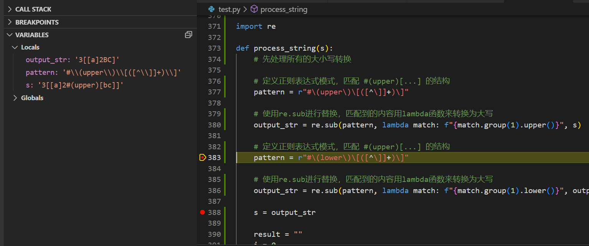

有点儿忘记题意了

基本思路是正确的

这个没用stack只用指针也处理得很好

递归做的，也还可以，每个括号深度直接就递归进去，记下数字，进出处理完后，出来再乘          

比栈好理解一些

为什么考虑使用栈？

栈的特点： 栈是一种后进先出的数据结构。在处理嵌套结构时，栈能很好地模拟递归的入栈和出栈过程。
问题特点： 我们的字符串处理问题本质上是一个嵌套结构的解析问题。栈可以用来跟踪当前处理的嵌套层级，以及各个层级的重复次数和内容。


使用栈实现的思路：

初始化栈： 创建一个空栈，用于存储当前处理的元素。
遍历字符串： 从左到右遍历字符串。
遇到数字： 将数字压入栈中，表示当前层级的重复次数。
遇到 '['： 将当前栈顶元素（即重复次数）和一个空列表压入栈中，空列表用于存储当前层级的内容。
遇到 ']'：
弹出栈顶的列表和重复次数。
将列表中的元素重复指定的次数，并将结果作为一个新的字符串压入栈顶。
遇到字母： 将字母添加到栈顶的列表中。
遇到 #(upper) 或 #(lower)：
弹出栈顶的列表。
对列表中的所有元素进行大小写转换。
将转换后的列表压入栈顶。
遍历结束后： 栈顶的元素即为最终结果。


    def process_string_with_stack(s):
        stack = []
        for c in s:
            if c.isdigit():
                stack.append(int(c))
            elif c == '[':
                stack.append([])
            elif c == ']':
                count = stack.pop()
                content = stack.pop()
                stack.append(content * count)
            elif c in ['#', '(', ')', 'u', 'p', 'p', 'e', 'r', 'l', 'o', 'w', 'e', 'r']:
                # 处理大小写转换，这里可以优化
                # ...
            else:
                stack[-1].append(c)
        return ''.join(stack.pop())

gemini可能不太理解，还是得人来


麻烦点在于 stack[-1]的pop时机以及对empty的考虑，算了

还是递归进去吧，用[记录深度，然后process_string(s[i+1:j-1]) 切片放进去，递归进去，result设置为递归之外的全局变量，不对被加进去，并用*count控制


    if s[i].isdigit():
        # 获取重复次数
        count = int(s[i])


### 二分图判断
染色法

-1未染色 0红色 1蓝色         

直接使用dfs一直找false，找不到就是true

这题主要改的地方是不是经典的graph--给出单节点所有邻接表，而是给每条边，而且节点起始是1


### 第三题 就是825原题 键写错


    from typing import List

    def best_fit(v: int, item: List[int]) -> int:
        n = len(item)
        dp = [0] * (v + 1)

        # 动态规划，计算在容量为v的情况下，能够装载的最大体积
        for i in range(n):
            for j in range(v, item[i] - 1, -1):
                dp[j] = max(dp[j], dp[j - item[i]] + item[i])  这个地方的dp[j - item[i]]写错 我习惯写 -1，没做出来。区别在哪里，可能是value还要最大，同时limit满足，多了一个条件。这道题只是遍历一个列表找出装货的最大。93题其实是在v最大容量下，满足limits(到这里和本题相同，我也是这个思路写)，同时value最大，多了这个控制变量。按照这题写法，可能能写出来吧，反正max就可以了。不管。

        # 返回剩余空间
        return v - dp[v]


# 百度 0825

第一题是基础的模拟题，但是处理起来有些许麻烦，难度不大。

第二题也是基础的模拟题，但是要注意数据规模，需要对于一些case进行额外的处理。

第三题连通图的处理，难度有些许大，需要分析好题意里面的特殊的连通关系进行快速的处理。

## 第一题 第二题可以理解
## 第三题 流言终结者
在一个小镇住着n个人，其中有m对朋友关系。朋友关系是相互的，即A是B的朋友也意味着B是A的朋友。这n个人分为两类：第一种人听到一个流言之后，会把它说给所有没有听过这个流言的朋友听。第二种人听到一个流言之后，不会把它说给任何一个朋友听。现在有q次事件发生，每次事件形如"有一个人u听说了某个流言"，每次事件独立。请问对于每一次事件，有多少人最终会听到这个流言？

输入描述

第一行正整数n,m,q。

接下来m行，每行两个数字 u,v(u!=v)，表示初始的一对朋友关系，朋友关系不会重复给出

接下来一行n个数字,每个数字为1或者2，第i个数字表示第i个人属于第一种人/第二种人。

接下来一行q个整数，每个整数代表一次事件中最初听到的流言的人。

1<=n<=10^5, 1<=q<=210^5, 1<=m<=210^5

输出描述

对于每个事件，输出一行一个整数，代表受影响的总人数

示例 1

输入

    5 5 5
    1 2
    2 3
    3 4
    4 5
    1 5
    1 2 1 1 2
    1 2 3 4 5
输出

    3
    1
    4
    4
    1
说明

第一次听到流言的人为1,2,5，第二、五次仅有初始时听到流言的人听到了，第三、四次是2,3,4,5

示例 2

输入

    6 7 5
    1 2
    1 4
    1 6
    4 6
    3 5
    1 5
    2 6
    1 2 1 1 1 2
    1 2 3 5 6
输出

    6
    1
    6
    6
    1


我的思路直接set 不需要找根啥的太麻烦       
多加一点判断即可      
他这个又要用键中值作键 简直就是想做成树 太麻烦


思路与代码

离线处理+ 并查集。

我们首先思考以下问题：

如果a和b是朋友，并且a和b都是第一种类型的，这样就跟朋友的连通图没有什么区别了，直接union即可。
如果a和b是朋友，并且a和b都是第二种类型的呢？此时他们直接的连通块关系并不会传播，可以不做任何处理。
如果a和b是朋友，并且只有是b第二种类型的呢？此时，对于a的连通图来讲，可以传播的数量会+1，而b没有任何改变。
但是这里需要注意的是：假设a和b是类型1，并且a和b是朋友；此时a和c也是朋友，b和c也是朋友，并且c是第二种类型，此时c只能给a和b这个连通块贡献1次。所以此处需要离线处理，将所有的类型一的节点先进行Union，然后对于存在类型二的朋友关系，再单独处理，用一个哈希表来表示每个类型最多只能给一个连通块贡献一次。


    from collections import defaultdict

    n,m,q = map(int, input().split())

    edges = []
    for _ in range(m):
        a,b = map(int, input().split())
        edges.append((a,b))

    types = [0] + [int(c) for c in input().split()]

    fa = [i for i in range(n+1)] 他这个设置意思是初始根节点是自己 0 1 2 3 4 5
    cnts = [1]*(n+1)
    #找到x的根节点
    def find(x):
        if x == fa[x]: return x 是自己 返回。什么时候不是自己？
        fa[x] = find(fa[x]) 循环找父节点 直到没有指向的节点 这种通过 列表模拟字典模拟树？这直接乱死 直接点还好些
        return fa[x] 最终规定fa[x]确实是父节点同时赋值 然后还要返回父节点

    #合并两个节点
    def union(x,y):
        fx, fy = find(x), find(y) 找父节点 根节点
        if fx == fy: return 父节点一样 不处理? 表示已经在一个Union
        cnts[fy] += cnts[fx] 没看懂 统计儿子个数？  当不一样的时候 合并
        fa[fx] = fy 重新设置父节点 十分的乱 这样一个接一个没意思 相当于创造union
        有父亲 就是union fy设置为fx的父亲 循环设置

    for a,b in edges:
        if types[a] == types[b] == 1:
            union(a,b) 比较好奇他这些在做什么

    vst = defaultdict(set)

    for a,b in edges:
        if types[a] ==2 or types[b] == 2:
            if types[a] == types[b] ==2: continue
            elif types[a] == 2:
                if find(b) in vst[a]: continue
                vst[a].add(find(b))
                cnts[find(b)] += 1
            else:
                if find(a) in vst[b]: continue
                vst[b].add(find(a))
                cnts[find(a)] += 1


    queries = [int(c) for c in input().split()]

    for query in queries:
        print(cnts[find(query)])


# 得物 0828
## 第一题

    import sys

    n,k = map(int,input().split(' '))
    a= list(map(int,input().split(' ')))

    win_rate=0

    per_win_rate = [[0]*n for _ in range(n)]
    for i in range(n):
        for j in range(n):
            per_win_rate[i][j] = a[i]/(a[i]+a[j])
    win_1_rate=[]

    for i in range(n):
        #if k==1
        temp=1
        for j in range(n):
            if i==j: continue
            temp *= per_win_rate[i][j]
        #if k=2:
        # win_rate += temp
        win_1_rate.append(temp)

    for i in range(n):
        if k==1:
            win_rate+=win_1_rate[i]
        if k==2:
            for j in range(n):
                if j==i: continue
                win_rate+=win_1_rate[i]*win_1_rate[j]
        if k==3:
            for j in range(n):
                if j==i: continue
                for k in range(n):
                    if k==i or k==j: continue
                    win_rate+=win_1_rate[i]*win_1_rate[j]*win_1_rate[k]


    print(f'{win_rate:.2f}')

只会这么写 太蠢了


您可以将此代码简化为一个更通用的版本，以支持任意的 k 值。考虑到 k 可能是一个较大的未知数（例如 100 或 200），我们可以利用递归或 itertools 模块中的 combinations 函数来生成所有的组合并计算 win_rate。

以下是使用 itertools.combinations 的简化版本：

    python
    复制代码
    from itertools import combinations

    win_rate = 0

    # 生成所有长度为 k 的组合
    for combination in combinations(range(n), k):
        product = 1
        for index in combination:
            product *= win_1_rate[index]
        win_rate += product
解释：
combinations(range(n), k)：生成长度为 k 的所有可能索引组合。
遍历每个组合：对每个组合计算其乘积，并将结果累加到 win_rate。
这种方法简化了代码逻辑，避免了多个嵌套的 for 循环，使其更加通用和灵活。


记忆里好像是用三维数组做的 但是这里说去递归

使用递归方法来计算 win_rate，我们可以递归地选择当前的元素并计算所有可能的组合乘积。递归的基本思想是，在每一层选择一个元素，然后递归地处理剩余的元素，直到达到所需的组合长度 k。

下面是使用递归来实现的代码：

    python
    复制代码
    def calculate_win_rate(n, k, win_1_rate):
        def recursive_combination(current_index, current_product, remaining_k):
            # 如果已经选择了k个元素，则将当前乘积加入win_rate
            if remaining_k == 0:
                return current_product
            
            win_rate = 0
            # 从当前索引开始，选择下一个元素
            for i in range(current_index, n):
                win_rate += recursive_combination(i + 1, current_product * win_1_rate[i], remaining_k - 1)
            
            return win_rate

        # 初始调用，开始索引为0，乘积为1，剩余需要选择的k个元素
        return recursive_combination(0, 1, k)

    # 示例使用
    n = 5  # 假设n的值为5
    k = 3  # 假设k的值为3
    win_1_rate = [0.1, 0.2, 0.3, 0.4, 0.5]  # 假设win_1_rate的值
    win_rate = calculate_win_rate(n, k, win_1_rate)
    print(win_rate)
解释：
recursive_combination 函数:

current_index：当前考虑的索引。
current_product：当前已选择元素的乘积。
remaining_k：还需要选择的元素个数。
递归终止条件：当 remaining_k == 0 时，表示已经选择了 k 个元素，此时返回当前的乘积。

递归调用：在每一步，选择当前索引后的下一个元素，并递归地计算剩余的组合。

初始调用：从索引 0 开始，初始乘积为 1，需要选择 k 个元素。


已经感觉很优美了


dp有点看不懂

使用动态规划（DP）可以有效地优化这个问题，避免递归可能带来的性能瓶颈。我们可以构建一个 DP 数组来保存中间结果，以避免重复计算。

动态规划解法
我们定义一个二维数组 dp[i][j] 来表示从前 i 个元素中选取 j 个元素的组合的总乘积和。最终的答案 win_rate 将会是 dp[n][k]。

动态规划状态转移方程：
初始化:

dp[0][0] = 1：从 0 个元素中选 0 个的乘积和是 1（即没有选任何元素）。
dp[i][0] = 1：从前 i 个元素中选 0 个的乘积和也是 1（没有选任何元素的乘积）。
状态转移方程:

如果 j > 0，则 dp[i][j] = dp[i-1][j] + dp[i-1][j-1] * win_1_rate[i-1]。
解释：dp[i][j] 表示前 i 个元素中选 j 个的总和。
不选第 i 个元素: dp[i-1][j]
选第 i 个元素: dp[i-1][j-1] * win_1_rate[i-1]
实现代码：

    python
    复制代码
    def calculate_win_rate_dp(n, k, win_1_rate):
        # 初始化DP数组, 大小为 (n+1) x (k+1)
        dp = [[0] * (k + 1) for _ in range(n + 1)]

        # 初始化基准情况
        dp[0][0] = 1  # 从0个元素中选择0个的情况
        for i in range(1, n + 1):
            dp[i][0] = 1  # 从前i个元素中选择0个的情况

        # 填充DP表
        for i in range(1, n + 1):
            for j in range(1, k + 1):
                dp[i][j] = dp[i-1][j]  # 不选当前元素
                if j > 0:
                    dp[i][j] += dp[i-1][j-1] * win_1_rate[i-1]  # 选当前元素

        # 返回从n个元素中选取k个的总乘积和
        return dp[n][k]

    # 示例使用
    n = 5  # 假设n的值为5
    k = 3  # 假设k的值为3
    win_1_rate = [0.1, 0.2, 0.3, 0.4, 0.5]  # 假设win_1_rate的值
    win_rate = calculate_win_rate_dp(n, k, win_1_rate)
    print(win_rate)
优化和解释：
时间复杂度: 该算法的时间复杂度为 O(n * k)，因为我们填充了一个大小为 n * k 的 DP 表格。
空间复杂度: 空间复杂度也是 O(n * k)，但可以进一步优化到 O(k)，因为我们只需要前一行的结果来计算当前行。
空间优化的 DP 解法：
如果我们只使用一个一维数组 dp[j] 来存储当前行的数据（从大到小更新），则可以将空间复杂度优化到 O(k)：

    python
    复制代码
    def calculate_win_rate_optimized_dp(n, k, win_1_rate):
        # 初始化一维DP数组
        dp = [0] * (k + 1)
        dp[0] = 1  # 基准情况

        # 填充DP数组
        for i in range(1, n + 1):
            # 从后向前遍历以避免覆盖掉当前需要的状态
            for j in range(k, 0, -1):
                dp[j] += dp[j - 1] * win_1_rate[i - 1]

        # 返回从n个元素中选取k个的总乘积和
        return dp[k]

    # 示例使用
    n = 5  # 假设n的值为5
    k = 3  # 假设k的值为3
    win_1_rate = [0.1, 0.2, 0.3, 0.4, 0.5]  # 假设win_1_rate的值
    win_rate = calculate_win_rate_optimized_dp(n, k, win_1_rate)
    print(win_rate)
总结：
使用动态规划的方法可以有效避免递归带来的时间复杂度爆炸，同时可以进一步优化空间复杂度，适用于更大的 n 和 k。


## 第三题
据说三层for循环 最外层检测<n/2 break       
内部两个指针i j 计算最小修改次数

 
## 面试： 最大和的连续子串的和

    def max_subarray_sum(nums):
        if not nums:
            return 0

        max_sum = current_sum = nums[0] 赋值为第一个元素

        for num in nums[1:]: 遍历后续所有元素
            current_sum = max(num, current_sum + num) 没搞懂为什么有效。比较 单个元素和current_sum+单个元素的最大值， 避免遇到负值-避免下降。如果单个元素大于（之前和当前元素的和），则启用当前元素
            1，1，1 则一直加
            1，-3，1
            1，-1,2
            3，-1，-1 首先当前总和最大为3，引入-1，尝试更新为全局最大
            3，-2,1 首先当前总和最大3，引入-1，当前汇总和为2，下一次，引入1
            截断考虑
            3，-4,2,5 首先3 引入-4 当前和为-1 引入2，截断，当前和为2，也即（之前和）若为负，则对后续没有增益，进行舍弃
            对后续即使有微小正向收益 1 ，也可以考虑，比如 max（5,5+1）
            max_sum = max(max_sum, current_sum) 一直更新为最大的当前总和

        return max_sum

    # 示例
    nums = [-2, 1, -3, 4, -1, 2, 1, -5, 4]
    print(max_subarray_sum(nums))  # 输出 6，对应子数组 [4, -1, 2, 1]


# 小红书91
整场笔试难度较大，考点分别为：动态规划、动态规划、动态规划第二题、第三题的考点，都在ak机制作的大厂笔试基础课的第三章均有涉及到，尤其是第三题，就是一个树形DFS的模板题
## 第一题：山峰数组

题目描述ak 机定义一个长度为的数组为"山峰数组":存在这样的一个位置，使得这个位置左右两边的全部元素均依次严格递减;使用数学的语言来描述，即存在使得$a_{i-1}a_{i+1}(i\in [1,x])$。例如 和是“山峰数组”而和不是“山峰数组”。ak 机有一个长度为的数组，他想知道在全部的子数组中，是“山峰数组”的子数组的长度最大值是多少。如果数组可以通过从数组的开头删除若干(可能为零或全部)元素以及从结尾删除若干(可能为零或全部)元素得到，则数组是数组的子数组。

题解：线性 DP本题是一个很经典的线性 DP：最长上升/下降子数组

我其实用的也是数组，先去for两次记录升降

找不到了 反正是先记进去 然后再一次for看一次


## 第二题：美观程度

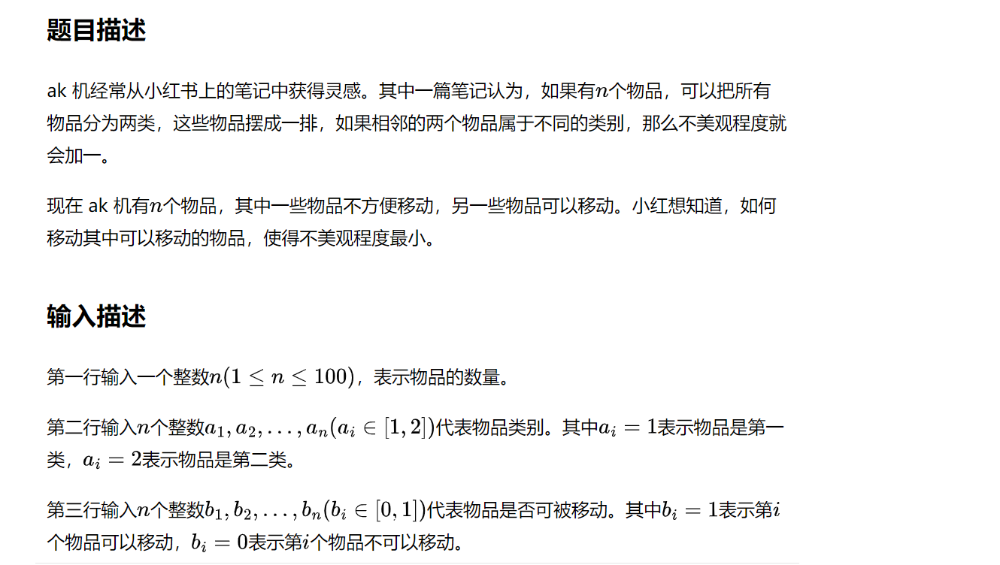


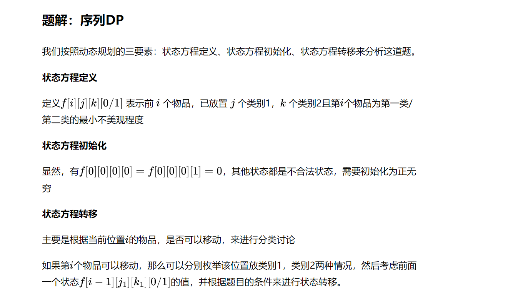

dp对我来说还是太复杂，直觉上就不想dp

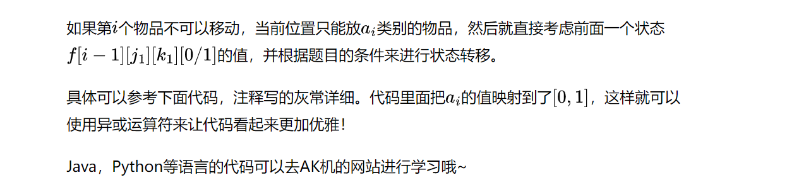

好像是从i是否可移动判断的，可移动就移走，然后看拉入能不能最小，但是没有考虑剩下有多少能移动进来？？

不能移动 参考迁移状态？什么意思？


    #include<bits/stdc++.h>
    using namespace std;
    const int N=110;
    int f[N][N][N][2];  //f[i][j][k][0/1] 表示前 i 个物品，已放置 j 个类别1，k 个类别2的最小不美观程度
    int n,a[N],b[N],c[2];  //c[0/1]分别表示可移动的类别1、2的数量
    这他妈有点复杂

    int main() {
        cin >> n; 
        for (int i = 1; i <= n; i++) {
            cin >> a[i]; 记录类别
            a[i]--;   //映射成0、1，方便后续处理
        }
        for (int i = 1; i <= n; i++) {
            cin >> b[i]; 记录是否可移动
            if(b[i]==1){ 代表当前第i个可以移动
                c[a[i]]++; 就这种写法，复杂起来了
    回去找类别列表，第i个物品，得到类别，记进去，类别可移动+1
            }
        }
        memset(f,0x3f,sizeof f);
        // 初始状态，前0个物品不美观程度为0
        f[0][0][0][0] = 0;
        f[0][0][0][1] = 0;

        for (int i = 1; i <= n; i++) { 枚举到第i个物品
            for (int j = 0; j <= c[0]; j++) { // 枚举已放置的类别1的数量
    应该说是枚举类别1可以移动的数量   
                for (int k = 0; k <= c[1]; k++) { // 枚举已放置的类别2的数量
                    // 如果当前物品是可移动的
                    if (b[i]) {
                        // 当前物品放置为类别1
                        if (j) { 
                            f[i][j][k][0] = min(f[i][j][k][0], min(f[i - 1][j - 1][k][0], f[i - 1][j - 1][k][1] + 1)); // 如果前一个物品是类别1或者前一个物品是类别2，需要增加不美观程度
                        }
                        // 当前物品放置为类别2
                        if (k) {
                            f[i][j][k][1] = min(f[i][j][k][1], min(f[i - 1][j][k - 1][1], f[i - 1][j][k - 1][0] + 1)); // 如果前一个物品是类别2或者前一个物品是类别1，需要增加不美观程度
                        }
                    } else {
                        // 如果当前物品是不可移动的
                        f[i][j][k][a[i]] = min(f[i][j][k][a[i]], min(f[i - 1][j][k][0] + a[i], f[i - 1][j][k][1] + (a[i] ^ 1))); // 如果前一个物品是类别0或者前一个物品是类别1

    都只用考虑前一个物品？11221122 好像确实是的
                    }
                }
            }
        }
        int res=min(f[n][c[0]][c[1]][0],f[n][c[0]][c[1]][1]);
        cout<<res<<endl;
        return 0;
    }


//f[i][j][k][0/1] 表示前 i 个物品，已放置 j 个类别1，k 个类别2的最小不美观程度


是的，`a[i] ^ 1` 在 C++ 中是异或运算符的使用。

`^` 是 C++ 中的位异或运算符，它会对两个整数的每一位执行异或操作。异或的规则是：

- 1 ^ 1 = 0
- 0 ^ 0 = 0
- 1 ^ 0 = 1
- 0 ^ 1 = 1

例如，如果 `a[i]` 是一个二进制数 `1010`，那么 `(a[i] ^ 1)` 的结果将是 `1011`，因为最低位的 `0` 和 `1` 异或结果是 `1`。这个操作通常用于翻转某些特定位（如最低位）。


整个看下来还是很乱


    import sys

    # Initialize constants
    N = 110
    INF = float('inf')

    # Initialize arrays
    f = [[[[INF] * 2 for _ in range(N)] for _ in range(N)] for _ in range(N)]
    a = [0] * N
    b = [0] * N
    c = [0, 0]  # c[0] for category 1, c[1] for category 2

    # Input reading
    n = int(input())

    for i in range(1, n + 1):
        a[i] = int(input()) - 1  # Map to 0, 1

    for i in range(1, n + 1):
        b[i] = int(input())
        if b[i] == 1:
            c[a[i]] += 1

    # Initial state: the unappealing degree of the first 0 items is 0
    f[0][0][0][0] = 0
    f[0][0][0][1] = 0

    # Main loop
    for i in range(1, n + 1):
        for j in range(c[0] + 1):  # Enumerate the number of placed category 1 items
            for k in range(c[1] + 1):  # Enumerate the number of placed category 2 items
                if b[i]:  # If the current item is movable
                    # Current item placed as category 1
                    if j:
                        f[i][j][k][0] = min(f[i][j][k][0], 
                                            min(f[i - 1][j - 1][k][0], f[i - 1][j - 1][k][1] + 1))
                    # Current item placed as category 2
                    if k:
                        f[i][j][k][1] = min(f[i][j][k][1], 
                                            min(f[i - 1][j][k - 1][1], f[i - 1][j][k - 1][0] + 1))
                else:  # If the current item is not movable
                    f[i][j][k][a[i]] = min(f[i][j][k][a[i]], 
                                        min(f[i - 1][j][k][0] + a[i], f[i - 1][j][k][1] + (a[i] ^ 1)))

    # Calculate the result
    res = min(f[n][c[0]][c[1]][0], f[n][c[0]][c[1]][1])
    print(res)


过于巧妙

确实太巧妙 没怎么理解

看久了确实理解了


# 挚文
1

class Solution:

    def main(self , P: List[List[int]]) -> int:
        # write code here
        result = []
        if len(P)<2: return 1
        for i,p in enumerate(P):
            left = P[:i]+P[i+1:] if i+1 < len(P) else P[:i]
            max_x = max(sub[0] for sub in left)
            max_y = max(sub[1] for sub in left)
            if p[0] > max_x and p[1] > max_y: result.append(p)
        return 1

2

确实通过这道题，彻底理解了nms算法，只需要一直pop就行，pop到最后         
也理解了sorted_indices的神奇写法，目标数据，然后根据key写-直接定义为一个函数，reverse默认false由小到大，true由大到小       
sorted和sort()再度加深


class Solution:

    def main(self , boxes: List[List[int]], scores: List[float], iou_threshold: float) -> int:
        # write code here
        def iou_cal(box1,box2):
            # 左上角
            xi1 = max(box1[0], box2[0])
            yi1 = max(box1[1], box2[1])
            #
            xi2 = min(box1[2], box2[2])
            yi2 = min(box1[3], box2[3])
            inter_area = max(xi2-xi1, 0)*max(yi2-yi1,0)

            box1_area = (box1[2] - box1[0]) * (box1[3] - box1[1])
            box2_area = (box2[2] - box2[0]) * (box2[3] - box2[1])

            return inter_area /(box1_area + box2_area - inter_area) if (box1_area + box2_area - inter_area) !=0 else float('inf')
        
        sorted_indices = sorted(range(len(scores)), key=lambda i:scores[i], reverse=True)
        selected_indices = []

        while sorted_indices:
            current_index = sorted_indices.pop(0)
            selected_indices.append(current_index)

            current_box = boxes[current_index]
            sorted_indices = [idx for idx in sorted_indices if iou_cal(current_box, boxes[idx]) <= iou_threshold] # 默认置信度降序
        result = selected_indices.sort()
        return 1

3

import copy
class Solution:

    def main(self , A: List[int], B: List[int], K: int) -> int:
        # write code here
        # 算法思路:B序列中有n个元素不再本来应在的位置，就能知道n次置换后会重新变回原来的A序列
        # 时间复杂度 O(N+KN), 空间复杂度 O(N)
        cycle_duration = 0
        result = copy.deepcopy(A)
        if K<=0 : return 1
        for i in range(len(B)):
            if B[i]!=i+1: cycle_duration+=1
        K = K % cycle_duration
        if K<=0 : return 1
        for i in range(K):
            for j in range(len(A)):
                result[j] = A[B[j]-1]
            A = copy.deepcopy(result)
        return 1


# 美团

## 第四题 小塔删除序列。连续数据记录，没写好
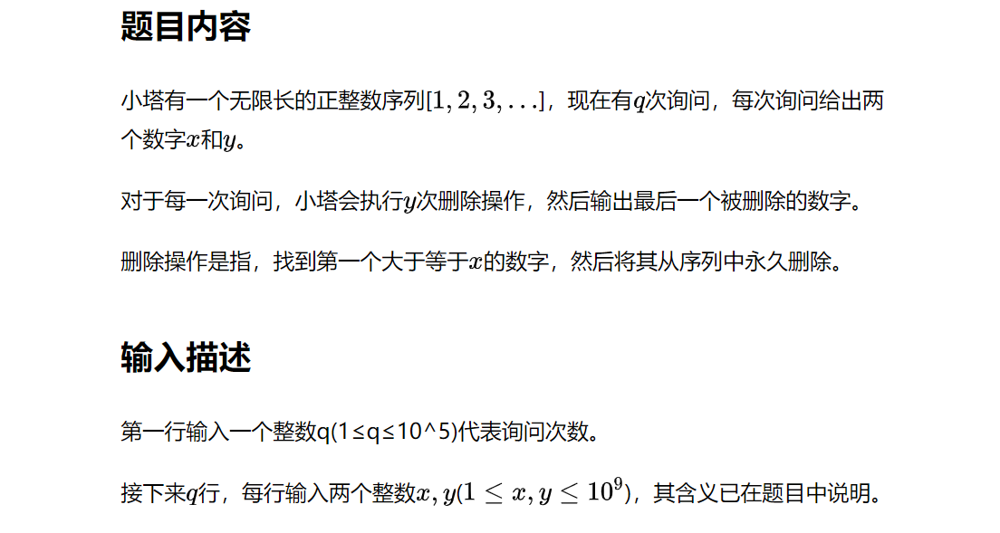


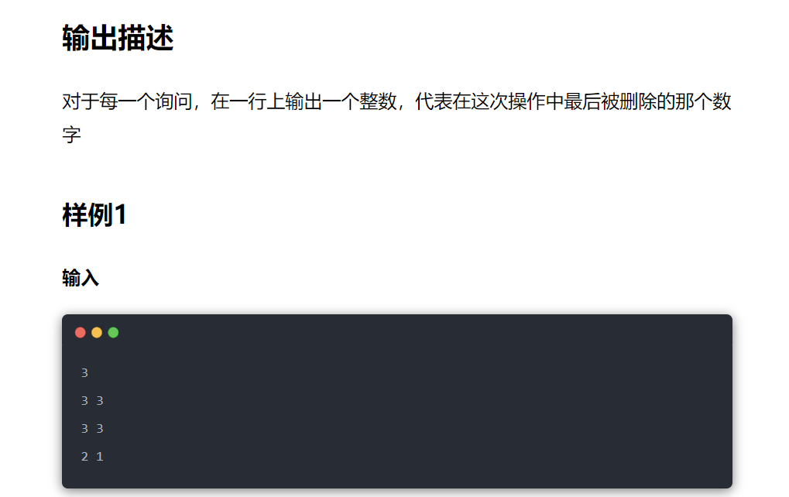

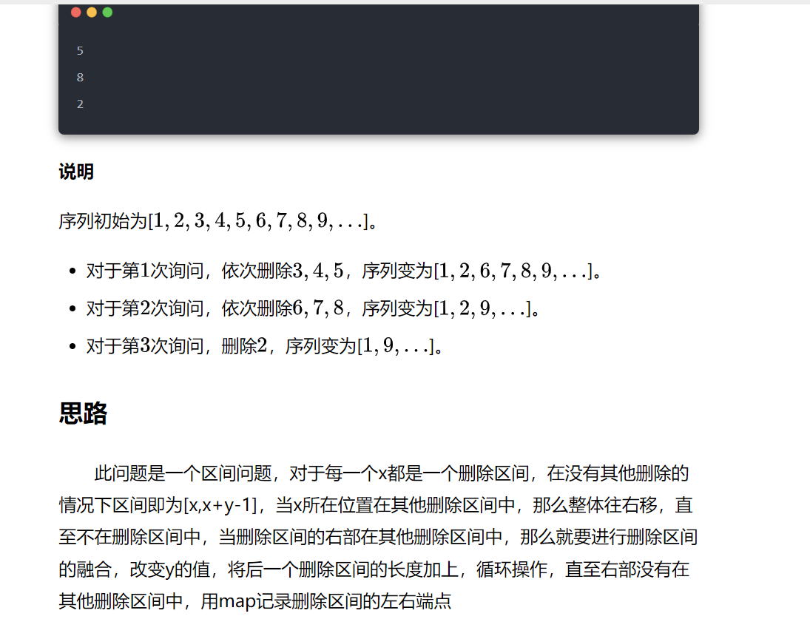

    from collections import defaultdict  
    
    T = int(input())  
    mp = defaultdict(int)  # 使用defaultdict来自动处理不存在的键  
    
    while T > 0:  
        T -= 1  
    
        x, y = map(int, input().split())  
        l = max((key for key in mp if key <= x), default=None)  找到起始值小于等于x的最大值。也就是字典里左边离x最近的。
    
        # 向右移动x直到找到一个空位或超出mp的范围  
        while l is not None and mp[l] >= x:  也是包含关系，具体说类似 

        l   x mp[l]
        [   ...].....
               新x

            x = mp[l] + 1  
            l = max((key for key in mp if key <= x), default=None)  这不是又循环一边？好像是为了防止没融合的错乱.，这个x被一直更新，所以相当于x右移，再重新找。第二次后就不再满足条件mp[l] >= x，就不会再进入循环。
    
        r = min((key for key in mp if key > x), default=None)  找出起始值大于x的最小值，也就是最近的，很巧妙啊，这个min用处很大，反过来就能用来找绝对差值最小。找右边离x最近的。
        # 清理x到x+y-1之间的所有已占用位置  

        ...[.      ]

        if r is not None:  
            while r is not None and r <= x + y - 1:  r这个边界（右边区间的左极限）小于等于当前待加长长度（区间包含关系）。说明得往后查找没被删除的数字。
                temp = mp[r]  
                del mp[r]  准备融合 temp - r + 1就是已删除连续区间长度
                y += temp - r + 1  整体右移，就是做融合，不知道稀疏型能处理吗？不管。直接结合后一起考虑最终加起来的长度，输出尾数字。增加待加长长度。
                r = min((key for key in mp if key > r), default=None)  有点绕啊。这个需要不停min判断当前r是否已经可用。继续类似进入循环前的那种查找。略不同的是，这次是找离该被去掉的删除区间最近的，key。而不是考虑x
    
        mp[x] = x + y - 1  记下更新的，新增连续删除区间，方便后续查找，
        print(x + y - 1)


3
3 3
5
3 3
8
2 2
9


过于巧妙 debug第一次还是看不懂

整个就是很巧妙


第四题使用map或者Treeset(java)等有序集合进行模拟，第五题情况讨论+线段树

数据结构


# 4399 0812
## 第二题 打家劫舍

    class Solution {
        public int rob(int[] nums) {
            int length = nums.length;
            if (length == 1) {
                return nums[0];
            } else if (length == 2) {
                return Math.max(nums[0], nums[1]);
            }
            return Math.max(robRange(nums, 0, length - 2), robRange(nums, 1, length - 1)); 分两个部分
        }

        public int robRange(int[] nums, int start, int end) {
            int first = nums[start], second = Math.max(nums[start], nums[start + 1]); 先找一次最大
            for (int i = start + 2; i <= end; i++) {
                int temp = second;
                second = Math.max(first + nums[i], second); 再迭代考虑加入第三个后的最大。第三个只能加载first里面。first和second逐个往右走，second要保证为最大结果。   
                假如first最大，second也为first，第一轮循环后second实际为first+cur,first变成了first（即上一轮最大）
                第二轮循环，考虑第四个元素，还是加在first上，因为second实际是1、3合体，如果结果是1,4最大，second为1、4, first为1/3      
                第五轮，第五元素，加在first.  只能说方法确实巧妙，能保证1,4这种情况也能存在。原因可能在于他保证了加进去的元素一定和上一个有间隔。有点过于巧妙
                
                这里主要是保证second一直是两个之间的最大。
                然后first要保证是上一个的值？第一次循环，first就是第一个值
                第二次循环，first变成上一轮的second

                first = temp;
            }
            return second;
        }
    }

这种写法类似 翻转字符串 最大和连续子数组 ，不清晰，可读性差，多一个变量，变量名规范化，多一些注释，绝不会有这么多的阅读成本，      
相当于每一个人都要想我一样多写十行。这种代码不如直接把各种典型case都写在旁边 结果也写上


## 第三题
总体的题目难度没有很大。

第一题是一个模拟题，根据要求进行模拟操作即可。

第二题是一道经典DP问题，非常简单。

第三题场景模拟题，稍微有些绕，但是难度也不会很大，仔细点写代码即可。


有N个餐厅和M个外卖员，每个餐厅在某个时间点会产生一个外卖订单，这些订单都有产生时间、所需送达时间和优先级。外卖员在空闲时会选择最优先的订单来配送，直到所有订单都被送达。

具体规则如下: 对于每个餐厅的订单，优先级高的订单优先，其次是所需送达时间最短的订单，再次是产生时间最早的订单。外卖员在空闲时会从`所有餐厅`的最高优先级订单中挑选一个所需送达时间最短的订单进行配送，若所需送达时间相同则选择餐厅编号最小的订单。


优先级高    
所需送达时间最短    
产生时间最早    
餐厅编号最小


输入描述

第一行三个数N、M、P，分别表示有N个餐厅，M个外卖员，P个订单随后有P行，每行有4个数字，分别是餐厅编号、产生时间、优先级和所需送达时间。


输出描述

输出P行，每行表示每个订单被送达的时间点。


示例：       
输入：

    2 2 4
    1 1 2 5       6
    1 4 3 2       8
    2 2 1 4       6
    2 5 2 1       7

输出：

    6 
    8 
    6 
    7


没有讲解 看不懂答案怎么来的


这道题思路很明确，按照题目要求去模拟即可，实现过程的代码比较繁琐，但是思路是很清晰的。遵循题目中给出的优先级规则。我们需要维护一个订单队列，并根据条件选择合适的订单进行配送。


看着就很繁琐

    #include <iostream>
    #include <queue>
    #include <vector>
    #include <algorithm>

    using namespace std;

    struct Order {
        int restaurant_id;
        int start_time;
        int priority;
        int delivery_time;
        int index;
    };

    struct CompareOrder {
        bool operator()(Order const& o1, Order const& o2) {
        
            if (o1.priority != o2.priority)
                return o1.priority < o2.priority;
            if (o1.delivery_time != o2.delivery_time)
                return o1.delivery_time > o2.delivery_time;
            return o1.restaurant_id > o2.restaurant_id;
        }
    };

    struct CompareDeliveryTime {
        bool operator()(int const& t1, int const& t2) {
            return t1 > t2;
        }
    };

    int main() {
        int N, M, P;
        cin >> N >> M >> P;

        vector<Order> orders(P);
        vector<int> result(P);

        for (int i = 0; i < P; i++) {
            cin >> orders[i].restaurant_id >> orders[i].start_time >> orders[i].priority >> orders[i].delivery_time;
            orders[i].index = i;
        }

        // 按产生时间排序
        sort(orders.begin(), orders.end(), [](const Order &a, const Order &b) {
            return a.start_time < b.start_time;
        });

        priority_queue<Order, vector<Order>, CompareOrder> order_queue;
        priority_queue<int, vector<int>, CompareDeliveryTime> free_deliverers;

        // 所有外卖员初始都是空闲的
        for (int i = 0; i < M; i++) {
            free_deliverers.push(0);
        }

        int i = 0;

        while (i < P || !order_queue.empty()) {
            // 将所有在当前时间点或之前产生的订单加入优先级队列
            while (i < P && orders[i].start_time <= free_deliverers.top()) {
                order_queue.push(orders[i]);
                i++;
            }

            if (!order_queue.empty()) {
                // 选择最优订单进行配送
                Order best_order = order_queue.top();
                order_queue.pop();

                // 外卖员取出队列中空闲最早的外卖员
                int available_time = free_deliverers.top();
                free_deliverers.pop();

                // 计算送达时间
                int finish_time = max(available_time, best_order.start_time) + best_order.delivery_time;
                result[best_order.index] = finish_time;

                // 更新该外卖员的空闲时间
                free_deliverers.push(finish_time);
            } else {
                
                if (i < P) {
                    while (!free_deliverers.empty() && free_deliverers.top() < orders[i].start_time) {
                        free_deliverers.pop();
                        free_deliverers.push(orders[i].start_time);
                    }
                }
            }
        }

        for (int i = 0; i < P; i++) {
            cout << result[i] << endl;
        }

        return 0;
    }


100行我靠

先排个序，然后照单送，最后汇总result_list 根据索引放入时间


优化成50行 还可以理解


    import heapq  
    from functools import cmp_to_key  
    
    class Order:  
        def __init__(self, restaurant_id, start_time, priority, delivery_time, index):  
            self.restaurant_id = restaurant_id  
            self.start_time = start_time  
            self.priority = priority  
            self.delivery_time = delivery_time  
            self.index = index  
    
    def compare_order(o1, o2):  
        if o1.priority != o2.priority:  
            return o1.priority < o2.priority  
        if o1.delivery_time != o2.delivery_time:  
            return o1.delivery_time > o2.delivery_time  
        return o1.restaurant_id > o2.restaurant_id  
    
    def compare_delivery_time(t1, t2):  
        return t1 > t2  
    
    def main():  
        N, M, P = map(int, input().split())  
        orders = [Order(*map(int, input().split())) for _ in range(P)]  
        for i, order in enumerate(orders):  
            order.index = i  
    
        orders.sort(key=lambda o: o.start_time)  
    
        order_queue = []  
        free_deliverers = []  
        result = [0] * P  
        heapq.heappush(free_deliverers, 0) * M  # Initialize all deliverers as free at time 0  
    
        i = 0  
        while i < P or order_queue:  
            while i < P and orders[i].start_time <= free_deliverers[0]:  
                heapq.heappush(order_queue, orders[i])  
                i += 1  
    
            if order_queue:  
                best_order = heapq.heappop(order_queue)  
                available_time = heapq.heappop(free_deliverers)  
                finish_time = max(available_time, best_order.start_time) + best_order.delivery_time  
                result[best_order.index] = finish_time  
                heapq.heappush(free_deliverers, finish_time)  
    
            # Skip forward if there are no orders yet but deliverers are available  
            while i < P and free_deliverers and free_deliverers[0] < orders[i].start_time:  
                heapq.heappop(free_deliverers)  
                heapq.heappush(free_deliverers, orders[i].start_time)  
                i += 1  
    
        for time in result:  
            print(time)  
    
    if __name__ == "__main__":  
        main()


在Python中，我们可以使用标准库中的heapq来模拟优先队列，并使用列表（list）和字典（dict）来存储订单和外卖员的空闲时间。下面是一个简化的Python版本，实现了相同的功能但使用了更少的代码行：


这个Python版本通过列表推导式简化了输入处理，并使用heapq模块来模拟优先队列。同时，通过functools.cmp_to_key（虽然在这个例子中直接使用了比较函数，因为heapq接受比较函数）和列表的sort方法简化了排序逻辑。此外，通过直接在循环中处理边界条件，减少了代码量。


## 0909
### 第二题
迷宫 陷阱

    from collections import deque
    maze = eval(input())
    direction = [(0,-1),(0,1),(-1,0),(1,0)]
    #print(maze)
    start_point = []
    end_point = []
    for i in range(len(maze)):
        for j in range(len(maze[0])):
            if maze[i][j] == 'S':
                start_point = (i,j)
            elif maze[i][j] == 'E':
                end_point = (i,j)

    rows, cols = len(maze), len(maze[0])
    single_direction = ['D', 'U', 'L', 'R']
    visited = [[False]*len(maze[0])   for _ in range(len(maze))]


    def bfs(maze, start, end):
        queue = deque([(start, 1)]) 少写了方括号和内括号
        while queue:
            position, path_length = queue.popleft()
            x,y = position
            visited[x][y] == True
            if position == end:
                return path_length
            for (dx,dy) in direction:
                if maze[x][y] in single_direction:
                    index = single_direction.index(maze[x][y])
                    if (dx,dy) != direction[index]: continue
                nx, ny = x+dx, y+dy
                if 0 <= nx < rows and 0 <= ny < cols and maze[x][y] != '1' and not visited[nx][ny]:
                    queue.append(((nx,ny), path_length + 1)) 踢脚板少写中间括号
        return -1
                    
                    
        
    print(bfs(maze, start_point, end_point))   


### 第三题
手写简单神经网络       
计算简单pos embedding       


# 海信 915
## 第二题
    class ListNode:
        def __init__(self, x=0, next=None):
            self.val = x
            self.next = next

    class Solution:
        def formatList(self , head ):
            # write code here
            cur_operate = head
            tail = head
            store = head.next
            is_reverse = False
            while store:
                cur_operate = store
                store = cur_operate.next
                if is_reverse:
                    #store = cur_operate.next 多写了一句没用的
                    cur_operate.next = head 
                    head = cur_operate
                
                elif not is_reverse:
                    tail.next = cur_operate
                    tail = tail.next
                    tail.next = None 少写这句 导致无限长，虽然能退出循环
                    无限长的原因？ 似乎和前一次循环有关，总之是cur_operate.next 有些多余无关的东西，
                    前一次循环后有何影响？，在最开始时候 cur_operate = store ，store很长？ 前一次循环后 store = cur_operate.next 这部分一直没有手动删除，默认让他自己跑

                    没必要找原因。不如多写一句手动删除

                is_reverse = not is_reverse
            return head


    def turn2tree(a):
        #dummy = head
        cur = None
        for i,item in enumerate(a) :
            if i == 0: 
                head = ListNode(item)
                cur = head
                next = head.next
            else :
                next = ListNode(item)
                cur.next = next
                cur = next

        return head

    tree1 = turn2tree({1,2,3,4,5})
    Solution().formatList(tree1)


# 图论？


# 结尾